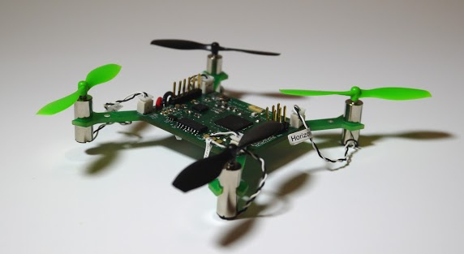

# The Quadcopter Class

Welcome to CSE176e Robotic System Design and Implementation (AKA, the Quadcopter Class).

This repo serves an the homepage for the course labs.  It contains all
the lab write ups and several resources you will use throughout the
course.

* `labs` has all the labs.  The write ups reference the starter repos they use.
* `Eagle` has the pre-built parts library, CAM files, and design rule files to use with Eagle.
* `Lecture Slides` has the slides.

Please see the course home page (https://sites.google.com/a/eng.ucsd.edu/quadcopterclass/) for schedule, due dates, and other logistical issues.

## Overview

We are going to build remote-controlled quadcopters from scratch in 10 weeks.  

The goals for the course are for you to learn how to design, assemble, and program a moderately complex electronic device.  The device you will build is a small, remote-controlled quadcopter similar to this: 

In particular, you'll learn and/or practice these skills/topics:

* Printed circuit board design
  * Implementing a spec
  * Leveraging reference designs
  * Interpreting data sheets 
  * Selecting parts
* PCB Assembly
  * Concepts
  * Moderately advanced soldering
* Embedded Systems Programming
  * Real-time
  * Resource constrained
* Basic Sensor fusion
* Basic Control Theory

## Labs 

There are 11 labs divided into four sections.  Deadlines are on the course homepage.

### PCB Design

1. [Introduction To Eagle](https://github.com/NVSL/QuadClass-Resources/tree/master/labs/Introduction-To-Eagle)
2. [Building Parts In Eagle](https://github.com/NVSL/QuadClass-Resources/tree/master/labs/Building-Parts-In-Eagle)
3. [Building The Quadcopter Schematic.md](https://github.com/NVSL/QuadClass-Resources/tree/master/labs/Building-The-Quadcopter-Schematic)
4. [Laying Out The Board](https://github.com/NVSL/QuadClass-Resources/tree/master/labs/Laying-Out-The-Board)
5. [Manufacturing The Board](https://github.com/NVSL/QuadClass-Resources/tree/master/labs/Manufacturing-The-Board)

### PCB Assembly

6. [Assembling A PCB](https://github.com/NVSL/QuadClass-Resources/tree/master/labs/Assembling-A-PCB)

### Software

7. [Programming The Hardware](https://github.com/NVSL/QuadClass-Resources/tree/master/labs/Programming-The-Hardware)
8. [Sensing and Filtering](https://github.com/NVSL/QuadClass-Resources/tree/master/labs/Sensing-And-Filtering)
9. [Implementing PID](https://github.com/NVSL/QuadClass-Resources/tree/master/labs/Implementing-PID)

### Flight

10. [Flight](https://github.com/NVSL/QuadClass-Resources/tree/master/labs/Flight)
11. [Cleanup](https://github.com/NVSL/QuadClass-Resources/tree/master/labs/Cleanup)

## Lab Equipment

The course requires several pieces of equipment:

1. A remote control
2. A PID test stand
3. A flight control board.

During the course you will also assemble a small Arduino-compatible breakout board that is yours to keep, if you like.  You will also build a quadcopter, which you can also keep.

### Keeping the Remote

The remote control, however, you cannot keep by default, because providing them for each student is too expensive.  However, if you would like a remote control of your own, you can build one instead of the building the breakout board.  If you wish to do this, talk to the instructor to get a parts list.  You can order the parts, and assemble your robot during [the PCB assembly lab(Assembling-A-PCB/README.md).

### Returning the Equipment

The PID test stand, flight control board, "loaner" remote, and other miscelleneous equipment you borrow for the labs must be returned or replaced before I will assign you a grade in the course.

