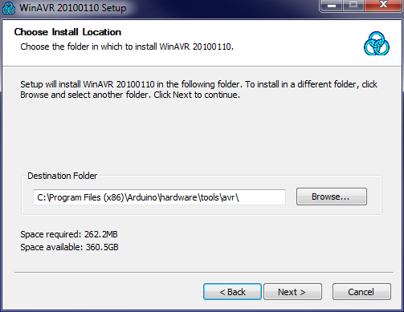
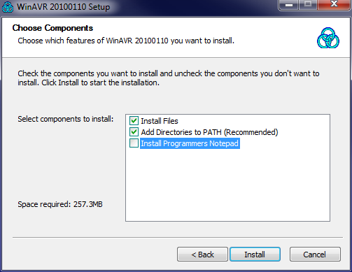
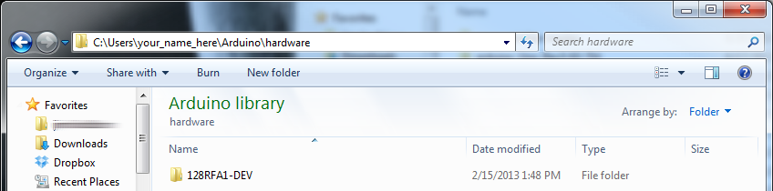
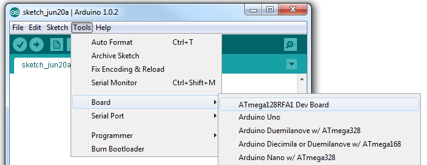

### Update WinAVR

Arduino is still (as of v1.0.5) packaged with an out-of-date version of WinAVR and AVRDUDE. This older version does not support the ATmega128RFA1.

The version of WinAVR in this directory (WinAVR-20100110) should be installed over the WinAVR included with Arduino, which is located in the Arduino\hardware\tools\avr directory. Follow these steps to update WinAVR:
<ol>
<li>Run the WinAVR-20100110-install.exe in this directory.</li>
<li>Cick "Run", Select your install Language, Click "Next", Click "I Agree" (unless you don't?), until you get to this the install location screen.</li>
<li> On the install location screen, click **Browse..**, and navigate to the *../hardware/tools/avr* directory wherever your Arduino install is (with the Arduino installer, this should be about where it is:

</li>
<li>Click next. On the next screen, make sure *Install files* and *Add Directories to PATH* are selected. *Install Programmers Notepad* is optional.

</li>
<li> Click *Next* and wait for the install to finish.</li>
<ol>

### Add the Board Definitions File

The 128RFA1-DEV folder should be added to a *hardware* directory within your Arduino sketchbook. Normally the sketchbook will install to your documents/Arduino folder. If a *hardware* folder isn't already there, make it.

This directory contains a *boards.txt* file which defines the ATmega128RFA1 Dev Board, and adds a selectable option under the *Tools > Board* menu. When you open the Arduino ID (close and reopen if it's already open), this option should be added to the menu:

