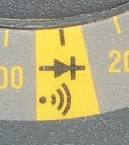
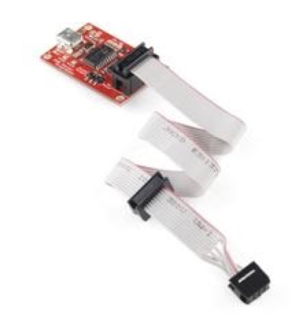
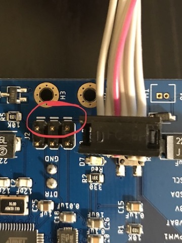
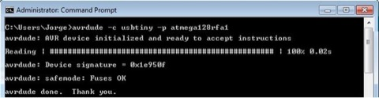
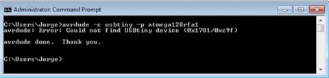
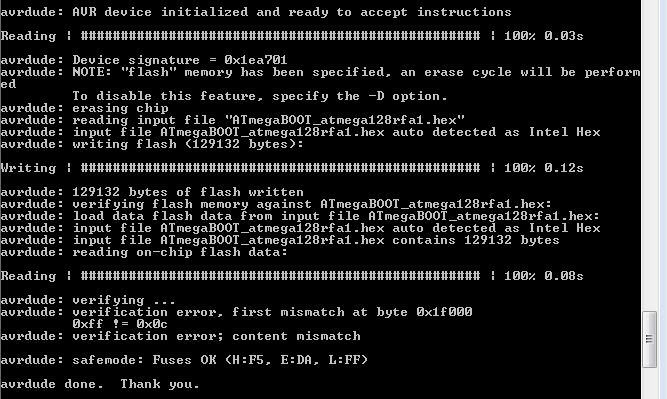

# Flashing the Bootloader and Bringing up Your Board

## You Will Need

1. Your board
2. A battery.
3. ISP Programmer
4. FTDI Board 
5. Multimeter
6. A computer with Arduino

## Electrical Short Test

By this time you should have received your PCB from manufacture and solder all the components to your board.  Before you power your board for the first time it is wise to check for shorts.  Use a multimeter to check for shorts between VBAT and GND and between 3.3V and GND.  Set the multimeter in continuity mode:
  


Then apply the probes to the test points on or breakout headers.  If you hear a beep when touching a power net and a ground net, there is a short somewhere in your board and you need to fix it.  Talk to the TA or the instructor.
    
## Sanity Check (Device Signature Verification)

The in-system programmer (ISP) let's us program the microcontroller while it is installed on a PCB.  The first step is to connect the ISP programmer to the board.  Here's picture of the programmer:



Attach a charged battery to your board, then connect the board to the AVR ISP programmer and the USB cable to your computer.  The 6-pin connector attaches the 6-pin header on your board.  The cable should point toward the three dashed lines on the side of the header:



If the lights on the programmer go out, you have an electrical problem.  Look for solder bridges, then talk to the course staff.

The next step is to establish communication between your board and the ISP programmer. 


First, check if your compute can communicate with the board.  For this (and the rest of the flashing process) we are going to use a command line tool called `avrdude`.  It can do tons of things to microcontrollers and is what Arduino uses internally.

Open your command line and type the following (it can take a few seconds to run):

```
avrdude -c usbtiny -p atmega128rfa1
```

If this doesn't work, check the following

* The `avrdude.exe binary` is in `Arduino/hardware/tools/avr/bin` on Windows and in `/usr/local/bin/avrdude` in MacOS.
  - You can add this path to your environmental variables paths so you can use this command in any directory in your shell.
* `avrdude.exe` asks for a `avrdude.conf` file. This file may be located in   `Arduino/hardware/tools/avr/etc`
  - You can copy averdude.conf to `Arduino/hardware/tools/avr/bin` or you can add the path to where you dowloaded `averdude.conf` like in the following command: `avrdude -c usbtiny -p atmega128rfa1 -C ~/Downloads/avrdude.conf`
* If avrdude doesn’t recognize the "Pocket AVR Programmer" you can find the drivers in the following website: https://learn.adafruit.com/usbtinyisp/download.

When it's finally successful, you'll see a message like in the following image should be displayed.



If the command displays an error (see images below) it means that the computer is not able to communicate to your board or that your computer couldn’t find the AVR ISP Programmer.



The above error happens when your computer can’t find the AVR ISP Programmer. To solve this check that the device driver for the AVR ISP Programmer is installed.  If the tool suggests that your "override" with `-F`, don't bother.  It won't help.  Talk to the course staff.

For more information about how to use avrdude check this website: https://learn.sparkfun.com/tutorials/pocket-avr-programmer-hookup-guide 

## Flashing the bootloader

You are now ready to "flash" the bootloader.  This means we are going to write the bootloader into the non-volatile memory of the microcontroller.  The bootloader is a small program that allows us to reprogram the microcontroller over the serial port instead of the ISP header.
  
You’ll need the hex file that contains the bootloader.  It’s part of the `QuadClass_Atmega128RFA_Arduino_Addon` repo you intalled in Arduino during the first Arduino lab.  The file you need is `QuadClass_Atmega128RFA_Arduino_Addon/avr/bootloaders/ATmegaBOOT_atmega128rfa1.hex`

To flash the bootloader, run the following commands. The last one will fail, see below.

```
 cd <your quacopter repo>/firmware/hardware/QuadClass_Atmega128RFA_Arduino_Addon/avr/bootloaders/
 avrdude -p atmega128rfa1 -c usbtiny -e -u -U lfuse:w:0xff:m -U hfuse:w:0xda:m -Uefuse:w:0xf5:m lock:w:0x3F:m
 avrdude -p atmega128rfa1 -c usbtiny -B 1 -U flash:w:ATmegaBOOT_atmega128rfa1.hex -U lock:w:0x0f:m
```

The second command sets the fuses in the AVR microcontroller to configure the microcontroller to use an external clock, among other things.  The third command copies the `ATmegaBOOT_atmega128rfa1.hex` to the microcontroller.

The last command will fail due to a big in `avrdude`. You’ll see something like this:



This is a known issue and is because the `USBTinyISP` protocol that we are using with the “[Pocket AVR Programmer](https://www.google.com/url?q=https%3A%2F%2Fwww.sparkfun.com%2Fproducts%2F9825&amp;sa=D&amp;sntz=1&amp;usg=AFQjCNE9r-L1FIzqw8_vdyJFJjEe-tV_Ew)" is incapable of addressing memory addresses in excess of 64 KB. In our case the atmega128RFA1 is of 128K.
“… Someone in the code put uint_16 for the address so it overflows…” (Ignore the error!)

## Programming The Board With Arduino

Open up the Arduino IDE and make sure it's configured properly (See notes in "Programmin The Hardware Lab").  The run the blink test on the board.  Your PCB should have a blinking light!  

Your board is not ready for use!

## Bringup

"Bringing up" a board means carefully checking that each component of the board works as expected.

There is a tendency to move to quickly during bringup, but take your time.  If you try to run a big piece of software at first, the bugs will be much harder to find.

### Bringing up the BBB

You should be able to the Arduino blinking light test.  You can also run `test_remote_harness.ino` on the BBB and `test_remote.ino` on your loaner remote.

### Bringing up the Remote

A purpose-built tester is useful here.  For instance, for the remote, there is `Quadcopter-Remote/src/test_remote/test_remote.ino` and `Quadcopter-Remote/src/test_remote/test_remote_harness.ino`.  `test_remote.ino` runs on the remote and transmits a bunch of data to another device (a working remote or a FCB) running `test_remote_harness.ino`.  It tests all the software-accessible components of the remote.
It doesn't, however, check that the battery charger works.  So, you'll need to verify that mannually.

### Bringing up Your Quadcopter

Your code from the first remote/FCB can also serve as a good starting point.  When bringing up your quadcopter, remember that the pin assignments may be differnt, so you may need to modify the code slightly.

