# Assembling Your Quadcopter

Assembling your quadcopter is similar to assembling the BBB board, but more involved because there are more components.

You should re-read the [BBB assembly lab](Readme.md).  Everything there applies here as well, including the suggested order for assembly.  Below are just the differences.

If you want to build a remote to keep, here are [the instructions](Building-Your-Own-Remote.md).

## Preparing Your Part Kit

You can think of the part kit for your quadcopter as breaking into three parts:

1.  The parts that are common to all the quadcopter designs.
2.  Additional instances of the parts common parts.
3.  Parts specific to your design.

For the first group, we have part packets prepared for you just as we did with the BBB board.  Grab *one* of each packet.

The second group is usually resistors and mosfets (e.g., to control LEDs).  Take additional packets of these parts to get what you need.

For the third group, we have ordered parts from Digikey for you.  Each part will come in it's own bag with the "customer reference" field containing the list of reference designators that the parts correspond to.

## Part Notes

The quadcopters have a few parts that were not on the BBB.  Here they are (quantities are for the core design.  You may have other parts, depending on your LED design):

### Surface Mounts Parts

| Part              | Qty | Picture                                            |
|-------------------|-----|----------------------------------------------------|

| MOSFET            | 4   |   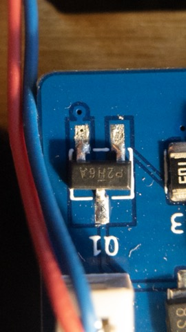.                    |
| IMU               | 1.  | 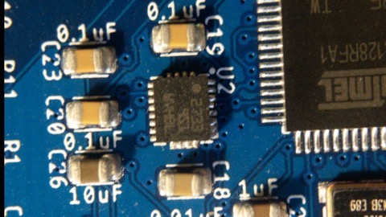.                            | 
| 10KOhm Resistors  | 6   | 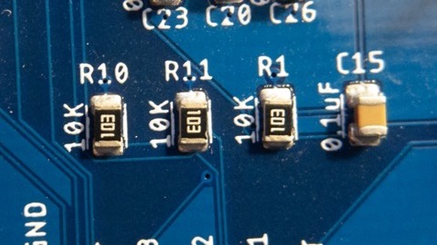.                 |
| 330Ohm Resistors. | 2.  ||
| 220 uF Capacitor  | 5   |             |
| 0.01uF Capacitor  | 1   | 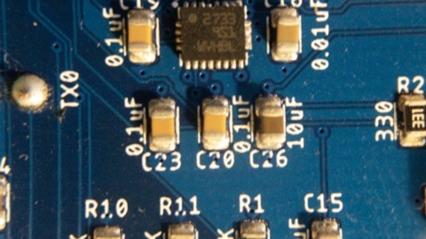.              |
| 0.1uF Capacitor.  | 4   ||
| 10uF Capacitor.  | 1   ||
| 12uF Capacitor.  | 2   ||
| 22uF Capacitor.  | 1   ||
| 0.75uF Capacitor.  | 1   ||
| Diode             | 4   | .            | 
| MCU.              | 1   | .                  |
| Crystal           | 1   | 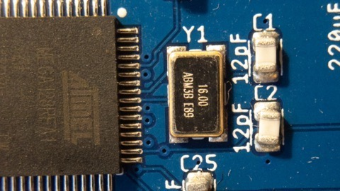.                      |
| Balun             | 1   | 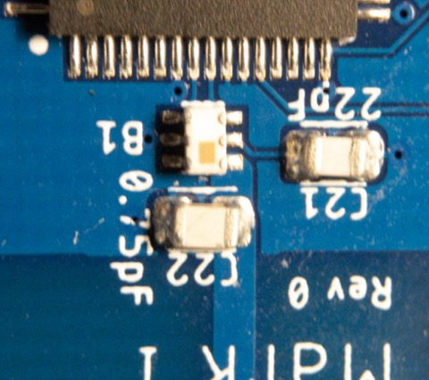.            |
| LED Red &Green    | 1   | 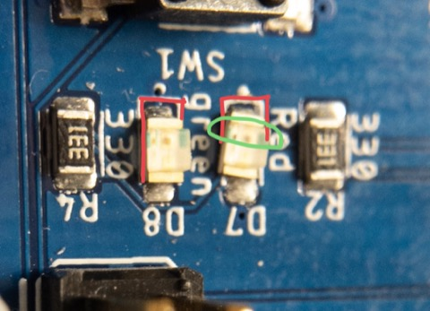.                |
| Voltage Regulator | 1   | 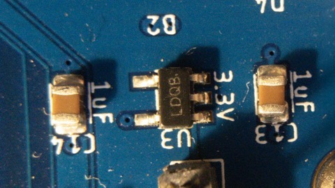.            |

### Through Hole Parts

| Part              | Qty | Picture                                            |
|-------------------|-----|----------------------------------------------------|
| Motor Sockets     | 4   | 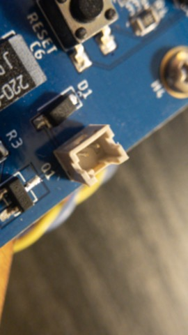.          |
| FTDI Header.      | 1   | 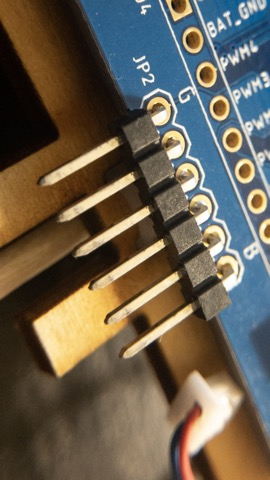.                  |
| Button            | 1   | 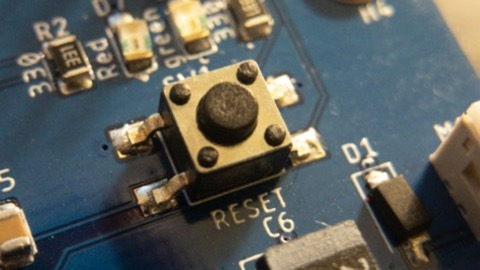.                      |
| Screw Terminals   | 1   | 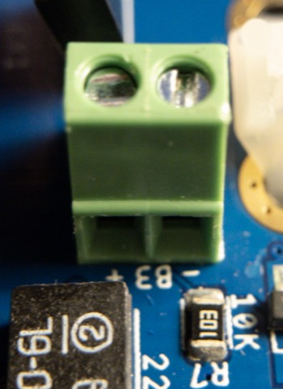.          |
| 2-pin Header      | 3   | 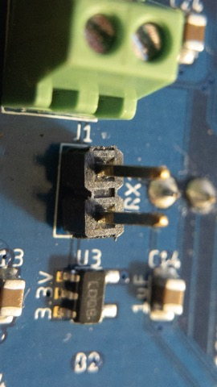.                |

## Assembly Drawings

Eagle provides a simple mechanisms to help you place parts.  Open your `.brd` file.  You need to enable  the "Design Manager" (`View->Design Manager`).

The "Devices" pane shows a list of all the parts in your design.  Sort the list by "value" and hide the other columns (wrench icon).

You can now select all the parts of a given type and Eagle will highlight their location on the board.

## Time Management

Assembling your boards will take longer than the BBB, because there are more parts, and class time is limited.  To ensure you have time to apply paste, place parts, and reflow the boards, you must start applying paste **at the beginning of class**.  

We will have stations set up for applying paste at 10am on days we are doing assembly for this purpose.

This means you need to have your part kit completely assembled **the class period before**.  If your part kit is not ready at the starte of class, we will not let you start assembly that day.

You also need to work quickly.  Your quadcopters have between 70 and 100 parts (vs 30 for the BBB), and you need to complete assembly at least 1 hour before the end of class (2pm).  This means you need to be placing 1 part ever 30-45 seconds or so.  Keep an eye on the clock.

## Scheduling

On assembly days, the TA will set have parts out by 10am and paste assembly stations ready by 10:30.

On Tuesdays, you must have boards ready for reflow by 1pm. 

On Thursdays, we have to vacate the room by 1pm.  I would suggest starting (and finishing) assembly in the main maker space work area.  Again, you must be ready to reflow by 1pm.

The TA and I both have other obligations after class after on some days.  This means that if you aren't ready to reflow in time, we may not be able to stay after to reflow your board.

The soldering stations are available for hand-soldering the through-hole parts.  You can work on this whenever the maker studio is open.

## Tips, Tricks, Bells, and Whistles

### Attaching the Motors

The spec for the board, should provide a snug fit for your motors, but the board milling process is not perfectly precise.  Also, the motors are subject to significant stress during testing (as your board bangs around the test stand).  To hold the motors in place, hot glue works well.  Position the motors as you like and apply 1-2 _small_ amount of got glue to the corner formed between your PCB and the motor.   You don't need very much and applying alot will make a mess and make it difficult to remove the motors later.

Do not using anything stronger (e.g., super glue or gorilla glue).  It makes a mess, is too brittle, and is very hard to remove.  Hot glue is really the about perfect.

### "Feet" for Your Quadcopter

It's useful to have something for your quadcopter to stand on so it sits level on the ground.  This is especially handy when you are calibrating your IMU.   You have several options:

1.  You can use the motors.  Position them to ride low, so the bottom extends down a ways, and make sure you put them all at the same height.  The draw back is that wires can get banged around.
2.  3D print something.   Go crazy, but remember that weight is an issue.
3.  A piece of light foam would make a pretty good landing pad.  You can even use part of a household sponge.
4.  The battery can also help here if you mount it underneath.

### Attaching the Battery

The battery is awkward, and it's a hard problem to solve.  Many things can work, but few look great:  Blue tape, rubber bands, velcro.  

One thing that might help is shortening the wiring harness that connects to your quadcopter.  Play around until you find a good length and then trim it short.

We also have some plastic "cages" you're welcome to use.

