# Assembling PCBs

During this lab you will assemble and "bring up" a PCB.  This is practice for assembling and bringing up your quadcopter.

This lab is to be completed on your own.

You will assemble a simple Arduino-compatible board based on the microcontroller we are using for this course.  It's called the Bare Bones Board (BBB).

These instructions apply to assembling your quadcopter and to building your own remote control that you can keep after the class is over.  [Read this](Building-Your-Own-Remote.md) for more details.

Note specific to assembling your quadcopter are [here](Quadcopter-Assembly.md).
## Preparation

Assembling a board (especially your first one) can take a couple hours.  Also, the working time for the solder paste is limited, so you need to work reasonably quickly once you start.

Begin by making sure you have everything you need.  For the BBB and quadcopter assemmblies we will, have everything you need set up ahead of time.

## Safety

The solder paste we use (like all solder paste) is potentially toxic (although it's lead-free).  The material safety datasheet is here: [MSDS](../../Datasheets/NP560_SDS_EN_(V3)US.pdf).

You must take the following precautions:

1.  You must wear eye protection while applying the paste or using a soldering iron.  The makerspace has glasses across the hall from our classroom.  Your own glasses are fine.
2.  You must wear gloves while applying paste and placing parts.
3.  You must not eat or drink while working with solder paste.  During assembly labs, no food or drink is allowed in the classroom.
4.  You must wash your hands before eating or drinking after the lab.

## Applying Solder Paste

### What You Need

1. Blue tape
2. Solder stencil
3. 4 scrap PCBs the same thickness as your board. 
4. 1 large putty knife
5. 1 small putty knife
6. Butcher or craft paper
7. Gloves
8. A magnifier
9. Alcohol in a pump dispenser
10. Kimwipes
11. Compressed air
12. Solder paste
13. Gloves

### Preparing Your Space and Aligning Your Stencil

You need a large, clear space to apply solder paste.

1. It can be messy, so cover everything with a big sheet of butcher or craft paper.  Tape down the paper, so it's not sliding around.
2. Tape down some scrap PCBs so they will hold your board still.  The PCB should be oriented so the stencil aligns with it in "portrait" orienation (tall rather than wide).
3. Align your stencil with your board so the wholes line up perfectly with the pads. This must be very precise.
4. Tape down the right edge of your stencil so you can easily lift it on and off your board like a page of a book.  The tape should be on the right, and there should be clear space for the stencil to lay flat.  
5. Check the alignment again
6. Verify your alignment with course staff.

### Apply Paste

1. Use the narrow putty knife to apply a thin (1cm) bead of paste to the edge of the wide putty knife.
2. Hold the wide putty knife at a 45-degree angle and drag it across the stencil, using firm (but not too hard), constant pressure to apply a thin layer of paste across across the stencil.  Press just firmly enough that there is a thin layer of paste left on the stencil (see photo).  If you push too hard, it will force paste through and slightly under the stencil, which is not what you want.  Move smoothly.  Do not stop.  Make sure you align the knife so it will pass over all the pads on the board.  You can only make one pass.
3. Turn the squeegee over and scrape the extra paste off the stencil with the squeegee almost vertical and held gently against the stencil.  There should be very little paste left.  Again, you can only make one pass.
4. Smoothly and in one motion lift up the stencil and fold it back.  Lifting it up and accidentally dropping it back onto the board is means redoing it.
5. Examine the paste pattern with your magnifier.  Look out for
   * Pads with missing paste
   * Indistict or touching -- even slightly -- paste blobs (esp. on the IMU, microcontroller, and balun).
6. Check it with course staff and point out any problems you spotted.
7. If it looks good, carefully remove your board.
8. If something is wrong, you'll need to remove all the paste using Kimwipes and alcohol and start again.  You can do this many times.
9. You need to be very exacting about paste application.  The solder needs to be very crisply defined.  If it doesn't look good, you'll have to redo it.  Redoing it is not hard, and it's good practice, so there's no point in settling for sub-standard paste application.

**A Stencil**

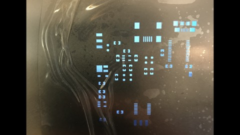

**Poor Stencil Alignment (some holes are dark)**

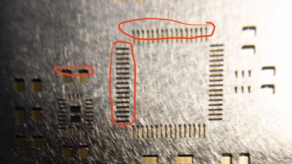

**Good Stencil Alignment (all holes are gold)**

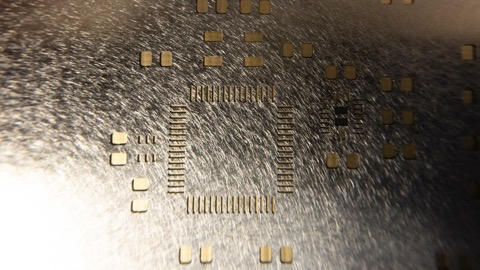

**Poor Paste Application**

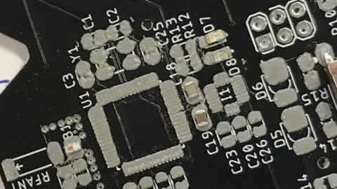

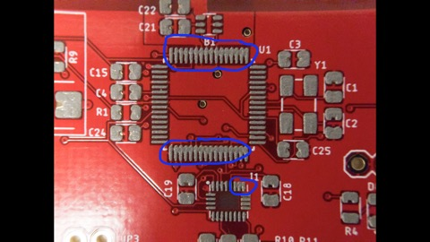

**Good Paste Application**

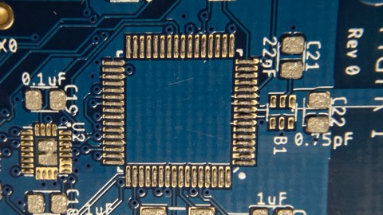

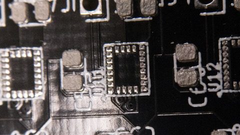

### Cleanup

1. If someone else is going to use putty knifes immediately, you can leave them.
2. If not (or in doubt), clean them by scraping large blobs of paste back into its container and wiping them with alcohol and kimwipes.
3. Wipe up any stray solder paste on the table, *both* sides of the stencil.
4. Blow any remaining solder paste out of the stencil holes with compressed air.

## Placing Components

### What You'll Need

1. A complete part kit for your board.
2. A pair of tweezers
3. A magnifier.
4. Steady hands.

### Get Organized

You need to place parts carefully and precisely.  You also need to work somewhat quickly.  With practice, you can place a board like the BBB in 10 minutes.  You should not take more than an 45 minutes.  Getting organized will help you meet this goal.

1. Get _everything_ you need together at once.
2. Collect all the parts you will need (see below).  For the BBB assembly, you will need 1 packet of each type of part.  They will be laid out for you.
3. Have a clean work area (preferably with a white surface).  The parts are _tiny_.  The less stuff there is around, the less likely you are to lose anything.
3. Allow adequate time.  
    * Paste has a limited working time, and the course staff are not around forever.    
    * For the BBB, Assembly will take ~0.5 hour.  Reflowing takes ~12 minutes.  Something will go wrong, budget an extra ~15min.  
    * So, you shouldn't start assembly unless you have _at least_ 1 hour left in class.
    * For quadcopter or the remote, allocate 2 hours.
5. Eat something before hand.  You need to patient and steady.

Most of the parts come on paper or plastic tape.  We have cut the tape to the right length for you and labeled them.  There are part portions available in the size required for the BBB and for the typical number of parts needed for your quadcopters.  This means you should take 1 piece of tape for each type of part on your board.

The throughhole parts are mostly loose.  Take just as many as you need.

### Placing Parts

1.  Dump the parts from one a packet out on your work surface.
2.  If a part is upside-down, picking it up and dropping it is a good (if probablistc) way to turn it over.
3.  Place the part gently and as precisely as you can.
4.  Once the part is on the board, move it as little as possible.  Moving the parts smears the paste.  The parts will self-align a bit during reflow, so it doesn't have to be perfect.
5.  Don't pick up the board.  You more likely to bump a part if you pick up the board.
6.  Arrange your pile of parts at your board so you don't have to reach over the board, otherwise, you're more likely to bump parts.
7.  Don't mess up.  If something goes significantly wrong, you have to start again.
8.  Do one type of part at a time (e.g., 1uF caps).  For the BBB, you should have exactly the right number of them, so when they are gone, you're done.
9.  Typing `show C1 C2 C3` in Eagle will highlight where `C1`, `C2`, and `C3` are on the board.   You can also say `show C*` to see where all the caps are.  For the BBB refer to the assembly drawings below.
10.  Place the parts very gently onto the board.  It should almost be like you are dropping them.  Do not press them down.  It'll displace the solder paste.
11.  If you think you've messed things up, get the TA or prof.  They may be able to save you...or not.

### BBB Part List

| Part              | Qty | Picture                                            |
|-------------------|-----|----------------------------------------------------|
| Resistor 10K Ohm  | 1   | .                 |
| Resistor 330 Ohm  | 2   |                                                    |
| Capacitor .75pF   | 1   |          |
| Capacitor 12 pF   | 2   |                                                    |
| Capacitor 1uF     | 6   |                                                    |
| Capacitor 22 pF   | 2   |                                                    |
| Button            | 1   |                        |
| Crystal           | 1   |                      |
| LEDs              | 2   |                 |
| Balun             | 1   |              |
| Power Switch      | 1   |                                                    |
| Microcontroller   | 1   | 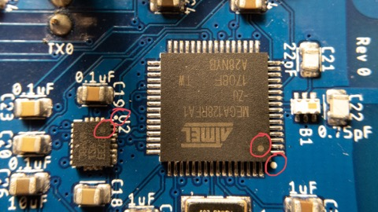 |
| Voltage regulator | 1   |  |
| Headers(ISP)      | 1   | 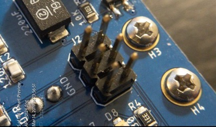                     |
| Headers(FTDI)     | 1   |                     |
| Headers(Power Jumper)   | 1   | )          |
| Battery Terminals | 1 |   |

### Notes on Particular Parts

I suggest you proceed in this order.  This is roughly from easiest to hardest.

This list covers all the parts on the BBB, your quadcopter, and the quadcopter remote.  Some parts only apply to one or two of those boards.  The parts that are relevant for BBB assembly have a BBB assembly drawing showing where, exactly, those parts should go.

Note that on the remote, there are many parts you will leave unpopulated. Only put parts where there is solder paste.   

In the photos, I've highlighted the polarity markings on the board and the part.

#### Resistors

1. These are pretty easy -- a good warm-up.
2. Make sure they are marking-side-up.

##### BBB: 10KOhm Resistors

##### BBB: 330Ohm Resistors

#### Capacitors

1.  The small caps are non-polarized, so direction doesn't matter. 
2.  Align the big caps carefully.  If you get it wrong your board will look ugly.

## 0.75 pF Caps

## 12 pF Caps

## 1 uF Caps

## 22 pF Caps

**Good Cap Placement**

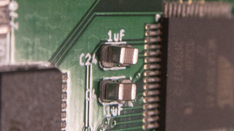

#### Voltage Regulator and Battery Charger.

1. Orientation is obvious (there's three pins on one side and 2 on the other)
2. Be sure not to confuse these two if you are assembly a remote.
3. Only the remote has a charger.

## Voltage Regulator

#### Button 

## Button

1. Either orientation is ok.

#### Crystal

## Crystal

1.  It seems like orientation should be important, but it's not.  The part is diagonally symetric. 

#### LEDs

1. This is your first polarized component, pay close attention or your board will be doomed to darkness.
2. The green line (yes, there really is one) goes near the dot. 

## LEDs

#### Diodes

1. These are also polarized, but the markings are extremely hard to see.  They are printed black on black.
2. If you hold the diode and look at in the light, one end has a faint rectangular bar code on it.  The other has an "8"
3. The barcode goes near the dot.

#### Balun

1.  The red dot faces up and goes next to the dot.  This means the red dot will be farther from the microcontroller and nearer the antenna.
2.  Pay close attention to the aligment.
3.  Check it with your magnifier.

## Balun

#### Microcontroller

1.  Make sure you orient it correctly.  The dot goes next to the dot.
2.  The silkscreen markings fit tightly to the corners of the package, so use them as a guide. 
3.  Once it's down, check the alignment.  If it's not perfect, do not pick it up.  Instead, nudge it every so gently to align it.
4.  The magnifier will help you check alignment.  You can see the pads on the side of the package.  The pins on the package need to be aligned with the patches of solder paste on the board.

## Microcontroller

**MCU Alignment**

**Good MCU Placement**

## Reflow

### What You Need

1. A TA or professor.
2. The reflow oven.

## Touch Up and Throughhole Components

### What You Need

1. Soldering station.
2. A syringe of flux.
3. Thin, lead-free solder.
4. Swaps and/or a horse-hair brush.
5. Alcohol in a squirt bottle.
6. kimwipes.
7. Blue tape.

### Checking Soldering

**Good MCU Soldering**

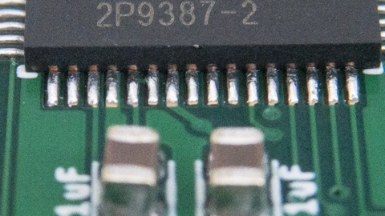

**MCU Soldering Requiring Touch Up**

### Cleaning up Flux Residue

Wire solder has flux in the middle to help the solder flow.  SMD rework requires adding flux manually.  In either case, the result is a yellow-brown, unattractive residue that starts out sticky and hardens over time.

To keep your board looking nice and clean, you should remove it ASAP.  If you have several things to fix, do not wait till the end.  Due it one part at a time.  To clean up the flux, place a kimwipe over the area and squirt rubbing alcohol onto it.  Then, take a hair brush of swap and rub the kimwipe around over the area.  It'll absorb the flux residue.  Repeat once or 
 twice.  Don't be shy with the alcohol, it won't hurt anything.

If you don't have alcohol in a squirt bottle, just get the kimwipe very moist with alcohol and put it on mannually.

### Mounting Throughhole Parts

You'll have to solder the through-hole parts by hand. The process is the same for all of them:

1.  The part goes on the side of the board with the reference designator.
2.  Tape down the part using blue tape. 
3.  The main challenge is getting them straight up and down and not crooked.  Do your best.

We aren't populating the big headers on the BBB to save time in class.

#### ISP Header

## SPI Header

#### FTDI Header

## FTDI Header

#### Power Jumper

#### Battery Terminals

1.  Similar to the headers, but orientation matters.  The holes on the side should point toward the '+' and '-' on the board.

### Common Reflow Problems

You should inspect all the parts on your board for problems.  

1. Sometimes solder won't reflow on some parts of the board.  You can tell because the solder paste is rough and not shiny.  To fix it, add a _tiny_ amount of flux and touch it with your soldering iron.
2. Parts sometimes get dislodged during reflow (It's actually pretty windy in the oven).  If only one terminal of the device is still connected, melt that side and lift it up.  If two terminal are connected, see course staff.
3.  You realize you forgot a part.  See course staff for a lesson in mannual surface mount assembly.

## Flashing The Bootloader

Once you've assembled your board you need to [Flash the bootloader and bring up your board](Flashing-The-Bootloader.md)

## Turn in Your Work

Demo you working BBB for the course staff:

1.  Upload a sketch
2.  Blink an LED (using the example code is fine)
3.  Complete the reflection for this lab: https://docs.google.com/forms/d/e/1FAIpQLScKSJucU3BTdXCpcaoRSXui36gL--QQvO2Y9j9LpOaGY0qj-w/viewform

## Remote/Quad only 

#### MOSFETs (Quad Only)

1. The correct orientation is obvious, since the package asymmetrical.
2. You need to align the pins carefully.

#### IMU (Quad only)

1.  Similar to the microcontroller.
2.  The dot goes near the dot. (see image above for MCU)
3.  Use the silkscreen markers to align it and the "drop" it on.
4.  The pads are smaller, so alignment is more important.
5.  Don't fiddle!

#### Motor Recepticals (Quadcopter only)

1.  Orientation is very important.  Removing/replacing these things is really hard. 
2.  The pins are not centered, and part should be oriented so it fits completely inside the silkscreen outline.  If it's backwards it'll protrude on one side.

#### 6-pin Header (Remote Only)

1.  The surface-mount 6-pin header is not hard to place, but it sticks up and is easy to bump, so do it last.

#### USB Receptical (Remote Only)

1.  The key point of alignment are the pins on the back and 5 pads on the board.
2.  Check it with the magnifier.
