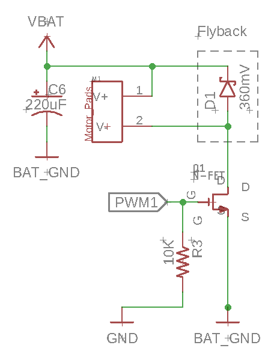

# Assembling The Quadcopter Schematic

To be completed in pairs.

Check course schedule for the due dates. 

## Skills to Learn

1. Design a schematic to match a written specification.
2. Integrate portions of a referenc design into your schematic.
3. Read and understand key portions of part datasheets.

## Equipment, Supplies, and Software You Will Need

1. The starter repo for this lab: https://classroom.github.com/g/LqnP9DDz.
2. The `custom.lbr` library you built in previous lab. (Copy and commit it in your lbr/ directory for this lab).
3. The design files for the remote: https://github.com/NVSL/QuadClass-Remote.

## Preliminaries

### Install Eagle Premium Edition

Sign up here to get an Autodesk Student account: http://www.autodesk.com/education/free-software/eagle.

Download and install Eagle Premium.

### Setting up Eagle

The repo for this lab will evolve to hold all the hardware and software for your quadcopter. To keep Eagle happy and make it easier to access and update libraries, remove all the other directories from the list of library directories and replace it with the `lbr` directory in this lab’s repo.

Copy and commit your `custom.lbr` into `lbr`. You can decide to use one or another of the libraries from each of your team members, or you can copy them both as custom `_<name>.lbr`.

### Make Eagle Easier to Use

By default, Eagle comes configured with a bunch of libraries that can make it hard to find the libraries we are using for this class.  This is controlled the directories Eagle is setup to look in for library and other files. You can change the directories by selecting “Window->Control Panel” and the selecting “Options->Directories”. I suggest the following settings:

* Libraries: `<path to>/quadcopter-<gitusername>/lbr`
* Design Rules: `<path to>/QuadClass-Resources/Eagle/DRU`
* CAM Jobs: `<path to>/QuadClass-Resources/Eagle/CAM`
* User Language Programs: `<path to>/QuadClass-Resources/Eagle/ULP`
If you don’t want to replace the defaults, you should at least append these to directories already there.

Sometimes this does not cause the libraries to disappear from the “add part” dialogs. To make them go away, select `Options->Library Manager`, then select all the libraries you don’t want to use and click ‘remove’. There should just be handful left (e.g., Lab01.lbr, Lab01_smd.lbr, custom.lbr,…).

### Making Sure Your Repo is Up-to-Date

If I find a bug in the repo, I will commit changes to the base repo. I’ll announce these commits via piazza or email.

To retrieve the new version, you can do the following:

```
git remote add upstream git@github.com:NVSL/QuadClass-Quadcopter.git
```

```
git fetch upstream
```

```
git merge upstream/master
```

Detailed instructions are here: https://help.github.com/articles/syncing-a-fork/.


## Assembling the Schematic

You’ll build the schematic for your quadcopter starting from an empty Eagle schematic.  You'll assemble the design by studying fragments of other design and the datasheets for the components you will use.

The only libraries you should use in assembling your schematic are `quadparts_prebuilt.lbr`, your `custom.lbr`, and `LED.lbr` (which you'll build).  Eagle comes with a bunch of built in libraries.  They are off limits.

Name your schematic `quadcopter.sch`.  Put it in the `hardware` directory of your quadcopter repo.

### General Schematic Style Guidelines

Here are the course style guidelines for schematics. Your schematics must adhere to these guidelines.  If you don't, Eaglint will give warnings and we won’t accept the design.

1. You should not use any libraries other than `quadparts_prebuilt.lbr`, your `custom_*.lbr`, and your `LEDs.lbr`.
2. All visible net and component names must not have “$” in them. When Eagle automatically generates names for nets and components it includes “$”. This is fine if the name is not visible (e.g., on an anonymous wire between two components), but if you it shows up on your schematic, you should give it a nice name like “C1” or “U1”.
3. By convention power supply symbols point up, and ground symbols point down. Neither should ever point to the side.
4. Nets should not cross each other unless they are electrically connected.
5. Nets should only be drawn at right angles.
6. Eagle embeds libraries in the `.sch` and `.brd` files. To keep them up-to-date, use `Library->Update` or `Library->Update All`. We won’t accept designs with inconsistent libraries.
7. Include a frame around our schematic.  Use device `FRAME_B_L`.
8. Use lines in `Info` layer to divide the frame into logically related regions (e.g., the IMU, the power supply, and the microcontroller). See the BBB schematic below for an example. Drawn nets shouldn’t cross these boundaries.
9. Use drawn nets connect components that are closely related (e.g., between the caps and the microcontroller in the BBB schematic)
10. Use named nets to connect separate “sub units” of your schematic. For instance, use drawn nets to connect all the capacitors to your IMU, but use named nets to connect your IMU to the microcontroller.

### The Microcontroller

Here's the schematic for the BBB without the voltage regulator.  It's the reference design for your microcontroller, the radio, and the associated circuits.


You should use the schematic as a guide for constructing the microcontroller portion of your schematic.

There are some changes you will need to make to this schematic based on what's required by the other components.  This is just a starting point for your circuit.

If you have questions about the parts attached directly to the microcontroller (including the radio), the first place to turn is the microcontroller datasheet.

### The IMU

The IMU datasheet contains all the information you will need to use connect the IMU to the microcontroller. A few things to keep in mind:

1. The IMU datasheet is not the best. If something doesn't make sense search the pdf.
2. There are actually two logical devices in this package: the accelerometer/gyroscope (A/G in the datasheet ) and the magnetometer (M).
3. Both devices will operate in I2C mode only and connect to microcontroller via I2C.
4. You must follow all the recommendations regarding external capacitors attached the IMU.
5. You will need to take care to configure the IMU's I2C addresses. It has two: One for the gyroscope and accelerometer and another for the magnetometer. The address for the gyro and accelerometer should be set to `1101011`. For the magnetometer it should be `0011110`.  You should read the datasheet to learn how to do this.
6. Power supply voltage and IO voltage will be 3V3 in our design, so connect them to `3V3`.
7. We aren't using the interrupt features, so you can leave `INT_M`, `INT2_A/G`, `INT1_A/G`, and `DRDY_M` disconnected.
8. `DEN_A/G` should be connected to `3V3`.

Most of the information you will need is Section 5 of the datasheet. A thing to know about datasheets: They almost always (although, frustratingly, not always) tell you everything you need to know. They don't, however, make it easy. You need to read carefully and thoroughly. You can't skim the datasheet and expect to know the details of how to connect each of the pins to configure the IMU properly.  You actually need to read through the tables.

### The Motor Driver 

Here's a picture of the motor driver circuit:



Build four copies to drive the four motors you'll need.  All the parts you need are in `quadparts_prebuilt.lbr` or your `custom.lbr`.  There's only one (non-light emitting) diode in the library, use it.

You'll need to connect the PWM control lines to suitable pins on the microcontroller. The suitable pins are marked with "~" on microcontroller's schematic symbol.

### The Power Supply

The quadcopter draws power from from a LiPo battery that nominally provides between 3.7 and 4.2V. This voltage is too high for the IMU and the microcontroller and the motors (which we will power directly from the battery) will create all kinds of noise on both the battery supply and ground rails.  To solve both of these problems, we will use a low-dropout (LDO) voltage regulator to provide a stable 3.3V power supply to the IMU and the microcontroller.

As a result, your quadcopter will have two power rails: An unregulated power rail (called `VBAT`) that provides power to the motors and input of the voltage regulator and is driven directly by the battery, and a regulated supply driven by the voltage regulator (called `3V3`).

The power supply for quadcopter needs to contain the following parts:

1. The battery. This is the `BATTERY` device in `quadparts_prebuilt.lbr`.  You need to use the `-SCREW-TERMINAL` variant.
2. A two-pin `jumper` to disconnect the positive terminal of the battery from `VBAT`.  Use the `-MALE` variant of `HEADER-0.1IN-2POS` in `quadparts_prebuilt.lbr`.  
3. A LP3985-series 3.3V regulator (see device `TPS73633-DBVT`).  You can find it's datasheet by looking it up on Digikey.

To the extent possible, we need to isolate the the IMU and the microcontroller from the noise that the motors will create on the power supply lines.  The motors will cause noise on both their power supply ( `VBAT` ) and ground return lines, so we will provide them with separate power and ground lines. For the power line, this is easy: Just connect the power supply for the motor drivers directly to the battery's positive terminal.

For the ground line, it is more challenging, since all the devices on the quadcopter must share a common ground reference. The best we can do is to structure our schematic so that we can exercise tight control over how the ground line is laid out on our PCB. To do this, create a separate ground net that connects the ground terminals of motor controllers to each other and the negative terminal of the battery (call it `BAT_GND` and use the `BAT_GND` device in the `quadparts_prebuilt.lbr` ). Then connect the digital ground (i.e., the ground that connects to other components, aka `GND` ) to the battery ground using a schematic component called a "net bridge" (see below). We will see in Lab 8 how we can use this structure to isolate the digital components. (This is a very important step, and we added it to fix problems that occurred in all but one of the quadcopter we built in this class the first year it was offered). 

A "net bridge" is PCB part whose only purpose is to electrically connect two nets in a schematic while keeping the nets separate in schematic (i.e., the two nets keep their own names). To create a net bridge, create a package that consists of two SMDs that touch one another. They can be very small. Remove the tstop on the pads, since we won't be soldering anything to them.

Create a schematic symbol (what's a good symbol for something that just connects to nets?) and device for the bridge and use one to connect `BAT_GND` and `GND`. Put this new part in your `custom.lbr`.

It would also be nice if you could program and debug your microcontroller without a battery or with the battery jumper disconnected.  To enable this, we will let the regulator also draw current from the FTDI or ISP headers.  To enable this, connect the FTDI 3V3 pin, the ISP 5V pin, and the input of the regulator with a net called `VIN`.

Connect `VBAT` to `VIN` via a diode oriented to let current flow the battery to `VIN` but not the other direction.  This will protect the battery from the 5V that some FTDI and ISP programmers provide, while letting the battery drive the regulator when no programmer is attached. 

### Breakout Header

When your quadcopter comes back from manufacturing and you assemble it, some debugging may be necessary and that may include the need to measure what's going on in different parts of the circuit. To make this easier, I suggest including a debugging header in your design.

A debugging header is a set of pins that connects key signals to pins that you can easily probe during debugging. I suggest including the following signals:

* `GND`
* `BAT_GND`
* `VBAT`
* `3V`
* The control lines to the four motors
* `SDA`
* `SCL`
To create the header, you'll need a package, symbol, and device for an 10-pin (if you use the list above) header. Just connect these signals to the pins. You'll label them on the PCB when you do layout.

You can also break up the debug header into smaller headers. For instance, you could put a 3 pin header next to each motor with `VBAT`, `BAT_GND`, and the control line. It's always a good idea to include a ground on each debug header.

You can model the breakout header symbol/device/package on the 2-pin jumper we use to connect the battery to `VBAT`. Put the new parts in `custom.lbr`.

Debugging headers can be a little dangerous, because it can be easy to accidently create a short circuit between two of the pins when you are debugging.  This is especially dangerous if you connect a power net and a ground net.  To avoid this, intermingle the PWM, SDA, and SCL lines with the power and ground lines.

### Some LEDs

You should also add some LEDs to your design. There are several reasons to add LEDs to your design:

1. It'll make it easy to tell which end of your quadcopter is the front.
2. They look cool.
3. They can provide information about what's going on in your flight control software.

There are several options for powering and/or controlling LEDs:

1. You can connect them directly to battery power and battery ground. In this case, you can't turn them off, but they can be very bright.

2. You can connect them to pins on the micro controller. If you use a digital pin, you can turn them on and off. If you use a PWM pin, you can control their brightness. In this case, you must size the resistor properly to limit the current through the LED to 8mA (the limit on the per-pin current on your microcontroller).

3. You connect them to battery power and turn them on and off using a transistor connected to a microcontroller pin. Depending on the pin you use, you can turn them on and off or vary their brightness. The transistor we use in the motor controller should work fine. If you do this, you can drive multiple LEDs with the same transistor and pin.

Regardless of which approach you take, you will need to pick out your LED. To do this, go to http://digikey.com. And enter LED into the search field. You'll see a bunch of results. Likely candidates for smaller LEDs are to be found under "LED Indication - Discrete," while brighter LEDs can be found under "LED Lighting - White", "LED Lighting - Color".

You'll note there are a dizzying array of options (at this moment there are over 20,000 different indicator LEDs available). Digikey presents you with a decent searching interface. Go exploring! Things to keep in mind:

1. Any LED you choose needs to be available in small quantities (the "minimum quantity" column should say "1").
2. The need to be at least 0805 (1.25mm x 2mm).
3. They need to be reasonably cheap: no more than a dollar per LED.
5. If you are going to drive the LEDs directly with a microcontroller pin, you must limit current to 8mA and you should make sure that the LED will actually light up with 8mA (many bright LEDs will not).
6. They need to be compatible with the power supply you are going to use: 3.7-4.2V if you use the battery. 3V if you are going to drive them from the microcontroller.
7. Their current draw needs to be within the limits of how you are powering them.
	1. The microcontroller limits how much current each pin will supply.
	2. The microcontroller consumes some current, as does the IMU (check the datasheets).
	3. The voltage regulator has limits on how much current it can provide.
	4. Make sure that voltage regulator can handle all your LEDs in addition to the microcontroller and the IMU.
	5. If you are powering them with VBAT, limit total current draw for all your LEDs to 500mA.
8. The current draw depends on forward voltage. The LED datasheets will contain some graphs that relate voltage to current and current to brightness. Pay attention to them to make sure that a) you aren't drawing too much current and b) your LEDs will light up.
9. There are many different parameters to consider: Color, brightness, viewing angle, etc. You'll need to go learn about these by reading the datasheets, etc.
10. You will probably want surface mount parts, but you can also use through-hole if you want.
11. Digikey lists the typical forward voltage on the web page. The LED will work with larger or smaller voltages (up to a point. See the "absolute maximums" section of the datasheet for limits).
12. If the forward voltage of the LED is much lower than the supply voltage, you'll need a large resistor to limit the current. Alternately, you could put two (or more) LEDs in series. The total voltage drop across the LED(s) and resistor needs to be greater than or equal to the supply voltage.
13. You can use RGB LEDs, too. Checkout the datasheets for details.

You'll need to build the library entries for the LED you want to use and then integrate them into your schematic. You'll also need to include a current-limiting resistor. You'll need to use Ohm's law to calculate the correct resistor value (here's a tutorial: http://www.ohmslawcalculator.com/led-resistor-calculator). You will also need to be sure that resistor can handle the amount of power it will need to dissipate (see the datasheet). If our libraries doesn't include an appropriate resistor, you'll need to add one from the same family of resistors we are already using (check the datasheet for the resistors in `quadparts_prebuilt.lbr`). Make sure it's available in small quantities on digikey. Put the new resistors in `custom.lbr`.

One thing to keep in mind is that most LEDs are extremely bright when driven at full current. Indicator LEDs can be driven very gently and still be visible.  LEDs added for visual effect can be driven harder, but they can easily become so bright that you can't even look at your quadcopter without being blinded.  For this reason, any LEDs that you want to be bright need to be attached to PWM pins, so you can moderate their brightness.

Once you have picked your LEDs, write up a brief description of why your design will work. It should include the manufacturer and digikey part numbers for the LEDs, voltage and current you intend to run the LEDs at, how you plan to supply that voltage and current (some combination of IO pins, FETs, and resistors), and a brief calculation showing that you aren't drawing too much current from the IO pins/microcontroller (8mA/pin) or the battery (500mA). Put this in a file called `led_notes.txt`.

Put the LEDs devices/packages you create in `lbr/LEDs.lbr`. Reuse the LED symbol from quadparts_prebulit.lbr.

The packages/devices you build need to meet all the standards described in Lab 4.

Add an attribute called `CUSTOM` to the variants you create.  This will ensure they get ordered.

### Eaglint 

Your design needs to pass http://eaglint.nvsl.io, so commit your design, submit it, and fix the problems it finds. Remember, each time you run the tool it lowers your grade on the lab, so you need to check your design carefully before submitting.

## Turn in Your Work

"Perfect" score: 10

Initial points: 12

Things to remember:

1. Sync your .lbr with your .sch: `Library->Update All`.

Submit the following to your github repo:

1. Your `quadcopter.sch`.
2. Your `lbr/LED.lbr`.
3. Your `lbr/custom.lbr` (maybe renamed to custom_<name>.lbr and maybe two of them)
5. Datasheets for your leds in `datasheets/`.
6. Your `led_notes.txt`.
Submit it to Eaglint: http://eaglint.nvsl.io.

For this part of the lab, human review will succeed instantly, if you have no errors or warnings.

Once it passes, create a tag called "Lab04" Be sure to make it an "annotated" tag and push it to your repo (https://git-scm.com/book/en/v2/Git-Basics-Tagging). Verify that it is visible on github.
