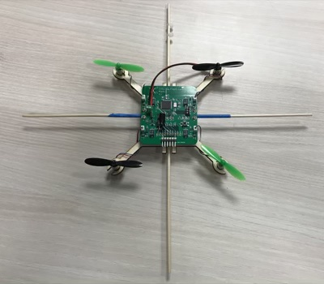
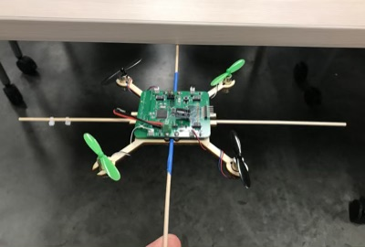

# Flight

To be completed in your groups.  This lab has several stages with different due dates.

## Tasks to Perform

This lab should get your quadcopter flying!  

In the best case, you would complete this lab with your quadcopter, but you should start with the FCB+airframe from your test stand.  There are several reasons for this:

1.  It's symmetric, so pitch and roll should be have the same.
2.  It's easy to repair (and we have lots of spare parts) -- you will crash a lot.  Better on the test stand than your board.
3.  It fits easily on the test stand.

Once your fligh control software works on the test stand, it should just be a matter of tweaking the PID values for your quadcopter. 

### The Last Axis

You need to add another PID controller for roll.  This will give you control over all three axes.  On the FCB, the pitch and roll axes should use roughly the same tuning pramaters, since our quadcopters are symetric.  You'll need to make sure that mixes is updated to pay attention to pitch too.

### Porting Your Code to Your Quad

Porting the code to your quadcopter should be easy.  The main thing you may need to change is the pin assignments for the motors.  You may also need to add code to control your LEDs.

### Tuning the PID Values

The process is same as it was for the test stand, with a few small changes, since the mass and balance of your quadcopter is different than on the test stand.  Both of these mean that the correct PID values for your quad are probably different than those for the test stand.

You can tune the values by attaching your quadcopter to the test stand. To do this, you can pull the pivot platform off the axel and attach your quad using tape or zip ties (available in the maker studio).  Or you can use tape (also available in the maker studio).

### Tuning the Roll PID Channel

The PID control for roll works the same as for pitch. In theory, if your quad is symmetric the PID values should be the same too. I would check by rotating the quad on the test stand and seeing how stable it is.

I have found it useful to attach the quadcopter to end of a stick (like the pivot from your test stand).  Then it can "fly" while you hold on to it.  With this you can check the general stability of either pitch or roll, and you can also check to make sure that your remote inputs are interpreted correctly (i.e., left on te stick means left on the quadcopter).

### Testing in All Together

To test all your PID axes together, you'll need to abandon the test stand.  A good first step is to leverage the two wood dowels installed on the FCB.

This will let you  fly the quadcopter against a table:

It makes it easier to switch from pitch to roll and lets you check whether the controls affect the quadcopter like you would expect.  

Once things seems pretty stable, you can put the quadcopter the floor with the stabilizers.  They  will reduce the likelihood of your quadcopter flipping over (a common failure mode).  

### Common Flight Pathologies

Lots of things go wrong during flight testing.  Here are some common problems.

#### Instable Flight

* When your quadcopter starts to leave the ground, it should not slip sideways across the floor.  If it does, adjust the trim until it takes off evenly.
* Your quadcopter's trim may change as the battery drains.  Re-trim frequently if flight becomes more difficult.
* Watch how your quadcopter's props slow down.  If one stops significantly before the others, it might be rubbing on something (e.g., a prop guard), which will make it ineffective.
* After a crash, it's common for your prop guards to move up and sometimes touch the propellors, reducing lift.  Push down on the prop guard to reseat.
* high-frequency occilations (2-3/sec) -- decrease D coefficient for that axis.
* Low frequency occsilations (0.5/sec, which will manifest as the quadcopter swinging back and forth in the air) -- increase P.
* Crashes immediately and repeatedly -- put it back on the test stand and tune some more.
* Check your battery level frequently.

#### Crashes 

You are going to crash alot. Crashes can damage your motors and propellers, causing your quadcopter to suddenly become unflyable.

If things are working pretty well, you crash, and then nothing seems to work, check the following:

1.  **Check your battery** Weak batteries can't fly a quadcopter.
2.  **Propellers** Bent propeller tips can reduce thrust enough to making the quadcopter uncontrollable.  Try replacing any that look damaged.
3.  **Motors** If one side of your quad seems weak and the propellers are good, try a new motor.  If it helps, cut the wires on the motor that was bad.  You never want to use it again.

**Note for COVID**: for the last two, check with the staff to verify what's wrong. 

#### Trouble Getting Airborne

You may also find that you have trouble getting your qudacopter off the ground cleanly.  Near the ground, the ground interferes with the propellers, causing the quadcopter to misbehave.

The bottom of the quadcopter may catch on the ground, causing it to tend to flip over.

A (sometimes) solution to both of these problems is to give it a quick boost to get it off (and away from) the ground.  You can also try launching from your hand.  The downside is that both of these techniques will increase the severity of crashes.

### Turn in Your Work

This lab has 5 stages -- one per class meeting for the last few weeks of the quarter.  The goal is to force you to make progress toward flight and prevent you from waiting till the last minute.

#### Commit your results:

1. Commit an updated version of `quad_firmware.ino` and `remote_firmware.ino`.
2. Updated version of `noise.txt` with updates filter configuration parameters
   (if you changed them), and the your PID and values for each axis.

Once you’ve committed everything, create a tag called “flight-1” Be sure to make it an “annotated” tag and push it to your repo (https://git-scm.com/book/en/v2/Git-Basics-Tagging). Verify that it is visible on github.

#### Demo your work:

1. Demo your clean orientation measurements for the TA.
2. Complete the reflection for this lab: https://docs.google.com/forms/d/e/1FAIpQLSfB8XsDV8FtTZYO1mv3FZrd9mUs1hDlFvQxnfAK0K2zptTjxQ/viewform

### Rubric

The "flight levels" (FL) are based on the following levels that build to stable, sustained flight.

1. "Roombaing" -- moving around the the floor with dowels installed with direction control and minimal yaw
2. Repeated, vertical hopping (>1 inches, > 0.25 second)
3. Repeated, vertical hopping (>6 inches, > 1 second)
4. Repeated, vertical hopping (>12 inches, > 3 seconds)
5. Short flight (>12 inches, > 6 seconds)
6. Sustained flight (> 12 inches, > 10 seconds, demostrate yaw control)
7. Sustained flight (Fly long enough to consume an entire battery)

You should be making constant progress.  `FL++` means one level better than you did the last time.  You can't make up points you miss (this is to disuade you from procrastinating).

#### Stage 1

Possible points: 2

1. Roll works just as well as pitch on the test stand.
2. Achieve FL1

#### Stage 2

Possible points: 2

3. Achieve FL++ (Nominally FL2).

#### Stage 3

Possible points: 2

4. Achieve FL++ (Nominally FL3).

#### Stage 4

Possible points: 2

5. Achieve FL++ (Nominally FL4).

#### Stage 5

Possible points: 2

6. Achieve FL++ (Nominally FL5)

#### Bonuses

1.  Achieve FL5: 2 points
2.  Achieve FL6: 5 points
3.  Achieve FL7: 10 points
