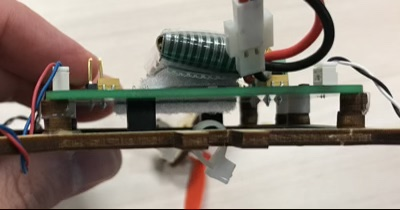
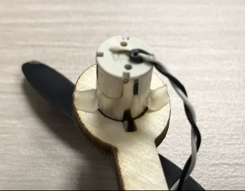
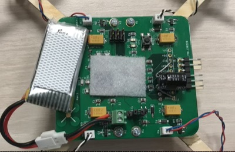
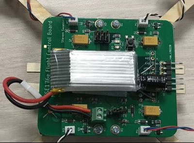
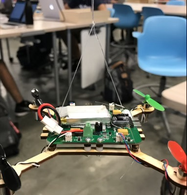

# Flight

To be completed in groups.  Due during the final period for the course (see the schedule).

## Tasks to Perform

This lab should get your quadcopter flying!  

In the best case, you would complete this lab with your quadcopter, but you should start with the FCB+airframe from your test stand.  There are several reasons for this:

1.  It's symmetric, so pitch and roll should be have the same.
2.  It's easy to repair (and we have lots of spare parts) -- you will crash a lot.  Better on the test stand than your board.
3.  It has holes etc. that make it easy to attach tuning aids (like sticks for it to balance on.)

Once your fligh control software works on the test stand, it should just be a matter of tweaking the PID values for your quadcopter. 

### Tweaks to the Airframe

To make the airframe more robust to crashes, it helps to add some supports between the corners of the FCB and the airframe.  Use a small amount of hot glue to add two "donut" spacers at each corner.  Like this:

You need to firmly attach the motors to your airframe.  Hot glue is the best way to do this.  Carefully position your motors so that motors extend down far enough to support the quadcopter (i.e., be its feet) so it sits level. Then apply as _small_ amount of hot glue:

You'll need to securely attach your batteries to your quadcopter.  Velcro works well for this, and we have some.  The soft, fuzzy side goes on the quadcopter.  It can be on the top or bottom, but it needs to be near the center.  For the FCB place it as shown below.  The hard, rough side goes on the battery:

Here it is installed:

You can also put some soft velcro on your remote somewhere to hold its battery.

You may want to shorten the battery cable on your quad.  For the FCB, 1-2inches is pretty good.  THe right value for your quadcopter will vary according to its design.

### Complete The Flight Controller

The code you wrote for the test stand should be more or less ready to run on your quadcopter. In theory, the only changes you should need to make to get flying (but maybe not steering) are to update the pin assignments for your motors, re-tune the PID values, and add a PID channel for roll.  For full flight control you’ll need to add a PID channel for and yaw.

### Tuning the PID Values

The process is same as it was for the test stand, with a few small changes, since the mass and balance of your quadcopter is different than on the test stand.  Both of these mean that the correct PID values for your quad are probably different than those for the test stand.

You can tune the values by attaching your quadcopter to the test stand. To do this, you can pull the pivot platform off the axel and attach your quad using tape or zip ties (available in the maker studio).  Or you can use tape (also available in the maker studio).

### Adding the Roll PID Channel

The PID control for roll works the same as for pitch. In theory, if your quad is symmetric the PID values should be the same too. I would check by rotating the quad on the test stand and seeing how stable it is.

I have found it useful to attach the quadcopter to end of a stick (like the pivot from your test stand).  Then it can "fly" while you hold on to it.  With this you can check the general stability of either pitch or roll, and you can also check to make sure that your remote inputs are interpreted correctly (i.e., left on te stick means left on the quadcopter).

### Adding the Yaw PID Channel

The Yaw channel is a little different.  Use the left-right axis of the left controller gimbal to set the rate of rotation.  You should get yaw working reasonably well before attempting flight.  Spinning in the air makes it very hard to tell what's going wrong with pitch and roll.

There are a few things that make yaw easier to deal with:

1.  The gyro gives you yaw rate directly, and it's pretty low noise.
2.  Yaw rate changes pretty slowly because the torque that the motors apply to the yaw axis is much smaller than the torqe the propellers apply to the pitch and roll axes.
3.  Small errors in yaw rate (i.e., rotating slowly) won't hurt quadcopter stabilty.p

The gyro is also pretty low noise, so you probably won’t need to do much filtering.

The inputs for the yaw controller are different than for pitch and roll.  Since you only get the rate of change for the yaw rate, so there’s no need or use for a complimentary filter.   Instead, use the yaw rate as the input and use PID to keep the yaw rate at zero (i.e., so you quadcopter is not rotating).  You should also be able to make your quadcopter spin in a controlled manner using the yaw stick.

Tuning this PID loop is both harder and easier that roll and pitch.  It's harder since the test stand doesn’t spin.  You can get around this by tying string to the four arms of your quadcopter so it  hangs level in the air and can spin freely.  The makerspace has string and I have monofiliment fishing line.  Make sure they don't get caught in the propellers.  It will look something like this:

Tuning yaw is easier because it's more forgiving, since the amount of force yours can apply to the yaw axis is relatively small.  You probably don't need an D term, and I find the P and I terms are pretty forgiving.

### Testing in All Together

Two test all your PID axes together, you'll need to abandon the test stand.  A good first step is to instal two wooden dowels as stabilizers:  One through the zip ties on the airframe and another through the holes between the spacers/screws that connect the FCB to the airframe:

The one stabilizer between the spacers maybe need a couple of layers (but no more) of blue tape to fit snuggly. 

This will let you  fly the quadcopter against a table:

It makes it easier to switch from pitch to roll and lets you check whether the controls affect the quadcopter like you would expect.  

Once things seems pretty stable, you can put the quadcopter the floor with the stabilizers.  They  will reduce the likelihood of your quadcopter flipping over (a common failure mode).  Flight with the stabilizers is not recommended.  They break easily.

 

