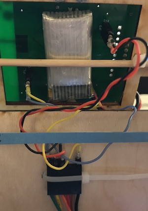

# Implementing PID

To be completed in your groups.

Check the course schedule for due date(s).

## Skills to Learn

1. Implement a PID control loop in Arduino.
2. Tune a PID control loop

## Equipment, Supplies, and Software You Will Need

1. Test stand
2. Remote control

## Tasks To Complete

You will build a PID-stabilized test stand. You should be able to control the following:

1. The angle of the FCB on your test stand.
2. The overall thrust of the motors (using the throttle gimbal of your remote).

So you should be able to move your pitch gimbal and see the test platform quickly and and stably move in response. You should also be able to turn the throttle up and down without observing much change in the angle of the test platform.

### The Control Loop

You will implement one controller in this lab for pitch.  Your quadcopter will eventually have three: one for pitch, one for roll, and one for yaw.

The PID controlled is a closed loop controller. Here's the flow chart for a generic closed loop controller.

The "System" is your quadcopter. The "controller" is your PID code. The "input" is the target "angle of attack" for your quadcopter (0 means flat). This is also called the "set point" because it is what you want to set system to do (e.g., setting a thermostat).  The "output" is estimate of the quadcopter's pitch produced by your complementary filter.

The controller takes the difference between the desired state of system (input) with the current state of the system (output) as the "error."  Based on this error (and it's behavior over time), it computes a set of control setting (i.e., power levels for the motors) that will, hopefully, reduce the error.

You should compute the set point based on the position of your pitch gimbal (right hand joy stick, vertical axis). Plus or minus 10 degrees from horizontal is a reasonable range. That is enough to make your quadcopter move forward or backward at a reasonable speed.

### The Mixer

The mixer (which would be inside the "system" box in the diagram above) is responsible for combining the current throttle setting with the outputs from the controller to set power levels for the motors.

A key consideration in the mixer is that the total angular speed of the propellers needs to remain constant. That means that if you increase the speed of one counter-clockwise propeller you must decrease the speed of another one by the same amount. This explain why propellers that are diagonally opposite one another rotate in the same direction.

The simplest way to implement the mixer is something like this: `power = throttle + PID_output` for the front motors and `power = throttle - PID_output` for the back motors. A potential problem is that the PID adjustment might be larger than the current throttle value or the throttle value maybe very close to the max motor power. In both of these cases, the quadcopter will be able to completely implement the output of the PID control. 

Initially, you can ignore this problem: Set test with your throttle in the middle or so.  You may need to compensate for this later, or you may not.

For your real quadcopter, your mixer will need to account for inputs from all three PID controllers (Pitch, Roll, and Yaw).

### The PID Controller

The basic form of the PID controller is this (thanks Wikipedia):

Where:

* Kp, Ki, and Kd are the P, I, and D coefficients.
* e(t) is the error at time t.
* u(t) is the "control variable" (I.e., the adjustment you will apply to the motors)

Implementing the PID controller requires you computing the integral and derivative of e(t), and there are pitfalls in both of them.

#### The Derivative of Error

The easiest way to compute the derivative is by dividing the change in error by the change in time. Just remember:

* To measure time in seconds.
* Be sure you have the sign right on e(t) and de/dt. If you get it backwards nothing will work.
* To use the actual elapse time since your last measurement.

In principle, you should also be able to use the output of your gyroscope as the derivative of error (perhaps with a different sign).  I have never gotten this to work satisfactorily, but your milage may vary.

#### The Integral of Error

This one is a little trickier. The obvious answer is to just sum the error term forever. The problem here is that if you happen to hold your test platform steady with your hand, the integral will grow rapidly. 

For instance, if you hold it in a position where the error term is positive for 10 seconds, the integral term will come to a large positive value. When you release the platform, the platform will move sharply to a position with negative error (because it has been trying for 10 seconds to reduce the positive error). It will then take a while (maybe another 10 seconds) to “unwind” the integral by adding in the negative error.

There are couple of solution to this:

* You can have the integral decay over time. For instance, instead computing `sum = sum + e` each iteration, you could do `sum = 3*sum/4 + e`.
* You can also just bound the integral at some value. Some trial and error may be required to find a reasonable bound.

### Implementation Strategies

The PID controller gets to be pretty complicated once you have taken all the above challenges into consideratios. It is also hard to debug, since bugs will manifest in strange system behaviors. Here are some suggestions:

* Use Arduino’s serial plotter to debug. You can put all sorts of stuff on there: Coefficients, the values of individual terms, etc.
* Start by just implementing an P controller (no I or D). This should get you an oscillating test stand, but it should change the angle around which it oscillates.
* Use the knobs and buttons on your remote to tune parameters.  It’s much faster than recompiling.  Spending time on the code to support this is well worth it.
* Write you code in a clean, disciplined way that makes it easy to identify errors.  If your code is a mess, you’ll miss something like a flipped sign and never find it.
* Pay attention to your PID update rate.  200Hz (5ms/iteration) is great. The call to lsm.getQuad() takes about 1.8ms. You will eventually have 3 ID loops. So that means you have about (5-1.8)/3 = 1ms per PID channel.

### Debugging Strategies

When you encounter a problem in this lab, it really pays off to be methodical about how you track down the underlying cause.  Here is what I recommend as a check list:

0.  How's your battery?  If it's low, you'll have trouble.
1.  Are you controlling the right motors?  If the 2x3 SPI programming header is "front" of the FCB, the pins are: front-left: pin 4; front-right: pin 3; back-left: pin 5; back-right: pin 6.
2.  Do you have the right props on?  "A" props go on the motors with the red and blue wires.  "B" props go on the motors with the black and white wires.  The color of your props tells you nothing.
3.  Are you motors installed properly?  Diagonally opposite motors should have the same wire colors (i.e., red/blue motors should be on opposite corners).
4.  Are the prop blowing down?  Check by holding your hand underneath.
5.  Are your motors+props able to move your quad in either direction easily?  
6.  Check your raw IMU measurements -- are they reasonable?
7.  Check your filtered IMU measurements -- are they not-so-noisy when the motors are on?
8.  Check your error calculation -- Does it change correctly when you tilt the FCB?  Does it change correctly when you move the pitch stick?
9.  Do the motor outputs change as you expect as you move the platform (i.e., do the motors on the lower side get stronger)?  Do they get stronger more aggressively when you turn up kP?
10.  Does it behave sensibly with just P?  Are your kP a reasonable value?
11.  Check your derivative calculation -- Does it match up with your error calculation?  Is dT in the right units (i.e., compute using the right time scale)?  Does dErr have the correct sign (i.e., when error is positive and decreasing is dErr/dT negative?  When error is negative and increasing, is dErr/dT positive?)
12.  Does it behave sensibly with P and D?  ARe your kD and KP reasonable values?
13.  Check your integral calculation -- Do you handle wind up correctly?  Is dT in the right units?
14.  Does it behave sensibly with PID? Is kI a reasonable value?

Almost always, overall PID problems are caused by something pretty early in this list.  It would be not be a bad idea to provide the means to run these tests quickly using the remote.  Then, if you have an error, you can quickly check whether all the underlying parts are working properly.

Be assured that the first time you ask me or the TA for help, I will go through this list with you.  You can save us both time by checking these items yourself first.

Here are some implementation notes suggested by the above:

1.  It'd be useful to have a mode where you can easily turn on one motor at time.
2.  It's useful to have a "manual" mode where your pitch stick directly controls the differential in power between the front and back props.
3.  It's useful if the logic to disable the motors when the quad is disarmed does so at the last possible stage.  Then you can watch what sense/filter/PID/mix datapath is doing while the quad is disarmed.  It's very hard to concentrate on debugging when your quadcopter is flopping around.

### Using the Alternate FTDI Headers

There are two 2-pin headers on the underside of your FCB.  They carry the four
key signals for FTDI: `DTR`, `TX`, `RX`, `GND`.  **Note:** `GND` is mislabled
as `CTS`.  You do not need to connect `CTS`.  You must connect `GND`.  The purpose of these connections is two allow a less physically
restrictive FTDI connection.  This will prevent your FTDI cable for unbalancing your quadcopter.

To you use it you'll need two 2-wire harnesses I'll distribute in class.  They
are made of special silicone-coated wire that is very bendy.  I made them myself.  
Don't lose or damage them them!

The photo below illustrates the basic idea: Zip tie your FTDI cable to the test
stand using the holes provided, and then connect the FTDI cable to the 2-pin
headers with the floppy wiring harnesses.

Here's the pinout for the FTDI cable:

| Green | Yellow | Orange | Red | Brown | Black |
|-------|--------|--------|-----|-------|-------|
|`DTR`  | `RX`   | `TX`   |`VCC`| `CTS` | `GND` |

**Note** the labels on the FCB are such that you need to connect the FTDI `RX` pin to the `TX` header and vice versa.

### Tuning Your Controller

Much has been written about how to tune PID controllers. I have used these two techniques with success:

* A simple manual tuning algorithm: https://en.wikipedia.org/wiki/PID_controller#Manual_tuning
* A more disciplined heuristic algorithm: https://en.wikipedia.org/wiki/PID_controller#Ziegler%E2%80%93Nichols_method

### Resources and Examples

#### Resources:

1. https://en.wikipedia.org/wiki/PID_controller
2. https://www.youtube.com/watch?v=UR0hOmjaHp0
4. Interactive demo: https://sites.google.com/site/fpgaandco/pid

#### Cool examples:

1. https://www.youtube.com/watch?v=j4OmVLc_oDw
2. https://www.youtube.com/watch?v=R2QOougRFww (Long but pretty thorough)
3. https://www.youtube.com/watch?v=7qw7vnTGNsA

### Turn in Your Work

#### Commit your results:

1. `Commit an updated version of quad_firmware.ino` and `remote_firmware.ino` for the remote.
2. An updated version of `noise.txt`, if applicable.

Once you’ve committed everything, create a tag called “PID-test-stand-2” Be sure to make it an “annotated” tag and push it to your repo (https://git-scm.com/book/en/v2/Git-Basics-Tagging). Verify that it is visible on github.

#### Demo your work:

1. Demo you working, stabilized test stand for me or the TA.