# Part 1: Creating the Schematic in Fusion360

This tutorial will take you through the steps of creating a schematic, creating a board, creating new devices, and preparing the board for manufacturing. It's broken into four parts.

We are going to design a PCB with a light controlled by a button.

**The course style guidelines for schematics can be found [here](https://github.com/NVSL/QuadClass-Resources/blob/master/labs/Building-The-Quadcopter-Schematic/README.md#general-schematic-style-guidelines). Read and follow them.  EagleLint will complain if you don't.**

You will need the `Lab01.lbr` file available in the lab starter repo.

## Making the Schematic

Next, we will create the schematic for our circuit. This video walks through the process, and detailed instructions are below.

Open up Fusion360, and select `File->New Electronics Design`. This will open up the Electronics Design tab:

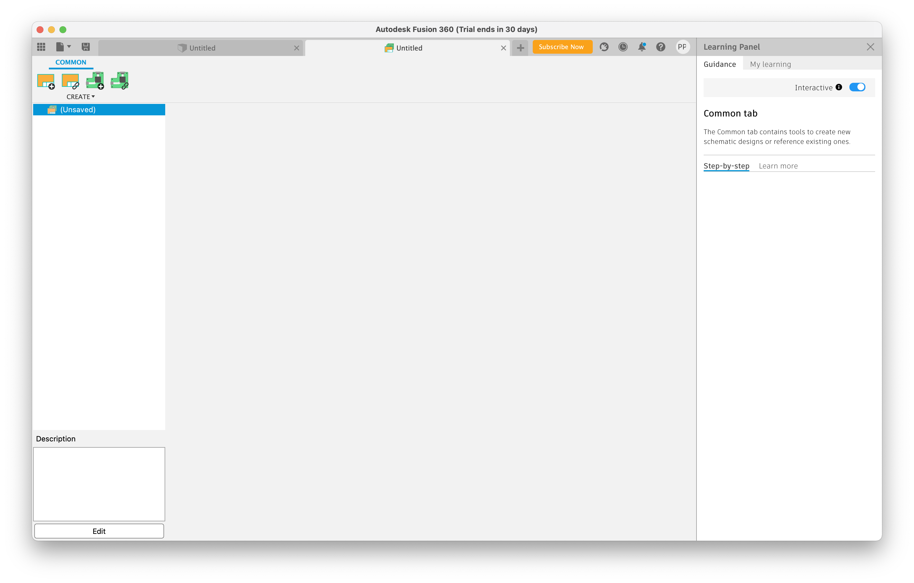

Next, click on the `New Schematic` button in the top left. It will open up the schematic editor tab:

We need to load the Fusion360 Library that describes the components we are going to use. Start by navigating to the `Library` tab of the tools navigator:

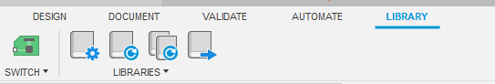

Click the `Open Library Manager` button and navigate to the `Available` tab:

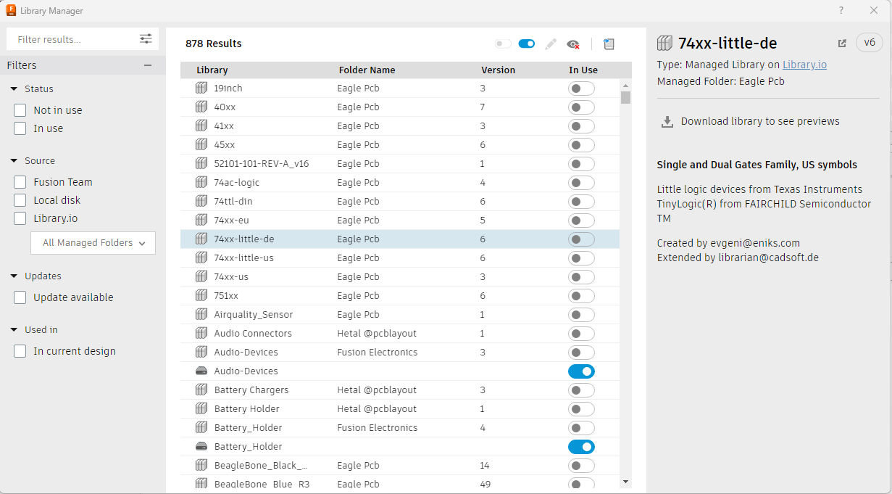

Use the `Browse` tool to locate your `Lab01.lbr` file. Once you have loaded it into Fusion 360, it'll be in the list, but it might be hard to find.  Type "lab" into the search box.  It should show up.   Press the `Use` button to enable it.  Close the Library Mananger.

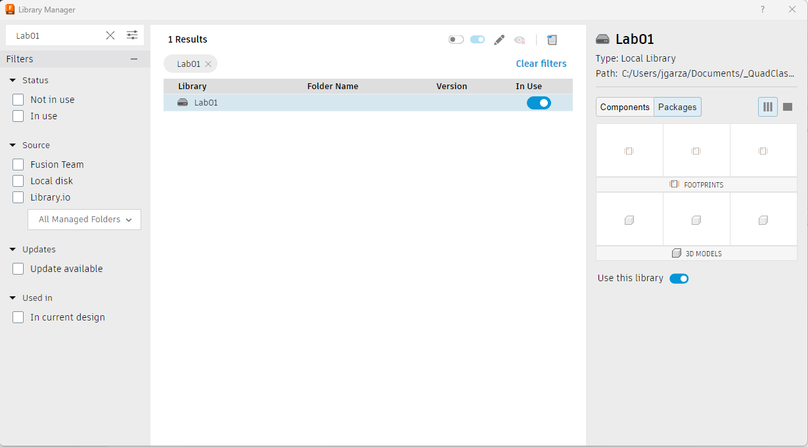

## Adding the Parts

Now you are ready to build your schematic. Go back to the `Design` tab and select the `Add Part` tool from the tool palette (or press `a` on your keyboard):

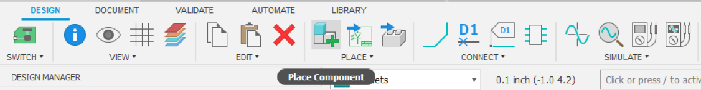

This will open up the library browser. Click on the triangle next to `Lab01` to expand it (if you don't see `Lab01`, select another library and type 'lab'). You’ll see four “devices” inside it. Go read [this page](http://goo.gl/HJtIzp) of the [Adafruit Eagle Parts Tutorial](http://goo.gl/GcM04V) to understand the difference between a schematic “symbol”, a “package”, and a “device.”

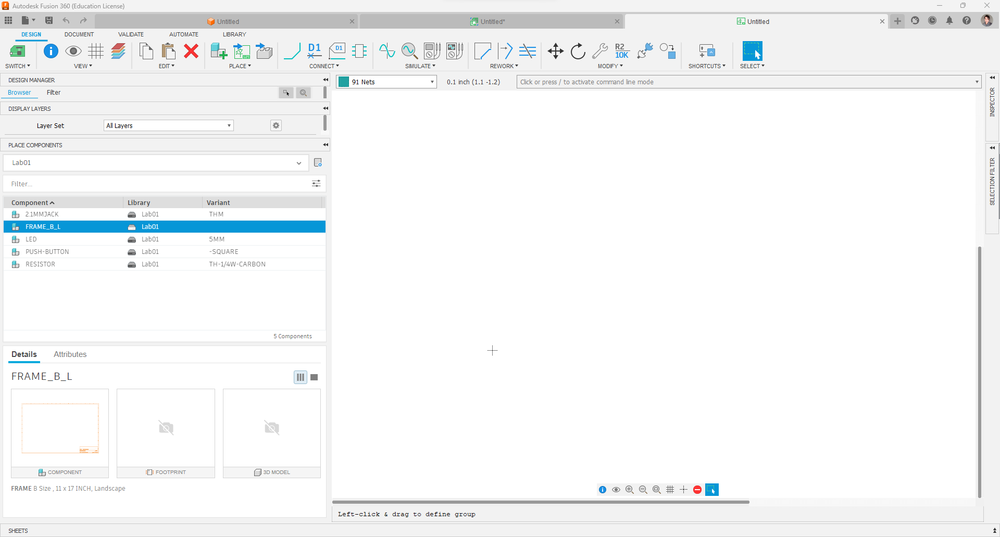

A schematic should have a “frame” around it to contain the size. The frame also include space for documentation about the version and author. To add the frame select `FRAME_B_L` and click “OK”. You can then place your frame

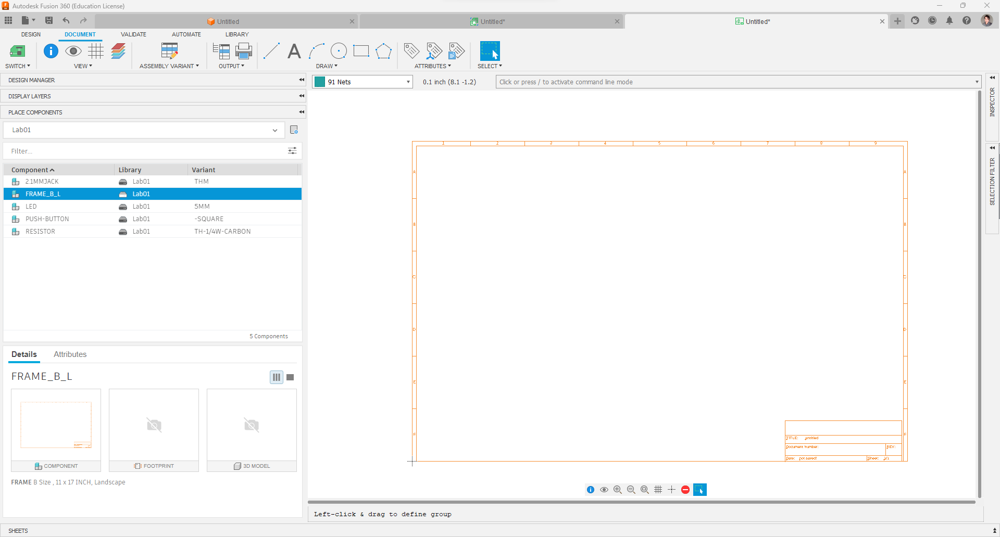

Select `2.1MMJACKTHM` from the Add Part menu and press “OK.” You’ll return to the schematic editor with the schematic symbol for the power jack attached to your mouse. Click to put it down somewhere:

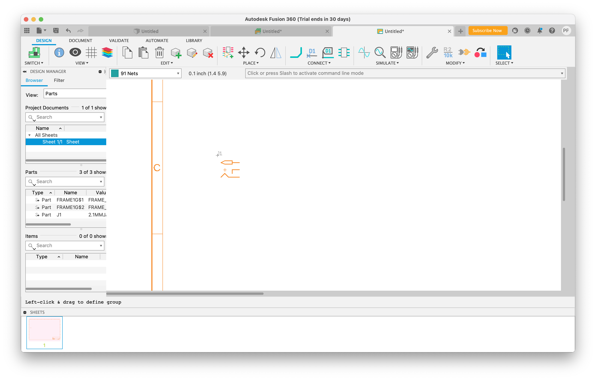

Save your schematic, so you don’t lose your work. Call the file “throughhole”.

Select the Add Part tool again, and choose the `BUTTON-TACTILE-SQUARE` device. Place it to the right of the power jack.

Next, we’ll add the LED. Choose the `LED5MM` device. Place the LED to the left of the power jack.
Finally, add the resistor. Use the device `RESISTORTH-1/4W-CARBON`.

Unfortunately, the schematic symbol for the switch is a bit sideways. To fix this, select the `Rotate` tool from the palette:

And click the symbol for the switch a few times. You can do the same for the LED if you want it horizontal:

## Connecting the Parts
Next, we need to wire up the components. Let’s start by connecting the resistor to the switch. Notice that the switch’s symbol gives a clear picture of how it operates: There is a pair of connected terminals on each side (“P” and “P2” on the left and “S” and “S2” on the right), and when we press the button the two pairs will be connected. We need to connect the resistor to one of the pairs. Select the `Net` tool:

Then draw a connection between one terminal of the resistor and one of the terminals of the switch:

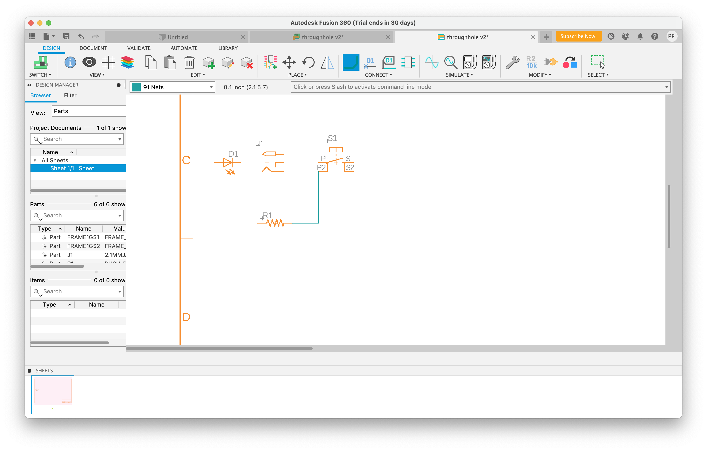

Next, connect the other end of the resistor to the cathode of the led (the cathode is at the tip of the triangle in the LED symbol).

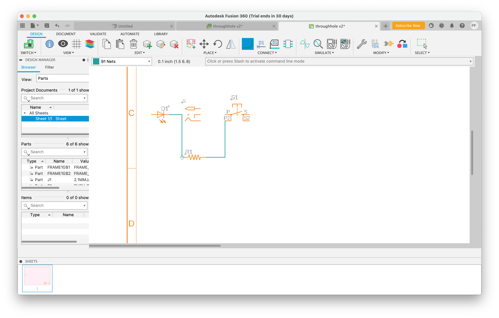

Finally, we need to connect everything to the power supply. The symbol for the power jack has three connection pins. The top pin will be connected to the tip of the power plug. The other two will be connected to the barrel. So, if the power supply is tip-positive, the top connector will be 5V and the bottom two will be ground (0V).

Connect the anode on the LED to the 5V pin and then connect the pin on the other side of the switch to the ground pin. Just be sure to wire both of the ground pins together (see below). 

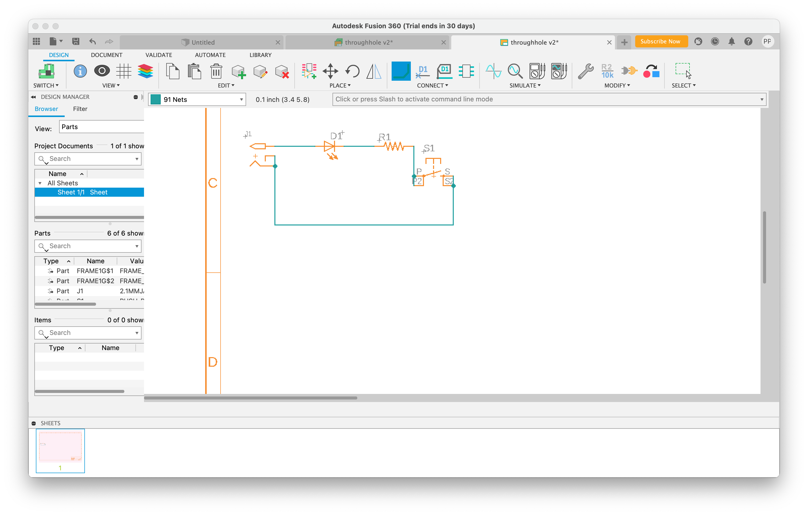

Finally, rename and label the power and ground nets by typing `name GND` into the command line box above the drawing (see below screenshot) and then clicking on the ground net. A label will appear. Make sure you place it so it’s touching part of the net it labels. Do the same for the positive side of the power plug, naming it `5V`.

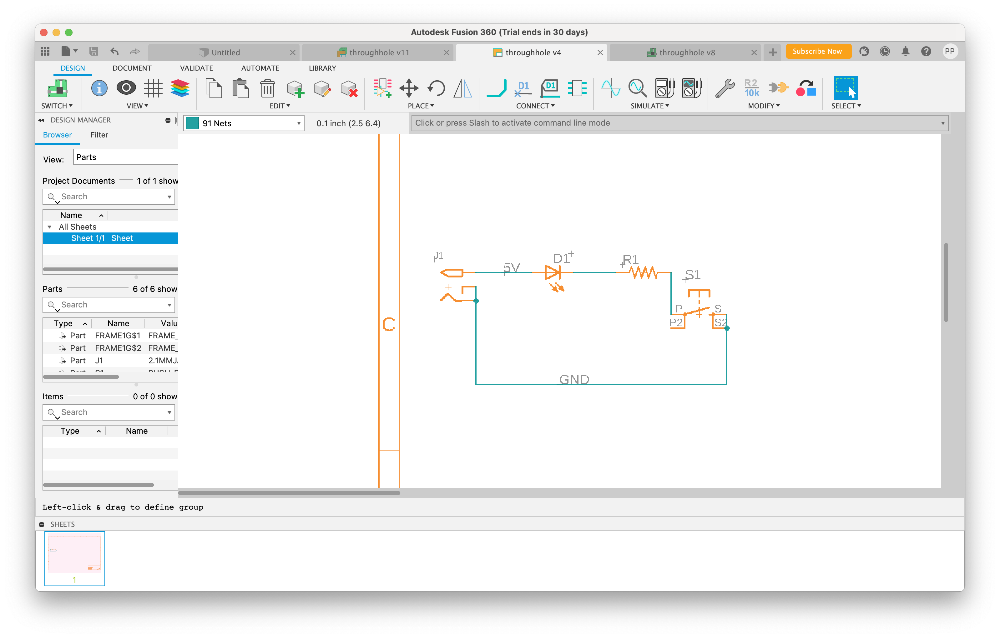

Now, think through how the schematic will operate and convince yourself that this matches what we build on the breadboard.

## Running Electrical Rules Check (ERC)
Fusion360 provides a mechanism to do a sanity check on your schematic. It’s called Electrical Rules Check (ERC). Select it from `Validate->ERC`. I recommend running a library update before executing it, which can be found in the `Library` tab next to the library manager.

A window will appear with a list of errors and warnings broken into three categories (note that your window may appear different):

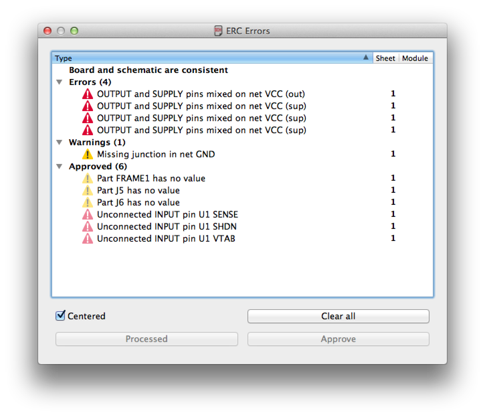

1. Errors: Potentially serious errors
2. Warnings: Potential problems
3. Approved: These are errors and warnings that you have marked as “ok” using the “Approve” button.
The warning and error names are a little cryptic, but you can usually figure out what they are getting at. Look at each error and warning and determine if it’s actually a problem. For instance, it may tell that a pin is not connected. If you did not intend to connect the pin, then it’s not an issue. For errors and warnings that are not a problem, click “Approve.” Fusion360 will remember this when you re-run ERC. Fix the errors and warnings that represent real issues.

Once you've verified that your design has no errors, you can move on to [Part 2](Creating-A-Board.md)!
