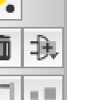
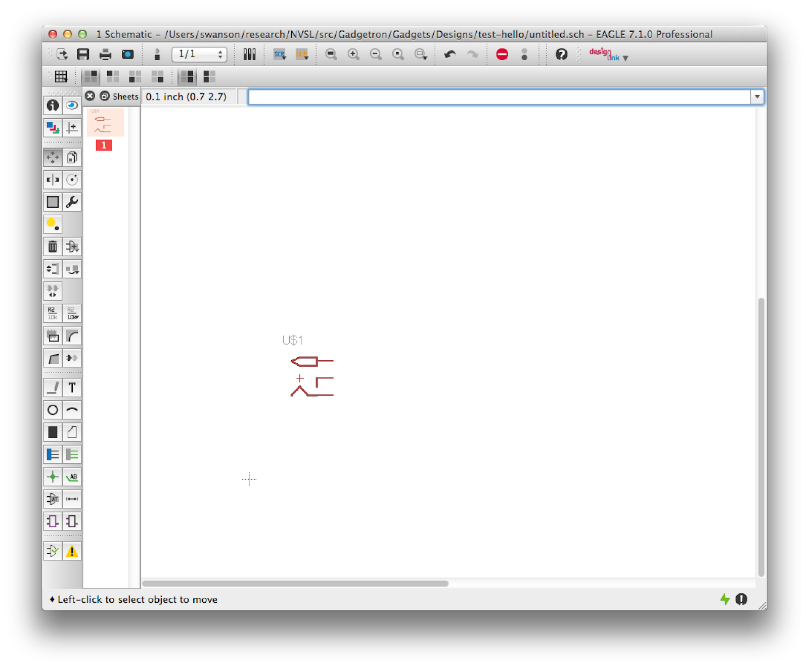
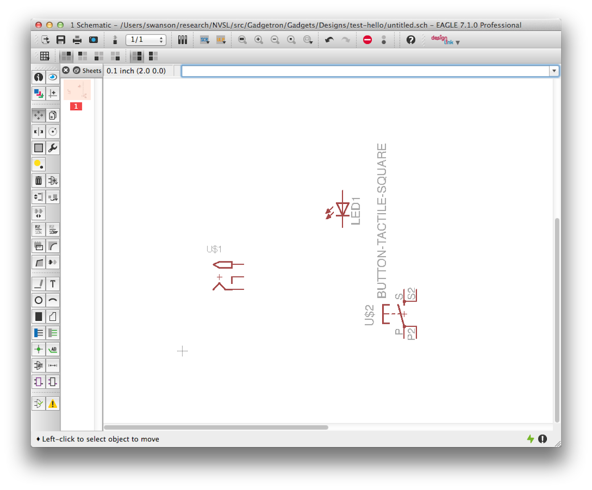
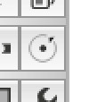
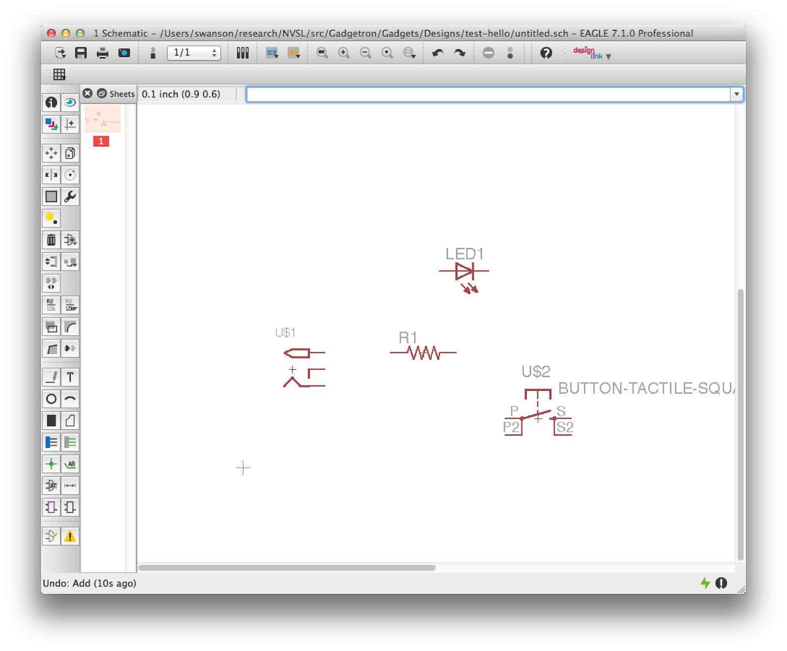

# Part 1: Creating the Schematic in Eagle

## This tutorial will take you through the steps of creating a schematic, creating a board, creating new devices, and preparing the board for manufacturing. It's broken into four parts.
Now, we are going to (almost) build the same circuit on a PCB. There are couple things that will be different about this design.

1. We will have the option of using "surface mount" parts rather than the "through hole" parts we were forced to use with the bread board.
2. Rather than just putting it together a bit a time, we will need to design the circuit and then build it.

Here's what you will need:

1. The electrical datasheets you used in the breadboard section of the tutorial.
2. The `Lab01.lbr` file available in the [Lab 1 repo](https://www.google.com/url?q=https%3A%2F%2Fclassroom.github.com%2Fassignment-invitations%2F05a6bde38fa4241f0019fd08db4d1e99&amp;sa=D&amp;sntz=1&amp;usg=AFQjCNHcxQk8qcHy6V96okJCUYvXzNH9Dw).

## Configuring Eagle
First, we need to tell Eagle where to find some files we will be using. In particular, we need to tell it where to find the libraries, CAM files, and design rule files we will be using in this class. This video shows how to configure Eagle correctly (the name of the repo has changed since I made this video):

## Making the Schematic
Next, we will create the schematic for our circuit. This video walks through the process, and detailed instructions are below.

Open up Eagle, and select File->New->Schematic. It will open up the schematic editor window:

We need to load the Eagle Library that describes the components we are going to use. From your eagle-intro repository move the Lab01.lbr file to the Eagle/lbr/.. folder on your computer. Back in the schematic window, select Library->Use…, navigate to `Eagle/lbr/Lab01.lbr` and select it.

## Adding the Parts
Now you are ready to build your schematic. Start by selecting the “Add” tool from the tool palette at left:

This will open up the library browser:

Click on the triangle next to “Lab01” to expand it. You’ll see four “devices” inside it. Go read [this page](http://goo.gl/HJtIzp) of the [Adafruit Eagle Parts Tutorial](http://goo.gl/GcM04V) to understand the difference between a schematic “symbol”, a “package”, and a “device.”

A schematic should have a “frame” around it to contain the size. The frame also include space for documentation about the version and author. To add the frame select “FRAME_B_L” and click “OK”. You can then place your frame

Select “2.1MMJACKTHM” and press “OK.” You’ll return to the schematic editor with the schematic symbol for the power jack attached to your mouse. Click to put it down somewhere:

Save your schematic, so you don’t lose your work. Call the file “throughhole.sch”.

Select the “Add” tool again, and choose the “BUTTON-TACTILE-SQUARE” device. Place it to the right of the power jack.

Next, we’ll add the LED. Select “Add” again, then click the triangle next to “LED”. The list will expand to show you several LEDs to choose from. Each of these has the same electrical interface, so they will appear the same on the schematic. For now, choose “LED5MM” since the corresponds the LED we used in our breadboard design. Place the LED to the left of the power jack.

Finally, add the resistor. Use the device “RESISTORTH-1/4W-CARBON.”

Unfortunately, the schematic symbol for the switch is a bit sideways. To fix this, select the “rotate” tool from the palette:

And click the symbol for the switch a few times. You can do the same for the LED if you want it horizontal:

## Connecting the Parts
Next, we need to wire up the components. Let’s start by connecting the resistor to the switch. Notice that the switch’s symbol gives a clear picture of how it operates: There is a pair of connected terminals on each side (“P” and “P2” on the left and “S” and “S2” on the right), and when we press the button the two pairs will be connected. We need to connect the resistor to one of the pairs. Select the “wire” tool:

Then draw a connection between one terminal of the resistor and one of the terminals of the switch:

Next, connect the other end of the resistor to the cathode of the led (the cathode is at the tip of the triangle in the LED symbol).

Finally, we need to connect everything to the power supply. The symbol for the power jack has three connection pins. The top pin will be connected to the tip of the power plug. The other two will be connected to the barrel. So, if the power supply is tip-positive, the top connector will be 5V and the bottom two will be ground (0V).

Connect the anode on the LED to the 5V pin and then connect the pin on the other side of the switch to the ground pin. Just be sure to wire both of the ground pins together (see below). Also rename and label the power and ground nets by typing ‘name GND’ into the command line box above the drawing and then clicking on the ground net. A label will appear. Make sure you place it so it’s touching part of the net it labels. Do the same for the positive side of the power plug, naming it “5V”.

Now, think through how the schematic will operate and convince yourself that this matches what we build on the breadboard.

## Running Electrical Rules Check (ERC)
Eagle provides a mechanism to do a sanity check on your schematic. It’s called Electrical Rules Check (ERC). Select “Tools->ERC”. A window will appear with a list of errors and warnings broken into three categories.

1. Errors: Potentially serious errors
2. Warnings: Potential problems
3. Approved: These are errors and warnings that you have marked as “ok” using the “Approve” button.
The warning and error names are a little cryptic, but you can usually figure out what they are getting at. Look at each error and warning and determine if it’s actually a problem. For instance, it may tell that a pin is not connected. If you did not intend to connect the pin, then it’s not an issue. For errors and warnings that are not a problem, click “Approve.” Eagle will remember this when you re-run ERC. Fix the errors and warnings that represent real issues.