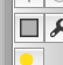
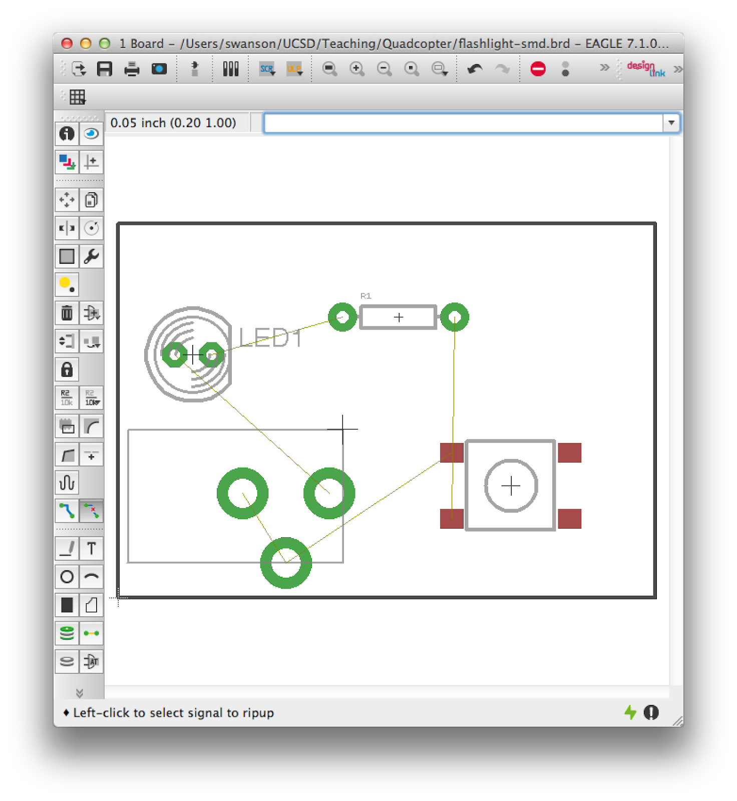

# Part 4: Creating Surface Mount Components

The design we have so far for the flashlight uses "through hole" parts. This means that the pins for the part protrude through the board and are soldered into place by filling the hole with solder. Through hole parts are easy to work with, but they are bulky and drill so many holes through the board makes it harder to route more complex boards since the parts effectively occupy space on all the layers of the board (front, back, and any internal wiring layers).

Most modern PCBs use "surface mount" (also called SMD) parts that more compact and only require connections to one side of the board. They are also harder to solder. Many of the components we will use are only available as surface mount, and many components are available as both surface mount and through hole.

## 

## Creating a Surface Mount Device
We will replace the through hole button with a surface mount version. We will use part number 1301.9315 from this [datasheet](http://www.google.com/url?q=http%3A%2F%2Fwww.schurter.ch%2Fbundles%2Fsnceschurter%2Fepim%2F_ProdPool_%2FnewDS%2Fen%2Ftyp_6x6_mm_tact_switches.pdf&amp;sa=D&amp;sntz=1&amp;usg=AFQjCNHtExOlXG7xE7EsTttPKfa7a4eS0w). It's the one that looks like this:

Adafruit has a very nice [tutorial about building new schematic symbols, packages, and devices in Eagle](https://www.google.com/url?q=https%3A%2F%2Flearn.adafruit.com%2Fktowns-ultimate-creating-parts-in-eagle-tutorial%2Fintroduction&amp;sa=D&amp;sntz=1&amp;usg=AFQjCNGsUFLtnS_nmz4ra63XcImFHoVf9A). Go through the tutorial using this tactile button instead of the lux sensor they use in the tutorial. The datasheet required is present in your Lab 01 repository. Make a copy of `Lab01.lbr` called `Lab01_smd.lbr` and create the package there. Create a new package, device, and symbol for the button by following the ADAFRUIT tutorial. 

### 

### Reading Datasheets
Interpreting datasheets takes some practice. Here are some tips:

* The datasheet includes data on many switches. Make sure you are looking at the correct part of the sheet.
* There are several mechanical drawings. For creating a package, you are interested in solder pad layout.
* Don't assume drawings are for scale. Instead, use the numerical values given.
### 

### Additional Requirements for Your Package
The package should be called `SCHURTER-1301.9315`, the symbol should be called `TACTILE-BUTTON`, and the device should be called `TACTILE-BUTTON`, and the variant should be called `SHURTER-1301.9315`.

Name the pins to match the PCB layout drawing in the data sheet, and orient your package to match the drawing as well. This is a good practice because it makes it easy to see that your package matches the drawing.

Make sure that the length of your smds in the long dimension, and the width is the shorter dimension.

### 

### Additional Requirements for Your Symbol
Your symbol should have just two pins (whereas the symbol you used in your throughhole schematic had 4). They should be called `A` and `B`, and pressing the button should connect them electrically.

Note that your package has four SMDs. You'll need to connect two SMDs from the package to a single pin in symbol. You do this in the "Connect" dialog. Just select one pin and two pads, and click connect.

### 

### Additional Requirements for Your Device
There are a few other things you'll need to be sure of in the package you build:

* You need two add three "attributes" to the new variant you created

	* "DIST" for distributer. This is where we buy the part from. You can put "NA"
	* "DISTPN" for distributor part number. You can put "NA"
	* "CREATOR" This should be your name, since you created the variant.
	* You can add attributes by clicking on "attributes" in the device editor window:

* You also need to be sure to draw a box around your package in layer ‘tKeepout’.
* You need to add a text item in layer “tName” that contains “>NAME”. This will be replaced with the parts name. To render clearly, the next needs to be at least 1.27 mm high, have a weight of 8% and be in the “vector” font. You can set these parameters in the tool bar at the top of the window or by using the “info” tool to change the attributes of the text after you create it.
## 

## Replacing the Through-hole Component
You can use your new SMD button just like our own through-hole button. Just delete the old button and replace it with your new button.

## 

## Fixing up the Board
Since you just changed the package for the button, the board will need to be updated. Traces will probably be crossed, etc.:

To fix this, we’ll rip up all the old traces and reroute the board. Use the “group” tool: To select everything on the board.

Next, select the “ripup” tool. Everything will appear to be deselected, that’s ok. Now, right-click on the board, and select “Ripup: Group”. All of the routed traces will disappear:

Now, you need to re-route the board using the “route” tool:

## Re-running the CAM Processor
Follow the instructions for running the CAM processor given above. In the Gerber viewer, you can find the pads for the SMD button the in the GTL layer. If you check the GBL layer, you’ll notice that while the pins for all the through hole parts appear on the bottom of the board, the pads for the surface mounted component does not.    