# Part 4: Creating Surface Mount Components

The design we have so far for the flashlight uses "through hole" parts. This means that the pins for the part protrude through the board and are soldered into place by filling the hole with solder. Through hole parts are easy to work with, but they are bulky. Also drilling so many holes through the board makes it harder to route more complex boards since the holes occupy space on all the layers of the board (front, back, and any internal wiring layers).

Most modern PCBs use "surface mount" (also called SMD) parts that are more compact and only require connections to one side of the board. They are also harder to solder. Many of the components we will use are only available as surface mount, and many components are available as both surface mount and through hole.

The course style guidelines for libraries are in the "Guidelines for Building..." section of [this lab](https://github.com/NVSL/QuadClass-Resources/blob/master/labs/Building-Parts-In-Eagle/README.md). Read and follow them. Eaglint will complain if you don't.

## Preparation

Create a new schematic and board files named `smd.sch` and `smd.brd` and load the DRU file for error checking. Remember for creating a new design `File->New Electronics Design` and save the design as `smd`. Then in the design tab `Create->New Schematic` and save the schematic as `smd`. Then in the design tab `Create->New Board` or in the schematic tab `Switch to PCB document`. Add the same components, with the exception of the through-hole push button. You can add the components into the schematic manually. However, if you are a desperate person as me, instead of adding the components again manually you can copy the entire schematic by going to the throughhole schematic tab, then clicking `Group Select` and selecting all components including the FRAME, then Ctr+C, then switch to the smd.sch tab and Ctr+V. Finally, delete the through hole push button. The tabs and smd schematic should look as follows:

This time instead of adding the throughhole (TH) push button component from a library we will create our own push button component inside a library which will be surface mount (SMD) instead. We will create part number [1301.9315](https://www.digikey.com/en/products/detail/schurter-inc/1301-9315/2643952) which has the following [datasheet](https://www.schurter.com/en/datasheet/typ_6x6_mm_tact_switches.pdf). It's the one that looks like this:

In datasheets is common that manufacturers show many dimensions for different versions for the same family of components. Also, they show two types of dimensions, the physical component dimensions and the PCB pads recommended dimensions. We will use the dimensions **of the recommended PCB pads** which in the datasheet correspond to the `LSH Gullwing lead` version:

If you can't access the datasheet for the SMD push button please ask the TA.

## Creating a Surface Mount Component

All electronic components are stored inside libraries (\*.lbr files), and include schematic symbols, PCB footprints, and 3D packages. Now, Adafruit has a very nice [tutorial about building new schematic symbols, packages, and devices in Eagle](https://www.google.com/url?q=https%3A%2F%2Flearn.adafruit.com%2Fktowns-ultimate-creating-parts-in-eagle-tutorial%2Fintroduction&sa=D&sntz=1&usg=AFQjCNGsUFLtnS_nmz4ra63XcImFHoVf9A). However, since this tutorial's release, Eagle has been ported over to Fusion360. Autodesk has released several tutorials on how to design custom parts, which can be found [here (~15 min)](https://www.youtube.com/watch?v=zqar0XWtFaY) and [here (~45 min)](https://www.youtube.com/watch?v=xNIEXCimRSg&list=PLmA_xUT-8UlKE-U-eEqrkNEI7rd1fUnLY).

We will go step by step creating the SMD push button component. However, it's recommended that you go through any of the above tutorials for further reference. We recommend the more recent ones from Autodesk.

Go to your Github repo folder and make a copy of `Lab01.lbr` called `Lab01_smd.lbr`, we will create the SMD push button there.

Open `Lab01_smd.lbr` in Fusion360. `File->Open...->Open from my computer->Lab01_smd.lbr`, you should be able to see the following tab:

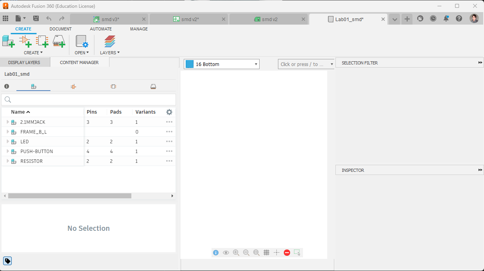

## Create a new Footprint

The footprint refers to the PCB pads (exposed cooper) where the SMD push button legs will be soldered into the PCB. Click `Create New Footprint` and give it the name of `SCHURTER-1301.9315`.

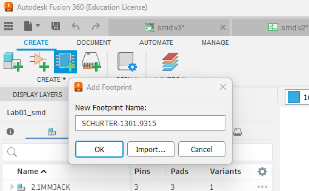

Change the Grid to `0.25 mm`. For footprints, it's recommended to use the grid that makes sense to follow the dimensions for the SMD push button pads shown in the datasheet.

Now it's time to add the SMD button pads. Click `SMD pad` and place the pad in X,Y position `[-5.00 -2.25]`. On the top center you can see the position of your cursor with the pad. By default, for placing pads the center of the pad is taken as reference.

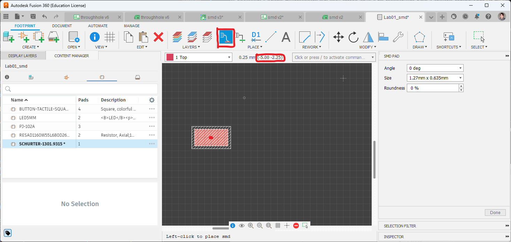

Why that position? Remember, we are trying to recreate the same pads with the same dimensions shown in the SMD push button datasheet. So if the pads require a Y spacing of 10.00 mm, 10.00/2 is 5.00 mm. Same for X spacing, 4.5/2 equals 2.25 mm. **Taking as reference the center**, the first pad (down left) should be placed at -5.00 mm, 2.25 mm. That will give us the correct dimensions. That's also why we set the grid to be 0.25 mm, so we can have a precision of 0.25 mm.

Add 3 more pads in the X,Y positions: `[5.00, -2.25]`, `[-5.00, 2.25]`, `[5.00, 2.25]`. The final result should look like this:

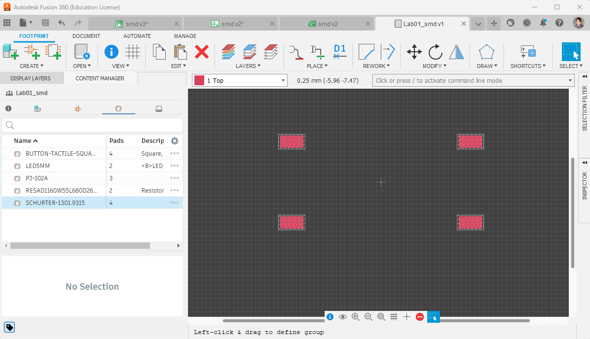

We are missing the pads dimensions which, taking as reference the datasheet, are `2.10 mm X 1.40 mm` for each pad. Use the Info button to correct the size for each pad.

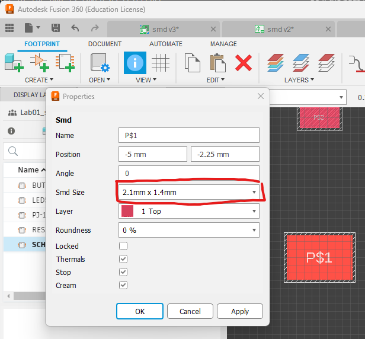

All pads need to have a number, which is used to know the orientation of the component and to make the right connections within the component. Use the numbering reference in the datasheet to number the pads (the image below the pads dimensions).

⚠️ I'm serious! Pay attention to the numbering. If you number the pads wrong it can make you, for example, connect pads 1 with 3 and 2 with 4, which is a short (push button always pressed). This error has happened to me before for not paying attention, and you can only figure the error out after the board has been assembled.

Now it's time to add some silkscreen information. Silkscreen information are the white lines and text on top of the green soldermask. Can you omit the silkscreen information? Yes, but if you are soldering each component manually, as we will do, you will need to go through the PCB design component by component and figure out the values, names, and orientation of each component. Adding a visual reference in the PCB makes placement much easier, also make your board more repairable making others understand more about your design.

There are three types of silkscreen information: Names, Values, and Placement & Orientation information. In Fusion 360 these layers are reserved as tNames & bNames, tValues & tValues, and tPlace & bPlace, where "t" stands for "Top of PCB" and "b" stands for "Bottom of PCB". Our design will place all components on top, so we only need to add information on the top. If you move components to the bottom in your PCB, Fusion 360 automatically switches the silkscreen layers.

Now it's time to add placement information on the `tPlace` layer. We will draw a 2D representation of the push button to let us know that a push button goes there. Change to layer tPlace, and then draw a square in the middle of the pads that represented the case of the push button, it should look as follows:

Now draw a circle representing the push button. Choose Circle from the Draw drop down menu to draw the push button button. There's no need to be precise with the drawing, the only thing that matters is that you make it understandable that a button goes there between those pads.

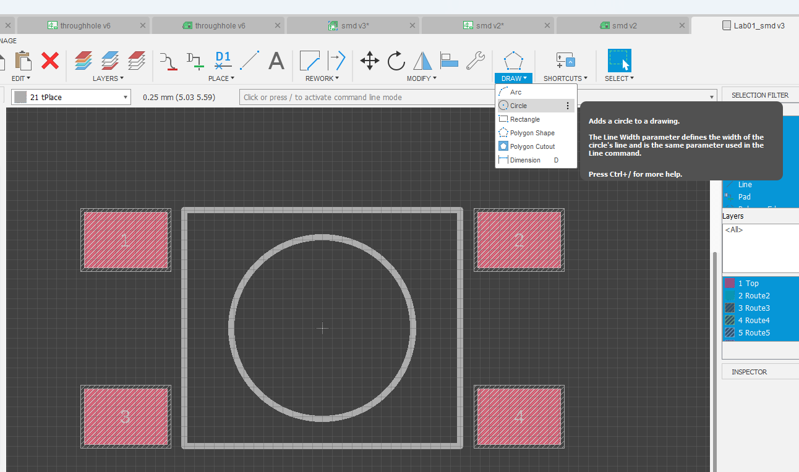

It's also important in some components to indicate which one of all those pads is the first pin, that way we know the orientation the component should be placed. For push buttons, it's not necessary since the push button can work in either orientation, however in the case of a microcontroller, if you don't place a microcontroller chip in the right orientation your circuit won't work. Although orientation information is not necessary for push buttons, let's indicate which pad is the first pin by drawing a small circle next to the first pad. After drawing the circle click on information and select the circle you just draw to view its properties. Increase the width of the circle and make it look like it's filled.

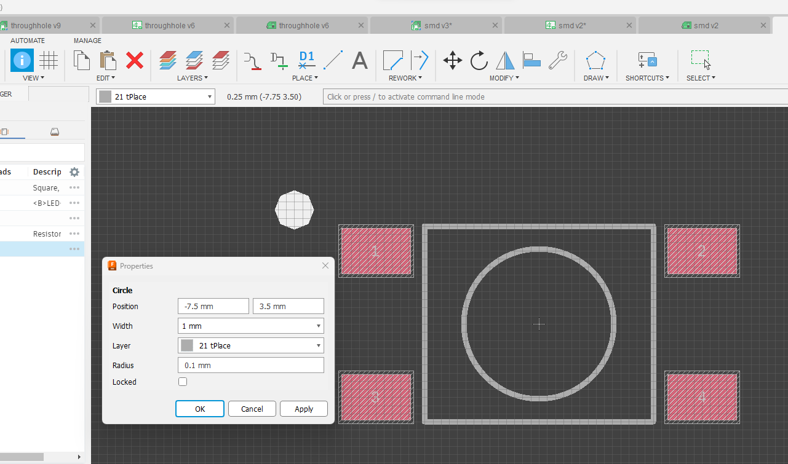

Let's move now with name information. tName should contain the [reference designator](https://en.wikipedia.org/wiki/Reference_designator) of the component (e.g., R1, R2, C1, S1, etc). We don't know this information yet, however Fusion360 has an annotation format that works as a placeholder. Change to layer `tName`, then click the "A" (text) button and enter `>Name`. With this we will indicate Fusion360 that that value should be replaced by the reference designator assigned automatically when you include the part into the schematic.

Change the text to be at least `0.9 mm` high, have a `weight of 8%` and be in the `“vector” font`. Otherwise, the manufacturer company can have problems printing such small text. Use the information button to make that change to ">Name". Note that first you need to change from proportional to vector and click apply, then adjust the other values. Finally, center the text.

Value information contains information such as the resistor and capacitor values (e.g., 1k, 22K, 0.1uF, 10ufF) or the manufacturer's part number (e.g, 1301.9315, ATMEL128RF). Follow the same steps as >Name, but now for `>Value` using the `tValue` layer. Note that you can change the text properties directly or by clicking the info button. The result should look like this:

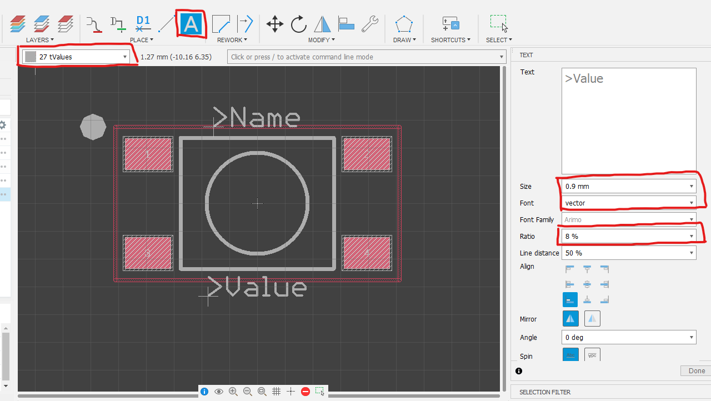

Finally, change to the `tKeepout` layer and draw a box around the component using the line button. Make sure the lines start and end in the same coordinates. This Keepout layer is not common in designs, and it's not necessary when you know what you are doing, however it's useful for preventing you from placing components too close to each other. Also, by making this tkeepout box bigger or smaller you can indicate, for example, that you need extra space for manually soldering a particular component, and that you don't want other components close.

For more info about how to create a footprint in Fusion360 check out [this video](https://www.youtube.com/watch?v=8-tJZHFzWXo&list=PLmA_xUT-8UlKE-U-eEqrkNEI7rd1fUnLY&index=3).

## Create a new Symbol

Now let's make a schematic symbol for the SMD push button component. Schematic symbols provide an easier visual representation of components, instead of using irregular footprint shapes. The schematic symbol can be as simple box with pins, however you make easier for people to interpret your schematic if you use the [standard schematic symbols](https://en.wikipedia.org/wiki/Electronic_symbol). Note that in industry, not everyone follows the standard, drawing symbols can consume precious time and some people just draw boxes, however others like to challenge the standard and draw some fancy symbols' art, just be aware of this. For this tutorial let's try to follow the standard schematic symbol for push buttons.

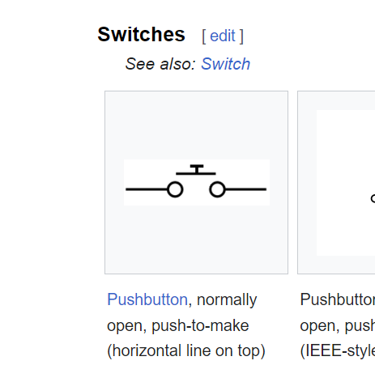

Create a new symbol and call it `TACTILE-BUTTON`.

Add two pins of medium length. The pins are the most important part of the symbol. Is where the schematic lines will connect to. The rest is just drawing for better visual understanding. The pins should match the pads in the footprint, however we will only draw 2 and later we will see how to assign multiple pads to one schematic symbol pin. Note that you can change the pins directions to be of type pwr (power), out, in, etc. Changing the pins direction makes sure you make the right connections. However, for now "io" (input/output) direction is fine, also if you are not sure, always use "io" direction.

⚠️ Note that it's very important not to change the grid when placing pins, keep it as `0.1 inches`, otherwise when you add the symbol into the schematic which has a different grid it will be hard to make pin connections.

Now, name the pins as `A` and `B`, use the naming tool for this. While footprints naming convention usually use numbers (1, 2, 3, 4....) which makes it easier to know the position and orientation, for the symbols you should name the pins with a name that represents what the pin will be used for (e.g., GND, 5V, EN, SDA, SCL). Push button pins doesn't have any extra capability, like providing power, etc and are simple connections, so that's why we name the pins simply A and B.

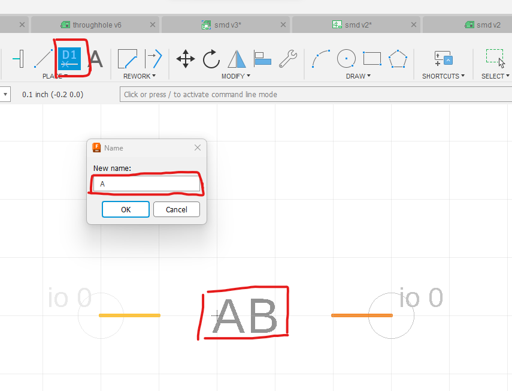

In most cases we want these pin names to be visually shown (e.g., GND, 5V, EN, SDA, SCL), however in the case of push buttons, since it doesn't matter how you connect the push button in the schematic, we can turn off the visibility of the pin names. Change the visibility to only pad, this means that when you make a connection, only the pad number will be shown.

Draw the push button symbol using lines and circles. Instead of changing the grid for drawing you can use "ALT" and move the lines and circles into coordinates different from the grid. Your design should look something like this:

Schematic symbols also need name and value information, Use `95 Names` layer to add the text `>Name`, and `96 Values` layer to add the text `>Values`. For symbols, you don't need to change the text to vector since we are not going to print this information into the PCB, keep the text as proportional.

## Create a new Component

Finally, it's time to create a component which consist of a footprint and a symbol.

Create a new component and call it `TACTILE-BUTTON`.

Click on `add symbol` to add the symbol you just created.

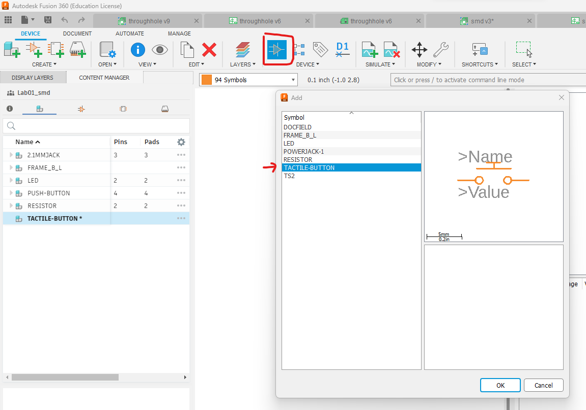

You should end with the following:

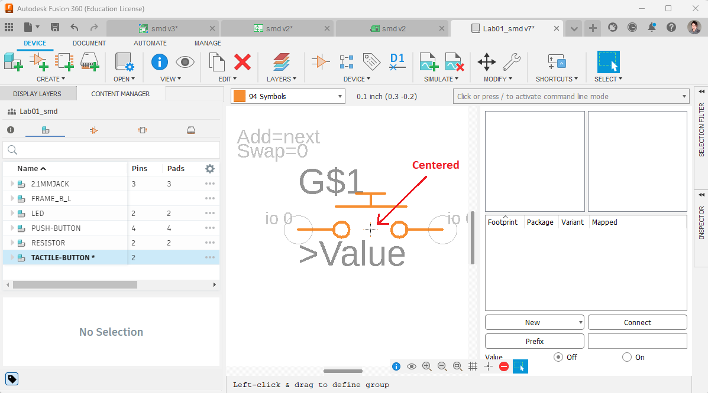

Click `New->Add local package` to add the footprint you just created.

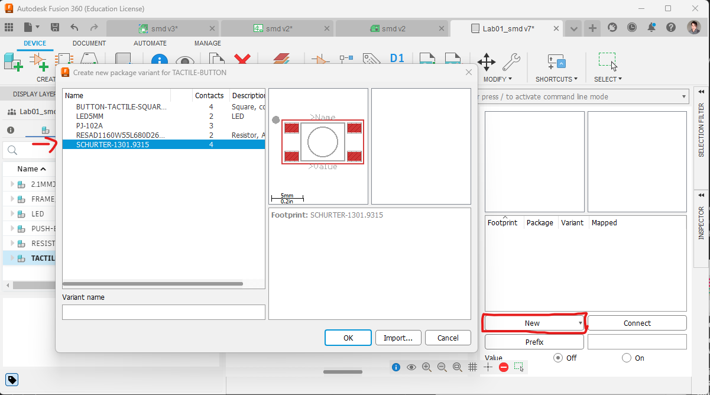

You should end with the following:

Now, what we have waited all the time, it's time to link symbol pins with footprint pads. Be very careful with this process, if you make wrong pins-to-pads link your connections won't match, and you will be wondering why a 5V pin was connected to a GND pad. Select the text with a warning symbol and click `Connect`, a window as the following should show up.

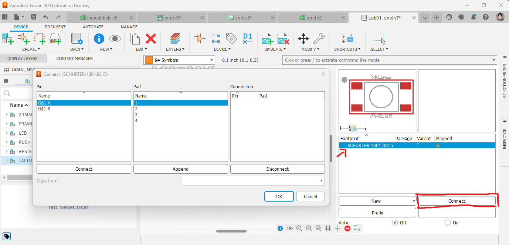

Now connect `pin A with pads 1 & 2` and `pin B with pads 3 & 4`. Use "ALT" to select multiple pads and then click connect.

You should end with the connections as follows:

Click "OK" to accept the connections. You should now see a green check mark for the connections.

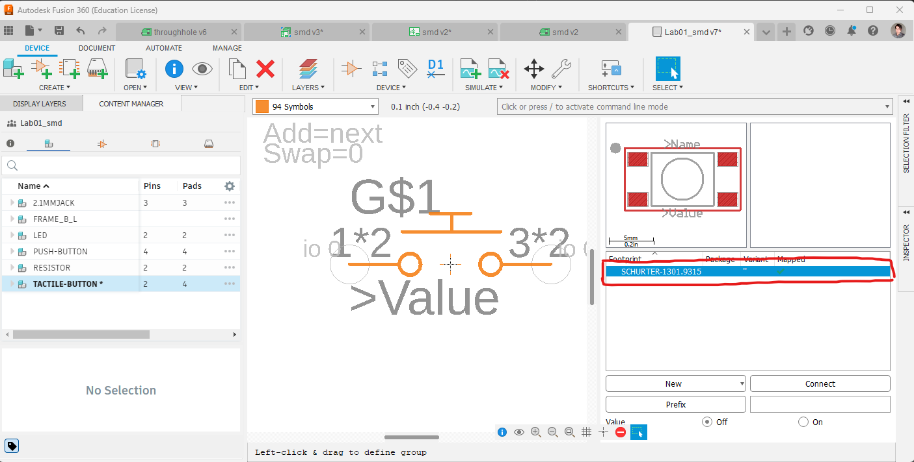

Add the reference designator prefix for that symbol (e.g, R, S, C). Use this link to search for the [reference designator](https://en.wikipedia.org/wiki/Reference_designator) for switches, and locate where it says switch.

Add the `"S" prefix` by clicking the prefix button.

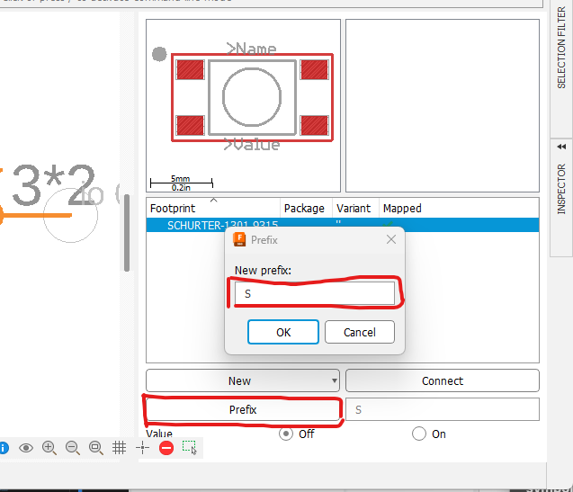

Make the footprint a variant and name it `-SCHURTER-1301.9315`. Variants are helpful so that you don't need to redraw the symbol. You can make a different footprint, maybe bigger push button and add to it the same schematic symbol using a variant. Right-click on the footprint text and select "Rename", you should now be able to rename to pad-to-footprint connection.

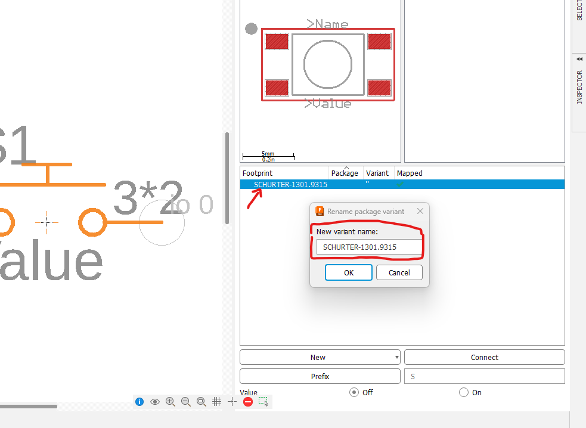
Note: on the image I'm missing the dash "-".

We now have a working component, however there's one last step, and that is of giving the component additional information. Like whom created it, who's the distributor, what's the manufacturer part number for this component, etc. You can find most of the useful information from the distributor, in this case [Digikey](https://www.digikey.com/en/products/detail/schurter-inc/1301-9315/2643952). Note that there are many other components distributors (e.g. [Mouser](https://www.mouser.com/), [Arrow](https://www.arrow.com/), etc).

Adding attributes also makes it easier to automatically generate the list of components you need to purchase.

Add three "attributes" to the new variant you created, which can be added using the `Attribute` button:

- "CREATOR" This should be your name, since you created the variant.
- "DIST" for distributer. This is where we buy the part from. Put "Digikey"
- "DISTPN" for distributor part number. Put "1301.9315".

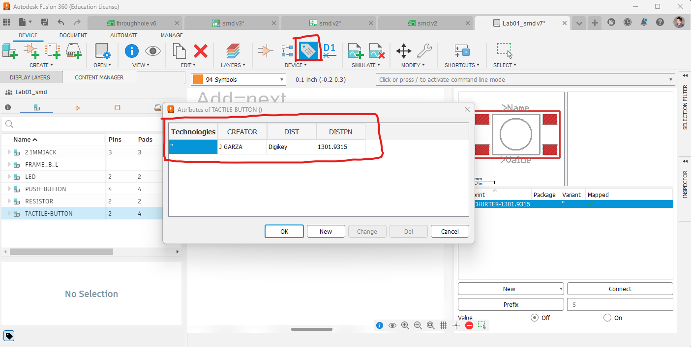

Congratulations! 🎉 You have a working SMD push button component.

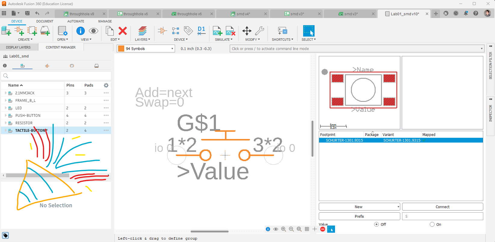

Save your component (Ctr+S).

## Adding the SMD push button component to your schematic

Go to the `smd.sch` schematic, select add new component, and select the library `Lab01_smd` which has a teams symbol.

You will see that the library is there, but your new component may not be there. What's happening? What's happening is that the library version that the schematic sees has not been updated. To update the library with your changes click `Update design from all libraries used in design`

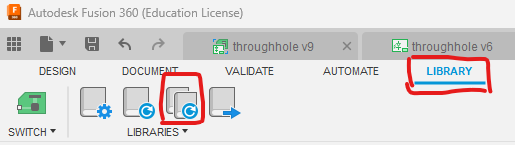

Now add your SMD push button and complete the schematic.

You will notice a strange text in the assigned value text for the symbol. That's a text composed of the component name plus the variant name. This text is not necessary for push buttons, so we can go to the component library and turn the value `"on"` (Don't ask me why on when it should be off).

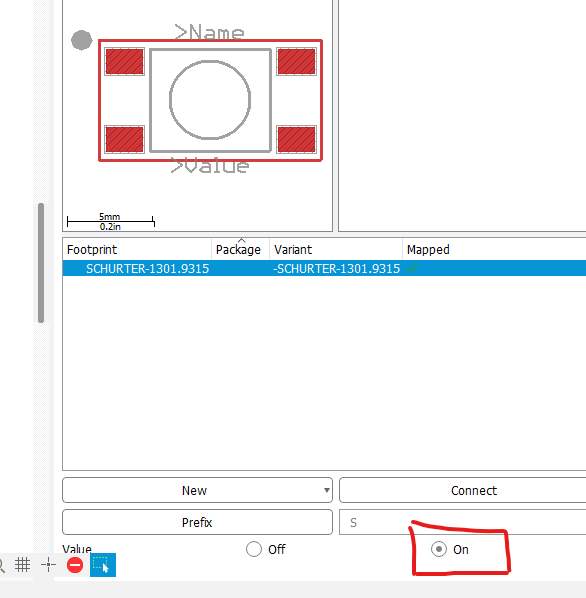

Go to `smd.sch` and update all libraries again.

We now see the text below is gone, and this gives us opportunity to add any value. This is useful for assigning values to resistors (e.g, 1K, 370 Ohms).

Bonus: If you want to give your component a fixed value, add the attribute "VALUE" and "\<Your FIXED VALUE\>".

## Completing the Board

Change the grid to `1 mm`. Add the DRU file `jlcpcb-2layer.dru`, "RULES DRC/EC -> DRC -> Load ...". Move the components into the board and adjust the board outline.

Now, re-route the board, but now using the `Autorouter` tool. The autorouter tool will trace everything for you. Keep in mind that the autorouter tool is very inefficient, you will sometimes need to add more layers or more board area for the autorouter for it to completly trace your design. For the most efficient design do it manually.

Click continue.

Click start

The process will create multiple threads that will execute with path finding algorithms. When it's finish click End Job.

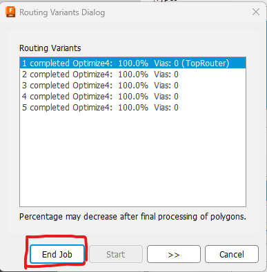

This will result in a nice, fully-routed board!

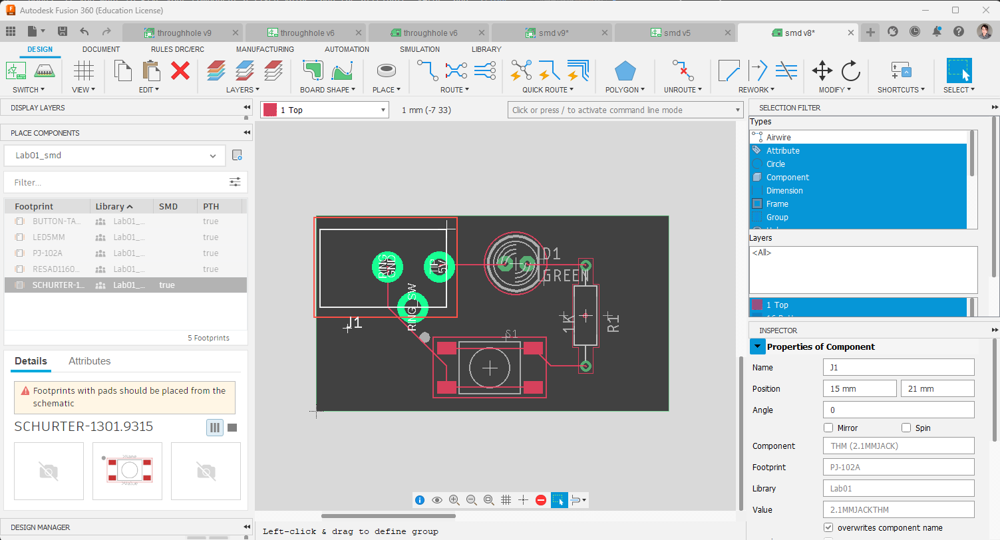

You can select “Unroute -> Unroute all” to remove all traces and try again.

## Re-running the CAM Processor

Follow the instructions for running the CAM processor given in the previous part. Make sure tu use CAM file `jlcpcb-2layer-eagle9.cam`. In the Gerber viewer, you can find the pads for the SMD push button the in the GTL layer. If you check the GBL layer, you’ll notice that while the pins for all the through hole parts appear on the bottom of the board, the pads for the surface mounted component does not. This gives more space to place more components and add more routing.

Save the gerber file as `smd.cam.zip`.

Once you've done everything, you're ready for the [final steps](README.md#getting-art-onto-the-board): adding artwork and exporting!
