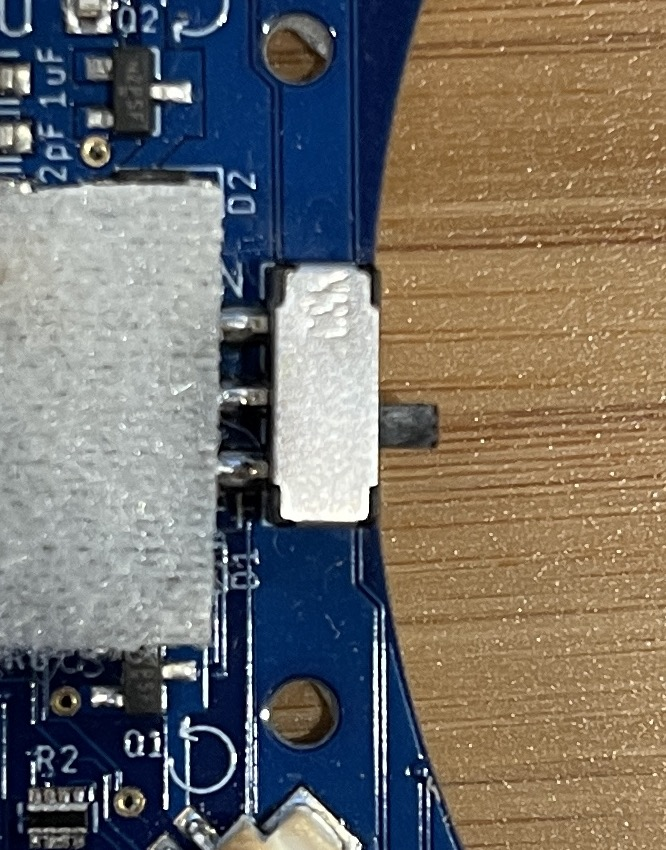
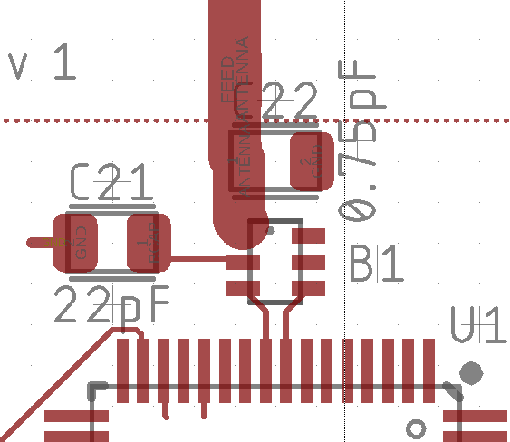
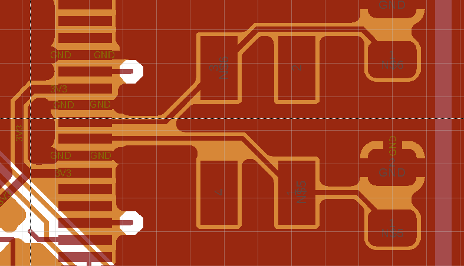
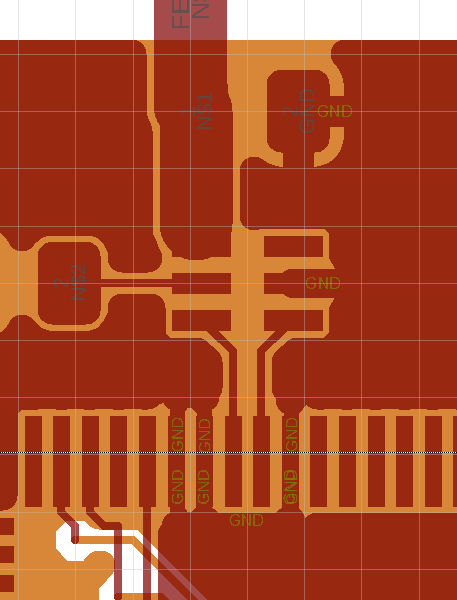

# Laying Out the Board

To be completed in your groups.

Check the course schedule for due date(s).

## Skills to Learn

1. Layout out a complex board.
2. Build power and ground planes.
3. Work with layers to control routing.
4. Size traces correctly.
4. Use the autorouter.
5. Protecting analog components from interference.
6. Drawing a logo in Fusion360.
7. Perform a design review on the above.

## Equipment, Supplies, Virtues, and Software You will Need

1. Fusion360
2. The contents of QuadClass-Resources repo, as well as `quadparts_prebuilt`.
3. Patience.
4. Attention to detail.
3. Read through the [Fusion Tricks Page](../../Fusion-Tricks.md) and skim the [Autodesk docs](https://help.autodesk.com/view/fusion360/ENU/?guid=ECD-PREPARE-LAYOUT) that go over the design tools you will use this lab. 

## Tasks To Perform (Part A)

### Board Shape and Quadcopter Orientation

The first step is to define the size, shape, and orientation of your quadcopter. There are several things you must take into account:

1. You need places to attach four motors.  We will use rubber grommets to attach the motors to your PCB just like we use them to attach the motors to the FCB's airframe.  However, the grommets that fit on the PCB are much smaller.  You will need a hole that is 12.2mm in diameter for each grommet, and the ring of PCB around the grommet must be at least 1.7mm wide.
2. You should ensure that most of the area the propellers will sweep out as they spin will not be over the board. For instance, putting the motor at the end of an arm will accomplish this. The arm must be long enough, however. The diameter of the propellers is either 40mm or 55mm.  Design for 55mm.  You can add four `PROPELLER` devices to your schematic/board to see this in your design.
3. Your design must fit with a rectangle whose area is less than 19,354 sq mm. -- about 13.9cm square.
4. The layout of the motors should be symmetric along the the x and y axes (i.e., the four motors should make a rectangle).
5. I recommend centering your board shape on Fusion360's origin. It will make it easier to place parts symmetrically.
6. The cutting tool the board uses is a 2mm in diameter.  This means if you should corners that are less than 180 degrees (i.e., the corners point into the body of your quadcopter), they will be rounded.
7. The cutting tool diameter also limits the smallest gap between two the board and itself.  Openings must be at least 2mm wide.  You can get a feel for this by doing `hole 2mm` which will give you 2mm circle that you can slide use to guage how the cutting tool will behave.
8. The board manufacturer will not build boards with "ismuths" (i.e., narrow strips of PCB) narrower than 2mm.  The guidance they give is not totally clear, but protrusions (i.e., pennisulas) seems to be OK, while narrow strisp between larger parts are not.  If you want something unusual, we can always send it in and see what they say.  

To verify that you have the dimensions correct, please add dimension elements to your board in `tDocu`. You need these four dimensions (all in mm, of course):

1. The width of your board at its widest point.
2. The height of your board at its highest point.
3. The diameter of the opening for your motors (should be 12.2mm). You can also do the radius.
4. The thickness of ring surrounding your motors.


### Configure Fusion360

We will be building 4-layer boards. You’ll need to set up Fusion360 for this. Here are the steps:

1. Select `Rules DRC/ERC->DRC`
2. Load `pcbcart-4layer-5mil-small-cream.dru`.  Use this DRU file for the rest of the project.


### Place the Parts
The next stage is to place all the parts on board.  Placing most of the parts is straightforward. Here are some things to keep in mind:

1. The location of some components is more important that others. Place these first and use them to guide the overall layout.
	1. The motor controllers should be close to the motors, so the wires on the motors wil reach the motor connectors.  The connectors should be no more than 45mm from center of the motors.
	2. The reset button and the battery connector should be out from under the propellers, so you don’t injure yourself while trying reset or unplug the quadcopter.
	3. The power switch is meant to be on the edge of the board (see image below).  It also needs to be reachable when the props are moving.
	4. There needs to space on either the top or the bottom for the battery. There should be a roughly flat area (like there is on the FCB).
	5. The IMU should be at the center of your quad.
	6. Any other LEDs you added should placed in an artistic way (or to achieve whatever effect you are going for).
	6. The 4-pin programming header should not be well-away from the propellers.
	7. The location of the micro-controller is not, in itself, important, but it’s location does drive the location of the antenna and the crystal.
	8. The antenna needs to be close to the edge of the board and it needs a fair amount of metal-free space around it.
2. You should mimic the layout of the FCB in places where signal integrity is important. This includes antenna (see below) and the crystal.
3. Make your board look good! Align components that are next to each other, make the spacing between components consistent, etc. Board designers appreciate a good-looking board.



### Board Layout Style Guide

Eaglint will warn about most of these.

1.  Align your parts to a 1mm grid.  This will go a long way toward making your board look really good.  The antenna and the capacitor attached to it are excepted, because signal integrity is more important.  You can also bend the rules and use 0.5mm grid for placing caps need the IMU and MCU.  Eaglint enforces the 0.5mm grid.  If you have good reason violate the grid, you can explain it in Eaglint.
2.  Align your reference designators and values to a 0.5mm grid.  Sometimes this is too restrictive.  If you must, you can use 0.1mm.  Eaglint will complain otherwise.
3.  Allow 1-2mm between parts to make assembly easy.  If you designed your `tKeepout` appropriately in the library, this should be no problem.
4.  Orienting all your parts in the same direction makes assembly easier (notice this on the FCB and your remote board).
5.  To be legible, any silkscreen text needs to be at least 0.9mm high, with a 'ratio' of 8%.  You should use the `vector` font.  Eaglint forces you to use exactly these settings on the reference designators.

Boards don't typically include the values of each component, but we do because it makes assembly easier.

### Logo and Decorations

Your team should have a logo! Design it in the footprint editor and then create a device called `DECORATIONS` in the `custom` library that contains it.  You'll need to create a symbol to go along with your new logo, which can just be a box with a `>name` and `>value`.  The name of the variant should be descriptive of what the decoration is, and feel free to add as many decorations as you like!  You can see an example of the `DECORATION` device in the `quadparts_prebuilt` library.

You may need to generate different versions with different sizes (there’s no way to scale anything in Fusion360).  If you want to get creative, you can integrate solder mask, silkscreen, and metal into your logo design.  Checkout the quadcopter logo on the FCB, remote, and battery charger boards:  It uses exposed metal, metal-under-mask, and silksceen.

### The Power Supply

To power your quadcopter, you need provide ample current to the motors and clean 2.5V power to the microcontroller and IMU. The vast, vast majority of bugs I encounter in PCBs like you quadcopter have to do with the power supply.

The power supply for the quadcopter is complicated because we have two different power systems that have different requirements: The motors need maximum power — high current and high voltage — while the IMU and microcontroller, need a clean, regulated, consistent voltage and don’t require much current.

To do this you will need to carefully layout the battery, the voltage regulator, and the bridge between `BAT_GND` and `GND`.  You will also need to create a set of "pours" to efficiently regulated and unregulated power to the components that need it.

You have already built your schematic to provide separate power and ground nets to these two sets of components.  Now we are going to exploit that separation to physically realize two, mostly separate power distribution systems that will meet these needs.

You have four signal layers (Top, Bottom, and two internal layers). The two internal layers will be a power and ground plane — i.e., dedicated to delivering the power and GND signals across the board. These layers are, for the most part, filled with metal. To create these metal areas, you will create pours.

For the 2.5V power supply (`2V5` and `GND`) here are the key considerations:

1. We need to isolate them from the high-voltage supply, both physically and electrically.
2. We need to provide adequate “decoupling capacitance” to minimize noise due to digital switching.
3. We need to provide low-resistance path between the component and `2V5` and the components and `GND`.
4. Correctly layout the voltage regulator according to the guidance in the datasheet.

For the high-current supply (`VBAT` and `BAT_GND`), here are the key considerations:

1. Minimize resistance between the battery and the motor drivers.
2. Minimize resistance on the nets within the motor driver.

#### Basic Principles: Resistance

The resistance of your power and ground connections is important because resistance causes voltage drop.  The voltage drop, `V`, for a current, `I`, flowing through a given resistance, R, is given by [Ohm’s law:](https://www.electronics-tutorials.ws/dccircuits/dcp_2.html) `V = IR`.  Power distribution systems carry non-trivial amounts of current so, the voltage drop can be significant.

Our power distribution networks are made of the copper foil that makes up the traces on our PCBs.  Resistance for a sheet of copper (or any conductor) is proportional to sheet’s aspect ratio.  Long, thin wires have higher resistance than short, fat wires.  For this reason, sheet resistance is measured in Ohms/square: A square sheet of copper has the same resistance, regardless of its size.

You can calculate the resistance of a wire on PCB using [an online calculator](http://circuitcalculator.com/wordpress/2006/01/24/trace-resistance-calculator).  Our wires are 1oz copper.  For instance, a 50mm wire that is 6mils wide has a resistance of 0.127Ohms.  If you tried to power one of your motors — which can consume over 2A — using such a wire, the voltage drop would be 0.24V or about 6% of motor power.  Not the end of the world, but still a waste.

The way to minimize resistance is to make wires wider: Increasing the width to 2mm, reduces the resistance to 0.01Ohms or so.

#### Basic Principle: Inductance

The second principle you need to consider is inductance.  Inductance is a resistance to change in current. The mathematics are more complicated than they are for resistance, but intuitively, if you suddenly turn on a transistor (i.e., the mosfet in your motor driver or the millions of transistors in your microcontroller), it takes a little while for the current to start flowing.  Likewise, if you turn off a transistor, it take a little while for the current to stop flowing (this is what caused flyback in our motor driver).

There’s a calculator for PCB trace inductance [here](http://chemandy.com/calculators/flat-wire-inductor-calculator.htm). The equation is more complex than Ohm’s law, but the trend is similar: Longer, thinner wires have higher inductance. This resistance to the change in current, can also cause a voltage drop along a wire — the higher the inductance, the larger the drop.  Calculating the actual voltage drop is a little complicated because you need to to know the rate of change of the current (dI/dt).  You could use one of the oscilloscopes in the maker space to do this for your motor drivers, if you wanted.  The important thing, though, is that dI/dt is high, so inductance is a problem.

Fortunately, minimizing inductance and resistance both push us toward making the wires in our power supply networks as short as possible and as wide as possible.

### Building Power and Ground Planes out of Pours

PCBs provide an easy way to minimize inductance and resistance while maximizing capacitance in our power distribution system: Power planes. Power planes are entire layers of your PCB dedicated to power or ground.  They cover all or most of the PCB and the power and ground planes should overlap as much as possible. This provides:

1. Low resistance and inductance because they planes act as very wide wires.
2. Capacitance because the power and ground planes form two plates of a capacitor.

We will build the power and ground planes out of "pours".  To create a pour, use Fusion's polygon tool.

1. Select the tool and the select the layer you would like the pour to be in. In your case one of the internal layers.
2. Select the area you would like the pour to include. There is a "width" option you can set while drawing the outline. This corresponds to the width of the outline. I recommend using a small value (e.g., 0.5mm).
3. Select the Name tool (Or type name in the command line) and click on an edge of the polygon. Type (e.g., “GND” if the metal should be connected to GND). It may ask if you want to merge nets (yes), what the resulting name should be (e.g., “GND”), and/or whether you want to rename the whole net or just this polygon (just the polygon).

Once the pour is created, you can click the "Show all polygon pour fills" tool and Fusion360 will fill in the pour.  Fusion360 is intelligent about how it fills in the pour. It will carve out areas around pads, SMDs, and traces that are part of the signal assigned to the pour.  For pads, SMDs, and traces that are part of the same signal, Fusion360 will attach the pour to those components.

You can also extend the pours past the edge of your design.  Fusion360 will trim them to match your board shape.  This much easier than following your board's shape with the polygon.

The gaps and holes Fusion360 can divide the pour into multiple pieces that are not directly connected to each other. By default, Fusion360 will not fill in a pour fragment if there is no connection to the pour’s signal. The unconnected pieces are called “orphans”.

To see the gaps Fusion360 will create in the pour, the connections it will make to pads and signals, and which portions of the pour are orphans, you can click "show all polygon pour fills" from the "polygon tool palette.  If nothing happens, that usually means that no part of the pour is connected to the signal, so the entire thing is an orphan.

The easiest way to ensure that the pour is connected to its signal is to add insert a via in the pour.  You can do this with `Via` tool.  Select it, make sure it’s set to insert a round via and add one to the pour near the edge. Use the `Name` tool to set the signal for the via to the pour’s signal name. Alternately, you can type `via '<pour signal name>'` in the command line and then insert a vias by clicking.  Select "Re-fill polygon pours", and the pour should fill in. 

To unfill the pours (they can make it hard to see things in your design), you can type `ripup @;` in the command line or click "hide all polygon pour fills".

#### Design Your Power and Ground Planes

In our design, we have two power supply signals ( `VBAT` and `2V5` ), so we will use two power planes in layer 15.  How exactly they should be configured will depend on your design, but one reasonable way to start is to draw a polygon around the perimeter of the board (shaped like a “C” if your board is round). It should be no narrower than 4-5 mm at any point.  It should pass under all four of your motor drivers and it should also extend to area where your battery connector and voltage regulator are located.  This will let all these components connect directly to the pours, avoiding long, thin, high-current wires.

The `2V5` pour should cover the rest of the board (except around the antenna. See below). Set the net for that pour to `2V5`.

There should should be a corresponding ground pour above these two pours (on layer 2). The `GND` pour should be same shape as the `2V5` pour, and the `BAT_GND` pour should be the same shape as the `VBAT` pour.

Note that none of these pours should not form a complete ring or "donut". 

The top and bottom layers should have a single, large pour of `GND` that covers everything except the area around the antenna.

Ideally, your pours should not have sharp (90-degree) corners, since it leads to "current crowding".  This is not a big deal in our designs, but it is an interesting phenomenon (https://www.signalintegrityjournal.com/blogs/6-expert-advice-on-power-integrity/post/534-the-perils-of-right-angle-turns-at-dc).

You should also be careful that your power planes on layers 2 and 15 are not cut in two more pieces by traces routed through them.  The goal is to have the pours provide a nice, wide, low-resistance path to the battery, the voltage regulator, the battery, or the net bridge (depending on the pour).  If it's cut in to pieces, all but one of the pieces will usually be connected by a single trace instead.

You can check whether your power planes are not sliced up you can do `display none 15`  or `display none 2` to look at just those metal layers.  `display all` will show everything again.

You should also pay attention to the narrowest point on your `VBAT` and `BAT_GND` pours.  We want wide wires all the way from the battery to the motors, if there's a narrow spot that can significantly increase the resistance.  We are interested in width of the actual metal, not the polygon you've drawn.  Pay attention for anything that might reduce the effective width of your pours (e.g., throughholes).

#### Exploiting Your Power and Ground Planes

The goal of the pours is to provide a low-resistance path for current to and from the battery, but they can only do this if your design uses them.

This means that, wherever possible, you should route your board to use the power and ground planes rather than traces. So, you want the traces that carry `GND`, `BAT_GND`, `2V5`, and `VBAT` to be as short and as few as possible.

The easy way to do this is with the `fanout` command.  It'll draw a short wire attached to each pad and put a via at the end.  `fanout SIGNAL GND` will do this for all your ground pins.  The `fanout` command is imperfect, so may have to fix up its work.

It also makes sense to shape your power and ground planes so that the planes are available where the signal is needed. This is why `VBAT` and `BAT_GND` should extend under all the motor drivers the battery connector.

If Eaglint complains about trace length on high-current traces, you can offer an explanation about traces to LEDs and the breakout header.

#### Laying out the Power Supply

There are three reasons that these components need to be close together:

1. The battery connector needs to be close to the voltage regulator to minimize the length the high-current trace between them. Just a few mm’s away.
3. The wire bridge needs to be close to the battery’s negative terminal to minimize the length of the trace connecting them. Again, a few mm’s.
4. The capacitors for the voltage regulator need to be as close as possible to the regulator because the datasheet says so.
5. The battery connector needs to be set back a little bit from the edge of the board.  There's a white box in the frontprint that represents a plugged-in battery.  The whole things needs to be on the board.  This is to prevent damage to the connect during crashes.  If you look at the FCB, the battery connector is not quite far enough onto the board.

Section 10 of the voltage regulator data sheet has detailed instruction for layout your power supply. Follow them as closely as possible. Your 0805 caps are not quite small enough to do exactly what they request, but you can come close.  Eaglint requires the 1uF caps to be with in 5mm of the regulator, measured center-to-center.  You can relax the grid to 0.5mm if needed -- just add a note explanation, if eaglint complains.  The 47uF cap on the regulated side needs to be with 10mm.

Be sure that the decoupling capacitors on the output of the voltage regulator are close to the regulator, close to each other, and connect directly to the `2V5` pour in layer 15 and all three `GND` pours (layers 1, 2, and 16) through vias situated close to the capacitor's SMDs.  You also want the traces from the capacitor terminals to the voltage regulator to be as short as possible.

Simultaneously satisfying all these constraints will require careful thought and planning. In particular, these constraint will affect how you layout the power and ground pours.

The traces from the battery to the jumper should be in your high-current net class (see below) as should `BAT_GND` and `VBAT`. 

The design includes a wire bridge that connects `BAT_GND` to `GND`. The reason for this is to ensure that noise from the motors (which are connected to the `BAT_GND)` does not impact the microcontroller. In order for this work, you need to place the bridge as close to both the battery and the voltage regulator as possible. This will ensure that the regulated ground has the shortest possible connection to the negative battery terminal.

### Laying out the Motor Drivers

To maximize thrust and responsiveness, you should keep the high-current (i.e., the mosfet, the motor pads, and flyback diode) components of each motor driver close together. `VBAT` should feed the into the controller directly from the `VBAT` power plane. Since the `VBAT` power plane is in Layer 15, and the pads are on Top, you’ll need at least one via, to connect the two. Consider using more than one via, to provide a wider conduction path. You can add all the vias you want using the `via` too.  The `fanout` tool will also add vias for you.

The routing for the low-current components of the motor driver (i.e, the resistor, and the pull-down resistor) is less critical.

### Laying out the Radio

The radio is one of the delicate parts of the board because it require special attention for good signal integrity. You should copy the layout on the remote as closely as you can. The key things you’ll need to get right are:

1. You can ignore the grid requirements in placing these parts.  Matching the reference design is more important.  If eaglint complains, add a note of explanation.
2. Except for the pad that is attached to the circuitry, the antenna should be mounted near the edge of the board without any metal nearby (i.e., there should be no metal in any layer in that area). 
3. The two capacitors and the balun that make up the antenna driver should not have any other signals near them.
4. The length of the traces from the micro controller to the balun should be as symmetric as possible: Equal length and mirrored geometry.
5. All the wires in the antenna should be as short as reasonably possible.  This constraint, combined with the need for the antenna to be near the edge of the board constrains where you can place your microcontroller.
6. The wire between the balun, the antenna, and the capacitor between them should be the same width as the antenna (50mil), and the wire should transition smoothly into the antenna. There should be no sharp corners.

Enforcing all of these requirements will require applying multiple techniques. Begin by laying out the parts to match the layout on the red board. Then read on for tips on how to implement the rest of the requirements.

Just to drive home how delicate this part of the design is:  I have here on my desk a package containing 25 remote control boards that have a range of about 4 inches because I got overconfident about how much I could mess around with the antenna layout.  Don't do that :-(

#### The Antenna

Building good antennas and the circuits to drive them is a deep and interesting area of electrical engineering.  It's also beyond the scope of this course.

To side-step that problem we are borrowing tested antenna design and layout.  You can use the FCB as a guide (the microcontroller is at the bottom the the antenna is at the top:



The antenna also needs a ground plane (https://www.electronics-notes.com/articles/antennas-propagation/grounding-earthing/antenna-ground-plane-theory-design.php).  This is simply a large area of metal extending out from the base of the antenna.  It's radius should be something 1/4 of the wavelength the antenna should emit.  Four our 2.4Ghz radio, that's about 31mm.  The ground pours in the PCB will work just fine (so you don't need add any additional metal to satisfy this requirement).

### Setting Trace Widths

By default, Fusion360 uses the narrowest wires allowed by the DRU file. For us, that’s 5mil (0.127mm).  Narrower wires have higher resistance, and if a trace needs to carry a sensitive signal (e.g., to drive our antenna) or lots of current (e.g., to or from our motors), the trace will need to be wider.

Fusion360 provides the notion of ‘net classes’ to specify different characteristics for different signals in your design.  We will define two new net classes, one for the trace between the balun and the antenna and another for signals within the motor driver (We will deal with `VBAT` and `BAT_GND` separately).

To create or edit a net class, select `Rules ERC/DRC->Class`. The dialog box that appears will let you set width of nets in the class as well as the size of vias the class should use and the distance (“clearance”) between nets of different classes.

First, enter “RFSIG” into box next to ‘1’ and enter ‘50mil’ (to match the width of the antenna) for the width. Leave the “drill” and clearance fields at ‘0’ (which mean use the defaults).

Next, enter "PWR" (or something similar) into box 2. This net class is for the regulated power and ground nets.  They should be 10mil.

Then, enter “HIGHCURRENT” (or something similar) into box 3.  This net class is going to be for wires that carry current to the motors, but how wide should those wires be?  This depends how much current the wire will carry, how hot we are willing to let it get, how large a voltage drop we can tolerate, how long the wire is, and how thick the copper is. The calculation for this are complex, but fortunately, there are tools online to figure it out for you. [This is a good one](https://www.4pcb.com/trace-width-calculator.html).

Our motors can draw about 2A, so peak current is something over 8 amps.  The batteries we use can deliver up to 9.5.  We are using 1oz copper (which means one square foot of the copper foil weighs 1oz.  This works out to 0.035mm).  10 degrees Celsius is a reasonable rise in temperature.  Room temperature is 25 degrees C.  The traces will be pretty short — probably less than 0.5in (or 12.7mm).

These traces are probably going to be on the top or bottom layers (although you should check this is the case after you’ve routed the board), so we are worried about “external layers in air.” Given all that we, see that a trace 30mils (0.72mm) will work just fine.

There will also be vias carrying these currents.  We can increase the default via size for the next class to match the width of the trace.  The diameter of a via is the drill size (which you can set in the `Net classes` dialog) plus an annular ring (which is the ring of copper you can see around the via).  Our DRU file set the annular ring to be 25% of drill _radius_.  Calculate a drill size that will give an annular ring diameter of 30mil and enter that value for the drill field for the “HIGHCURRENT” class.

Now that we have established the net classes, we need to apply them to some nets. This is easiest in the schematic view using the "Change" tool. If you click on the Change tool, you’ll get a list options, select “Class” and then select “HIGHCURRENT”. Then, go click on all the wires connecting components of the four motor drivers. You can skip the signals through the pull-up resistor, if you want.

Finally, use the Change tool to put the signal between the balun and the antenna in the “RFSIG” class.  Note that wires beteween the MCU and the balun can be in the default class.

### Laying out the IMU

You need to add some additional bits to the IMU package.  You built your IMU package with rectangle in `tRestrict`, `bRestrict`, and `vRestrict` to prevent metal in the top and bottom layers, but there is no restrict layer for the internal layers.   You will need to add a "cutout" to make sure there are the appropriate holes in in your `2V5` and `GND` planes.

To create a cutout, use the polygon tool, and check the 'cutout' box in the properties dialog.

The IMU datasheet (`datasheets/LSM9DS1.pdf`) and a technical note (`datasheets/LSM9DS1_smd_tech_note.pdf`) provide guidelines for layout the IMU and its associated components. Follow them.

The caps for the IMU need to be as close to the IMU as possible, and the traces between the caps and the IMU need to be as short as possible.  For decoupling caps, the length of the `2v5` trace is most important.  Eaglint requires all these caps to be with in 7mm of the IMU, measured center-to-center.  You can relax the grid to 0.5mm if needed -- just add a note explanation, if eaglint complains.

### Laying out and Labeling the Breakout Header

You should label each pin of your breakout header so you’ll know which pin is connected to which signal. The labels should go in `tPlace`.

You should also think about where to put the breakout header.  Near the edge of the board is a good choice, since it will provide easy access to the pins.  It’s not a bad idea to put silkscreen on the top and bottom for the breakout header.  It needs to be out from under the props.

### Laying out the IMU Rescue Header

Position the IMU rescue header so that when you attach the breakout board (https://www.adafruit.com/product/3387), the IMU on the breakout board will roughly align with the center of your quadcopter.  It doesn't have to be perfect, but close is good.  Ideally, you should also align it so that the IMU on the breakout board will be oriented in the same way as the IMU on your board.  Then, the same software will work either way.

### Laying out the Crystal

The crystal provides the clock to the MCU, and it's important that it be stable, especially for the radio's operation.  You should mimic the layout of the crystal seen on the FCB.  One detail that's not obvious:  the crystal provide a differential clock (two wires)
 that run to two adjacent pins on the MCU.  On either side of those pins are ground pins.  These are there to make it easy to isolate the clock signals from other parts of the circuit.  Ideally, the crystal and it's signals should be surrounded by an unbroken band of grounded metal that extends from under the MCU, through the ground pins and around the crystal via the top ground pour.  Even better is if the ground pour in layer two is also unbroken under the crystal.  Here's an example of what it should look like (red: `Top`; orange `Route2`):
 


### Laying out the MCU

The caps for the MCU need to be as close to the IMU as possible, and the traces between the caps and the MCU need to be as short as possible.  For decoupling caps, the length of the `2V5` trace is most important.  Eaglint requires all these caps to be with in 11mm of the MCU, measured center-to-center.  You can relax the grid to 0.5mm if needed -- just add a note explanation, if eaglint complains.

### Layer Labels

To help prevent errors or delays during manufacturing, it's useful to make it completely clear which CAM file corresponds to which layer.  There's a special footprint in `quadparts_prebuilt.lbr` for this purpose: `LAYER_LABELS`.  It's attached to the `DECORATION` device.  Use the `add` tool to add a copy to the schematic and it'll appear on the board layout.  It should be outside the boundary of your board.  It will cause the name of the layer to appear in the CAM file for that layer.

### Mouting holes for the test stand

You'll need to mount your quadcopter to the test stand.  The easiest way
to do this is to replicate the whole pattern on the FCB, and then mount your
quadcopter to the same plywood piece we attach to the FCB.

The `MOUNTING_HOLE` device in `quadparts_prebuilt` has a `2-56` variant that you should use for this.  There are four of them and they are centered on the board center of gravity (which should also be your IMU).  They are located at +/-20mm and +/-11.5mm.

You can put them in different spots, but you'll need to build your own adapter plate to attach it to the test stand (or drill holes in plywood for the FCB).  Depending on the size of your quad, drilling holes in the arms should work fine.

### Battery Voltage Meter

You can monitor the batteries voltage using a voltage divider and one of the MCU's analog pins (https://learn.sparkfun.com/tutorials/voltage-dividers/all).  The basic idea is to divide the battery voltage (4.2V max) so that the maximum output of the divider is less than 1.8V.  Then you can measure the that voltage with one of the MCU's analog inputs. 

You should use large resistances in your divider (e.g., in the kOhms range) so that not much current flows through it.
  

### Routing the Board

The final step is routing the board. The steps above have given the autorouter most of the information it needs to route your design.  It will set the trace widths correctly and respect all the `t/bRestrict` information that you added.

#### Hand Routing 

There are few things you should route by hand.  Routing the nets from the microcontroller through the crystal to the associated caps is also a good idea.  They should as short, straight, and direct as possible.

The most important are the traces between the microcontroller and balun.  Note (like the crystal) the antenna outputs have ground on either side.  These are (like with the crystal) to let you protect these signals from noise.

You will also need to manually make the connection between the antenna and the balun.  This requires a trick.  If you try to use the semi-automated "walkaround obstacles" router, it will not work.  This is because the width of the trace (50mil) is so wide that connecting it to one pin of the balun puts the edge of the trace too close to the adjacent pin of the balun.  To avoid this, route as much of the trace as you can at 50mils.  You should be able to get close enough that the trace mostly-engulfs the balun pin.  Then select the "ignore obstacles" option for the routing tool and set the diameter manually to something smaller (like 5mil) and complete the last bit.  The narrower segment should be completely covered by the wider portion of the trace, so it won't make any difference.  You'll get an warning when you run DRC about that little bit of narrow trace on your `RFSIG` signal, but you can 'approve' it.

If the above technique doesn't work, you can temporarily change the net class of the the `RFSIG` signal to allow you to route the narrower wire.

The end result of your routing and pours should look like this (red: `Top`; orange `Route2`):



Note that ground completely surrounds (both around on layer 1 and under via layer 2) the radio outputs and the antenna driver components.  Also note that boundary between the SMD on the cap, the SMD on the antenna and the trace from the balun to the antenna all run together.  This is as it should be.

#### Fanout

Next, you can use `fanout` tool.  It has two good uses: 1) to draw short wires that make it easier to route to parts that pins that are close together (like the microcontroller and IMU) 2) to help ensure that power and ground nets use their pours by adding vias at each pin.  You can fanout both nets and parts.

The fanout tool has it's troubles.  For instance, it will happily place vias for different nets on top of eachother.  You can get around this by fiddling with the various options (`help fanout`).  Once you have a sequence of `fanout` commands that seems to give good results, add it to your routing script (see below).

You can use the change `change` command to adjust the trace width and via size `fanout` uses.

#### Running the Autorouter

Once this is done, the autorouter will probably successfully route your board.  However, many things can prevent the autorouter from completing successfully.  If not, you can try hand routing signals that give you trouble.  If you get badly stuck ask the course staff.

The autorouter is a useful tool, but it is not a substitute for your judgement.  The internet is rife with people complaining that autorouters are no good or that "real" board designers don't use them.  This is a bit extreme, but it is the case that you need to keep an eye on them.  Here are somethings to watch out for:

1.  Routing nets under your antenna driver.
2.  Routing nets under your IMU.
3.  Failing to utilize your pours.  This is a big one.  Most of your connections to `2V5`, `GND`, `VBAT`, and `BAT_GND` should use vias to connect components to the pour.  The pours are electrically better than traces and it also save space for routing other signals.  If you do `show 2V5` (or any other of these signals) you should see your pours, a bunch of short traces from SMDs to vias, and that's about it.  The `fanout` tool is a big help here. The `fanout` tool is good at helping to avoid this.
4.  Routing traces via needlessly long paths. 

#### Rerouting with A Routing Script

You'll probably end up needing to reroute your board several times due to changes you make or bugs you (or Eaglint or the course staff) find.  Starting from scratch can be a pain because you have redo the manual routing too.  There's a way around this: A routing script.

The idea is to write a sequence of Fusion360 commands that does all the rerouting for you.  For instance here's part of my routing script (Fusion360 doesn't support comments, so don't include those):

```
ripup ! *_N *_P ANTENNA BCAP N$12;  # Ripup everything except the nets I hand routed.
change drill 0.1mm;                 # set the via diameter
change width 0mil;                  # set trace width to 0 (fusion360 will use the minimum allowed by your DRU file)
grid 0.1;                           # set the routing grid
fanout signal BAT_GND out;          # fan out some power signals
fanout signal VBAT out;
auto;                               # run the auto router.
drc;                                # run DRC
grid 0.5                            # restore the grid
```

You can either save this as an `.scr` file and run it the `script` command, but I find it easier to just copy and paste it into the command area in Fusion360.

### Performing Design Rule Check

You must run Fusion360's design rule checker (DRC).  It checks for a bunch of common problems.  Look through the list of errors it generates.  Do you best to understand what they mean (they are somewhat cryptic).  Here's a cheat sheet:

1.  "Airwire" -- unrouted net.  Never acceptable.
2.  "Wire stub" -- A short bit of wire.  Often these are remnants of partially deleted nets.  If they go somewhere useful, they are fine.
3.  "Keepout" -- There is metal in side a keepout region.  Rarely ok, but you may get some of these for the antenna and maybe your logo.
4.  "Overlap" -- Two things (e.g., two different nets or a net and an SMD) overlap.  Usually bad, but you'll probably see some for you bridge and the antenna triggers some as well, you can approve these particular ones. 
5.  "Width" -- A net is thinner than it should be.  You'll get one of these between the antenna net and the balun.  Usually they are not a good idea, but sometimes they are ok.  For instance, the IMU datasheet says that narrow power/ground traces are fine for that part, so you could route those nets with thinner traces than the other power nets.
6.  "Clearance" -- Two separate pieces of metal are too close.  Generally, you should cannot ignore these, since the minimum spacing is manufacturing constraint.

You can approve errors, but your peer reviewers (and me) will be looking at them closely.  You should be skeptical about approving errors.  They are called errors for a reason.

### Generating Gerbers

You will need to generate a zip file called `hardware/quadcopter.cam.zip` using `Eagle/CAM/pcbcart-4layer.cam` 

When you create the CAM file, you should check the "Export as ZIP" box in the CAM dialog.  After you generate the first one, you'll need to rename (Fusion360 will name with the current date).  Commit it to your repo.

Your .zip file needs to contain exactly the files required to build your board and no others (to avoid confusing the board house).  For your `.cam.zip` file you should have these:

1. `quadcopter.sol`
2. `quadcopter.l1`
3. `quadcopter.stc`
4. `quadcopter.cmp`
5. `quadcopter.plc`
6. `quadcopter.ncd`
7. `quadcopter.l2`
8. `quadcopter.sts`
9. `quadcopter.pls`
10. `quadcopter.crm`

## Task To Perform (Part B: Design Review)

For this design review, you need to be careful, meticulous, and demanding.  These are the hallmarks of a good design reviewer.

Once assigned, your groups design review partners are listed on your Eaglint homepage.

The reviewee needs to provide a zip file of their `hardware` directory (but not their entire github repo).

After you have performed an initial, thorough review, you should meet with the other team to go over any questions you have.
After that meeting you should produce a file called describing any problems you found.  You'll commit this to your repo as `design_reviews/questions_about_their_board.txt`.

You'll commit the corresponding file you receive as `design_reviews/questions_about_our_board.txt`.  In it, you'll also provide your responses to your reviewer's comments.  You should mark each comment as `fixed` or provide a carefully reasoned explanation of why you don't think it's problem.

These file needs to include the following:

1.  The reviewer team name (and student names/email addresses)
2.  The reviewee team name (and sudent names/email addresses)
3.  The date and time that you met face-to-face

Please only list potential issues in the document.  Do not remark on things that look good or seem ok, since doing so makes the reviews harder to read.

### What To Check For

As the reviewer, your job is spot potential problems with the design you are reviewing.  Since you have built a very similar design, you are familiar with the various problems that can arise, hence you are an expert.

Your review needs to include their schematic, their board layout, and the library entries they created and use.

As you look over the design you should keep in mind the contents of:

1.  The lab write ups
2.  The lecture slides
3.  What I said in class about the design.
4.  What you have learned from the data sheets for the components.

There is a (very incomplete) checklist of questions for you to consider below.  But, ultimately, you are responsible for identifying any and all ways that the design you are reviewing fails to match the spec for the class.

Your grade as the reviewer is based on how many errors I find in the design that you missed.
 
### Sample Checklist

Below is a check list of items you should consider during your design review.

* Antenna and Antenna Driver

	* Do all the traces for the antenna driver reside in layer 1?
	* Is the trace between the balun and the antenna in the correct net class and the correct width?
	* Are the other two capacitors close to the balun?
	* Is the trace between the balun and the antenna short (no longer than the corresponding trace in the reference design)?
	* Is there ample space around the antenna that is free of metal on all four layers?
	* Does the layout roughly match the layout on the FCB?
	* Are there any traces routed through the antenna driver area that are not related to the driver in any layer (there should not be)?

* Power and Ground

	* Does the `VBAT` power plane reach under all four motor drivers?
	* Is the `VBAT` power plane wider than 3mm everywhere?
	* Does the `2V5` power plane run under microcontroller and near the IMU’s power pins?
	* Does the combination of the `BAT_GND` and `GND` ground plane extend to almost every area of the board (with the exception of the area round the antenna)?
	* Are the `VBAT` and `2V5` power pours both in the same metal layer?
	* Are there any parts of the power our ground pours that are very narrow? They should be no “necks” narrower than 1mm.
	* Does the `VBAT` power plane extend to the battery connector?
	* Are the pours in `Route2` and `Route15` cut into pieces by traces routed through them?  They should not be.

* IMU

	* Is the IMU at the center of the board?
	* Are the capacitors specified in the IMU datasheet located as close as is practical to the IMU?
	* Is the IMU oriented so that the X and Y axes are aligned with the pitch and roll axis of the quadcopter?
	* Are there any traces under the IMU? Is there anything under IMU?

* Headers

	* Is the FTDI header oriented so the silkscreen is labels for the pins are on the board and the pins will protrude off the board?

* Microcontroller

	* Is the layout of resonator and the associated caps similar to the layout of those parts on the red board?
	* Do all the traces for the resonator and its associated caps lie in layer Top?
	* Are the decoupling caps for the microcontroller located as close as possible to power pins of the microcontroller?

* Power Supply

	* Are the caps associated with the voltage regulator located near the regulator?
	* Is the voltage regulator located near the battery connector?
	* Does the `2V5` power plane run underneath the voltage regulator?

* Motor Drivers

	* Are the traces that carry large currents thick enough?

* Aesthetics

	* Does does the layout look nice?
	* Are nearby parts aligned?
	* Are the reference designators arranged so they don’t overlap eachother or pads?

* Mechanical

	* Given the location of the motors, will the props clear the board (except for the arms)?
	* Are the rings for grommets the right diameter?

* LEDs

    * Does the contents of their `led_notes.txt` make sense?
    
* Checks

	* Does DRC check pass without errors?
	* If DRC doesn’t pass with no errors, does the team have good explanations for why the errors are ok?

* Gerber Files (ignore for now)

	* Are areas around the antenna clear in the gerber files?
	* Are the power planes where you expect them to be in the gerber files?
	* Are there any traces that cross in an unexpected way in the gerber files?
	* Are there any elements that should be in the silkscreen that show up in metal layers?
	* Are there any elements that should be in the metal layers but that show up on the silkscreen?
	* Does the board outline match what was draw in the brd file?

## Turn in Your Work

### Rubric Part A

“Perfect” score: 10

Initial points: 12

Submit the following to your github repo (you can leave other files in there. These are the file relevant to this lab):

1. Your `quadcopter.sch.`
2. Your fully-routed quadcopter.brd.
3. Your `lbr/LED.lbr`.
4. Your `lbr/custom.lbr` (maybe renamed to `custom_<name>.lbr` and maybe two of them)
5. `lbr/quadparts_prebuilt.lbr`.
6. A files called quadcopter.cam.zip that contains the CAM files for the design.
Submit it to Eaglint.  The tool will not look at any other libraries, so if you use any other libraries the consistency checks will fail.

For this part of the lab, human review will succeed instantly, if you have no errors or warnings.

Once it passes, create a tag called “board-layout-prereview” Be sure to make it an “annotated” tag and push it to your repo ( [https://git-scm.com/book/en/v2/Git-Basics-Tagging](https://www.google.com/url?q=https%3A%2F%2Fgit-scm.com%2Fbook%2Fen%2Fv2%2FGit-Basics-Tagging&amp;sa=D&amp;sntz=1&amp;usg=AFQjCNGOTg8gwVJ3tdWstD6PfspdhSq1Vg) ). Verify that it is visible on github.

### Rubric Part B

“Perfect” score: 10

Initial points: 14

Commit the following:

* The list of questions your reviewers had about your design as `design_reviews/questions_about_our_board.txt`.
* The list of questions you had about the design you reviewed as `design_reviews/questions_about_their_board.txt`.
* Your changes to your schematic, board, and libraries.

Submit it to Eaglint.

Once it passes and human review, tag your repo: 'board-layout-postreview'.

Grading for the design reviews is in two parts:

1. You will lose points for any problems I find in your reviewee’s design that you should have found.
2. You will lose a point for each failed submission to Eaglint and human review.
