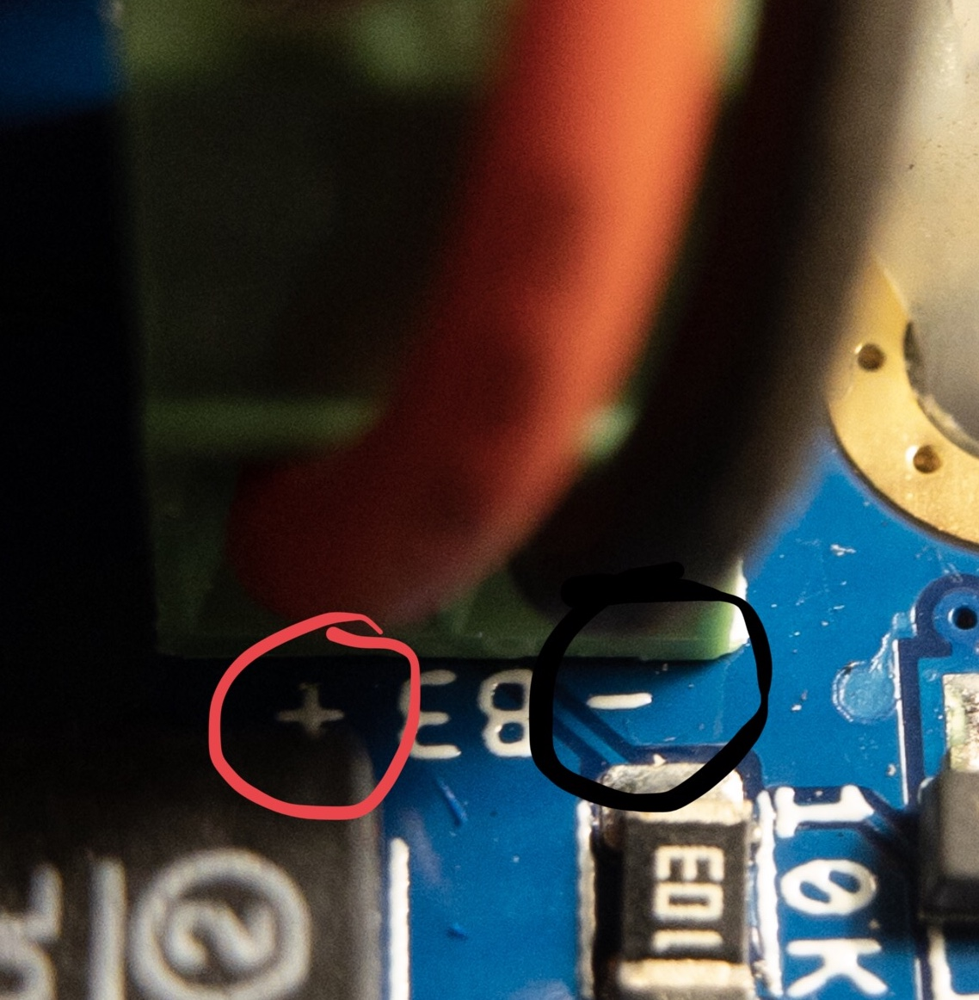

# Arduino, Wireless, and Quadcopter Hardware

This is big lab, but there shouldn’t be many surprises. You’re mostly getting parts and pieces together for future labs. However, don’t assume it won’t take much time. There’s a lot to do. Get started!

## Pick your Team
You will work on this lab and all future labs in teams of two. You will need to create a team on Eaglint and via the github classroom interface. Make sure the two teams match!

## Skills to Learn

1. Installing the Arduino GUI.
2. Programming your remote and the test stand board.
3. Communicating with the boards using an FTDI serial port.
4. Communicate wirelessly between the two boards.
5. Reading values from the controller gimbals.
6. Use the other features of the remote.
7. Driving a DC motor with PWM.

## Equipment, Supplies, and Software You Will Need

1. The starter repo for this lab: . (Don’t clone it until the start of class, last minute changes are likely)
2. A computer.
3. 1 fully-assembled remote control.
5. 1 5V FTDI USB-Serial converter.
6. 1 USB cable.
7. The contents of the github repo for the remote control: https://github.com/NVSL/Quadcopter-Remote for reference.
4. 1 flight control board (FCB).
11. Two charged LiPo batteries.
12. Laser-cut parts for a test stand.
13. Laser-cut airframe
14. 1 set of motors.
15. 1 set of matched propellers (2xCW, 2xCCW)
16. 4-6 small zip ties.

### Your Remote Control

Depending on when you assemble your remote, the remote you use for this lab will either be a 'loner' or your own.  In either case, you are responsible for its care.

1. If you break it, you'll need to pay replace the broken parts.
2. Be reasonably gentle with the gimbals (joysticks). They are of high quality, but are not indestructible.
3. Be careful to install the batteries in the correct orientation.  This mostly means attaching the battery leads to the screw terminals correctly.

### Your Flight Control Board and Test Stand

The flight control board (FCB) is a PCB very similar to the quadcopter you will eventually build.  It mounts to the test stand and will provide a platform for your initial quadcopter firmware development.  The flight control boards are provided for your use during the class.

## Preliminaries 

### Install Arduino

If you already have Arduino installed please upgrade to 1.8.5 or later.  This is the only version we will be supporting in class.  Otherwise, please install the latest version.

### Set Your Sketchbook Location

The `firmware` directory in the repo is organized as an Arduino sketchbook. To use it, open Arduino’s preferences dialog and set your sketchbook location to the `firmware` directory in the repo. You’ll be using this sketchbook all quarter.

### Setup Your Firmware Development Environment

The repo you create and use for this lab will be the repository you use for your software development during the rest of the class. The `firmware` directory is organized as an Arduino Sketchbook, which means the Arduino toolchain and IDE know where to look for things.  To use it, you’ll need to set that directory as your sketch book directory in Arduino (`Preferences->Sketchbook location`).

#### Add Board Definition Files

This will let Arduino talk to all the boards we will be using in this class, including your quadcopter.

* Clone the classes Arduino addon (https://github.com/NVSL/QuadClass_Atmega128RFA_Arduino_Addon) into `firmware/hardware` you should end up with this directory `firmware/hardware/QuadClass_Atmega128RFA_Arduino_Addon/avr`.
* Restart Arduino.  Then, under `Tool->Board` you should see `Quad Class ATmega128RFA1 Boards`.  Select that board.
* Select `Tools->Programmer->USBTinyISP`

#### Install the Libraries

You’ll need a few libraries, so you might as well install them now, but you won’t use most of them in this lab:

1. Attitude, Heading, and Reference System (AHRS): https://github.com/NVSL/QuadClass_AHRS 
2. Adafruit LSM96S1 library: https://github.com/NVSL/QuadClass_LSM9DS1
3. Adafruit unified sensor library: https://github.com/NVSL/QuadClass_Sensor

Clone them into `firmware/libraries`.

There are a few libraries you'll need for the remote as well.  These are in  `Quadcopter-Remote/src/libraries/`.  Copy that directory into your `quad_remote`, `RotaryEncoder` and `radio` to the `firmware/libraries/` directory:
 
```
 $ cp -r <path to>/Quadcopter-Remote/src/libraries/quad_remote firmware/libraries
 $ cp -r <path to>/Quadcopter-Remote/src/libraries/RotaryEncoder firmware/libraries
 $ cp -r <path to>/Quadcopter-Remote/src/libraries/radio firmware/libraries
 ```
 
or create symbolic links:

```
 $ ln -sf <path to>/Quadcopter-Remote/src/libraries/quad_remote firmware/libraries
 $ ln -sf <path to>/Quadcopter-Remote/src/libraries/RotaryEncoder firmware/libraries
 $ ln -sf <path to>/Quadcopter-Remote/src/libraries/radio firmware/libraries
 ```

Here's the command sequence on my machine: 

```
ln -sf ../QuadClass-Remote/firmware/libraries/Remote ./firmware/libraries/
ln -sf ../QuadClass-Remote/firmware/libraries/RotaryEncoder ./firmware/libraries/
ln -sf ../QuadClass-Remote/firmware/libraries/Radio ./firmware/libraries/
(cd ./firmware/libraries/; git clone git@github.com:NVSL/QuadClass-AHRS.git)
(cd ./firmware/libraries/; git clone git@github.com:NVSL/QuadClass-LSM9DS1.git)
(cd ./firmware/libraries/; git clone git@github.com:NVSL/QuadClass-Sensor.git)
(cd ./firmware/hardware/; git clone git@github.com:NVSL/QuadClass-Atmega128RFA-Arduino-Addon.git)
```

When you're done, the top few levels of your repo should look like this:

```
./firmware
./firmware/hardware
./firmware/hardware/QuadClass-Atmega128RFA-Arduino-Addon
./firmware/RFEcho
./firmware/RFEcho/RFEcho.ino
./firmware/RFChat
./firmware/RFChat/RFChat.ino
./firmware/libraries
./firmware/libraries/Radio
./firmware/libraries/RotaryEncoder
./firmware/libraries/QuadClass-Sensor
./firmware/libraries/QuadClass-AHRS
./firmware/libraries/QuadClass-LSM9DS1
./firmware/libraries/Remote
./firmware/RFCount
./firmware/RFCount/RFCount.ino
./firmware/BlinkTest
./firmware/BlinkTest/BlinkTest.ino
./hardware
```
 
Restart Arduino and the bottom of your `Sketch->Include Library`  menu should look something like this:


#### Create Your Firmware Source Files

Create sketches for your quad ard remote control firmware.  

* `firmware/quad_firmware/quad_firmware.ino` will hold the firmware (i.e., flight control software) for your quadcopter
* `firmware/remote_firmware/remote_firmware.ino` will hold the code for your remote control. 

### Run a Test Program 

* Open up `File->Examples->01.Basics->Blink`. 
* Compile and download to the remote.
* One of the LEDs on the board will start blinking.
* Open up `File->Examples->01.Basics->AnalogReadSerial`, and run it. 
* Then, open `Tools->Serial Monitor`. You should find it printing a number at you.  Moving the right stick on your remote should cause it to change.
* Repeat the process with the FCB.


### Arduino Troubleshooting

Programming Arduino microcontrollers can be a temperamental process. If you get an error while programming the board, there are many different things you can try to make it work (some of which seem like black magic):

* Make sure you have the right board and programmer selected.
* Try a different USB port. Computer have internal USB hubs and some hubs don’t play well with Arduino.
* Try a USB 2.0 port. Sometimes programming doesn’t work over USB 3.0. If your computer has a USB 2.0 hub use it. If not, get a USB 2.0 hub and plug the Arduino into that.  On some machines the blue USB ports are 3.0 and black ones are 2.0.
* Unplug everything, quit Arduino, plug everything back in, restart Arduino.
* Google the error. Chances are you are not alone.

In rare cases, you may need to install drivers for the FTDI programming board. Read the How to Install FTDI Drivers Tutorial https://learn.sparkfun.com/tutorials/how-to-install-ftdi-drivers ).

## Bringing Up the Remote

Your first task to "bring up" your remote.  This means verifying that all of it's components work and that you can successfully access them via software.

### Reading the Buttons

The `Remote` library provides a call-back-based mechanism for detecting when the user presses the buttons.  To see how it works open `Open->Examples->Remote->knob_and_buttons.ino`.  Run it, open the serial monitor, push some buttons, and see what happens.

Then read the code to understand how it works.

### Reading the Knob

There's a similar mechanism for the knob.  The library defines an object called `knob1`, and calls a callback when it's value changes.  You can access the current value of the knob with `knob1->getCurrentPos()`.  The knob can turn indefinitely in either direction and the number will grow and shrink accordingly.  

Checkout `Open->Examples->Remote->knob_and_buttons.ino` and the `libraries/RotaryEncoder/RotaryEncoder.h` for details.  Run the example and turn the knob.  The knob has a builtin button, too.  It works just like the other buttons.

### Reading the Gimbals

1. Write a function that reads values from the gimbals and use it to writes them to the serial port.
	* Check out [analog_read()](https://www.arduino.cc/reference/en/language/functions/analog-io/analogread/).
	* The [Arduino Serial monitor](https://www.arduino.cc/reference/en/language/functions/communication/serial/) will tell you how to get output to the serial port.
	* The function should go in your  `firmware/remote_firmware/remote_firmware.ino`, which will slowly grow into your remote’s firmware.
2. Does the value you read from the gimbals vary across the gimbals’ full range of motion? If not, let us know.
3. Have your code scale the values you get from the gimbals so the full range of motion corresponds to the range 0-1023. Don’t use floating point arithmetic — it’s very, very slow.

## Assemble your Test Stand

### Assemble the Frame

The test stand assembles without any tools, and should look like this when it's done:


1. The middle brace slides into the slots on the two end pieces.  You can use either the vertical or horizontal slot.
2. The wooden dowel goes through the holes
3. You can attach two small zip ties to the down to keep it from sliding too much.

It's easy to disassemble as well, although the corners are a bit sharp.

### Assemble the FCB and Airframe

The FCB mounts to the wooden air frame as shown:


1. Thread a small zip tie through the two holes on the board and the two on the airframe.  Include a wooden 'donut' to provide a gap between the two. Make it tight.  
2. Use another two zip ties to attach the air frame to the dowel.  Make it tight as well.
3. Trim the tails of your zip ties.
4. The battery should tuck neatly between the dowel and the FCB.
5. The motors plug into the four recepticals on the FCB.  You need two read/blue and two black/white motors and matching colors need to diagonally opposite eachother (like in the picture above)
6. Wrap the wire around the arms once or twice and then insert the motor into its holder.  It is a tight fit.
7. Install the four propellers.  You need two clockwise (labeled "A" -- see below) and two counter-clockwise propellers (labeled 'B').  Matched propellers should be diagonally opposite eachother.  Color has no relationship to direction.  Check the motor direction before installing the propeller to make sure they blow down.


8. If you need to attach a battery cable, unscrew the two screws on the green terminal block and insert the lead on the battery cable.  Make sure you get the polarity right: red is positive:



## Bringing up the FCB

The FCB has three key hardware components you'll need to test:  The microcontroller, the accelerameter, and the motors.

### Microcontroller Check.

Install a battery on the FCB and the jumper.  Load up `Open->Examples->01.Basic->blink` and watch the lights blink.

### Reading from the IMU

Load, compile, and run `Open->Examples->QuadClass Adafruit LSM9DS1 Library->lsm9ds1`.  Open the serial monitor (You may need to adjust the BAUD rate to 115200), and you should see something like this:


Shows the raw sensor readings from your IMU.  As you move the FCB, they should respond accordingly.  See if you can find gravity.  It's 9.8 m/s^2.

### Driving the Motors

The motors on the FCB are attached to pins 8, 3, 4, and 5.

Add some code to `firmware/quad_firmware/quad_firmware.ino` to control the speed of the motors, and use the functions to run the motors at different speeds.  [analog_write()](https://www.arduino.cc/reference/en/language/functions/analog-io/analogwrite/) will be useful.

To avoid injury take the following precautions

   1. Be careful of the propellers on the motors. They can hurt you.
   2. Before you start, make sure the airframe is in the “locked” position.

## Using the Wireless

The microcontroller on the remote and the FCB (and eventually your quadcopter) use has a built-in radio.  We will use it to send commands from the remote to the FCB and to return telemetry (if you want).

First, find out your groups assigned channel.  You'll need to edit the examples below to pass a channel number to `rfBegin()`.  Eaglint will assign you a channel number.  It's at the top of your list of group design checks. 

To test the wireless, open `firmware/RFCount/RFEcho.ino` and run it on your FCB.

Then run `firmware/RFChat/RFChat.ino` on your remote.  Open the serial monitor and type some text into the field at the top, and hit return.  It'll bounce the data off the FCB and print out the result.   You might get some garbage too, that's fine.

Look at the `RFChat` code to understand how it works: It checks if data is available from the radio and writes it to the serial port. Then, it reads data from the serial port and writes it to the radio.  Note that it sends and recevies multi-byte packets.

## Sending Useful Data

Your next task is to think about how you will transmit data from your remote to the quadcopter. A reasonable approach is to create a struct that holds all the control values you want to send to the teststand/quadcopter and transmit that struct, using `rfWrite()`. You should include the gimbal values and the buttons.

There are some caveats:

First, you should include a “magic number” in your command struct so you can make sure you are getting commands from your remote and not some other random data or packets from another team (we may have more teams than channels). If you want to be more careful, you can include a checksum as well. For instance, the last entry in the struct could hold the `XOR` of all the other words in the struct. If they don’t match, it’s a packet from somewhere else.

Second, don’t spam the world with your radio traffic. Modify your remote firmware to send the command packet between 10 and 20 times per second.  The  `millis()` functions (search for “arduino millis") will help you here.

Third, this struct and the related function will be shared between your quadcopter firmware and your remote firmware. The clever way to do this is to create your own Arduino library that holds the struct and related code. Otherwise, if you change it in one place, you’ll have to remember to change it in another. This violates the [DRY principle](https://en.wikipedia.org/wiki/Don%27t_repeat_yourself).

I recommend just sending the normalized values from the gimbals and buttons to the quadcopter.  That way, your remote control code won’t change much as your flight control software get’s more complex.  You’ll need to be careful when normalizing to make sure you don’t lose resolution on gimbal values.

To test it, program the test stand board to receive the data from your remote and print it out. Verify that the values change as you move the gimbals, etc. Keep this code around, you will demo it for us.

## Putting it All Together: Remote Controlled Motors and LEDs

Modify `firmware/quad_firmware/quad_firmware.ino` and `firmware/remote_firmware/remote_firmware.ino` so you can arm your FCB, calibrate your gimbals, and control your motors’ speed with the remote.

### Calibrating Your Gimbals

The potentiameters in your gimbals are imperfect, so they need to be calibrated.  As you move them around, you'll notice that the values don't go from 0 to 1023 (the full range of the microcontrollers ADC).  My yaw control, for intsance, only goes from 57 to 906.  You'll need the actual values for your gimbals so you can know, for instance, where the neutral position for pitch, yaw, and roll are.   To collect these values, you'll need a calibration mode.

A few nice things to have in a calibration mode:

1.  You don't have to do it every time your quadcopter restarts.
2.  You can't accidently enter it while your quadcopter is flying (since it requires you moving te sticks all over the place)

For #1, the Arduino EEPROM library is useful: https://www.arduino.cc/en/Reference/EEPROM.  It let's you store data across resets.

For #2, you should only be able to enter calibration mode while the quadcopter is not armed. (see below).

### Arming your FCB

The propellors are sharp enough and fast enough to hurt you.  To prevent accidents, your firmware should require you to "arm" your quadcopter before it will turn on the motors.  

A typical arming sequence is to put the both gimbals in the lowest, outermost position.  This position is useful in two critical ways: 1) the pilot is unlikely to do it by accident and 2) it ensures that the throttle is at 0.  Turn on an LED on the quadcopter when it is armed.

Your remote and the quadcopter need to always be in agreement about whether the quadcopter is armed.  For instance, if your reset your remote, the FCB should be disarmed.

### Throttle Control

Once the FCB is armed, the throttle gimbal (the vertical axis of the left stick) should control the speed of all four of your motors.
 
Make sure of the following:

1. When the stick is all the way down, the motor should turn off (I.e., writing 0 with `analogWrite()`).
2. When the stick is all the way up, you should be driving the motor at full power (i.e., writing 255 with `analogWrite()` )
3.  As you move the stick, motor power should vary smoothly with the sticks position.  (i.e., If the stick is at its midway paint, you should be writing 128).
4. If you push a little bit on the stick when it is all the way up or down, it shouldn’t behave strangely.  Achieving this will require you to deal with non-idealness of the gimbals.  The `map` and `constrain` functions that Arduino provides are useful here.

## Turn in Your Work

### Commit Your Code

1. Your remote firmware in `firmware/remote_firmware/remote_firmware.ino`.
2. Your quad firmware in `firmware/quad_firmware/quad_firmware.ino`.
Once you’ve committed everything, create a tag called “Lab03” Be sure to make it an “annotated” tag and push it to your repo (https://git-scm.com/book/en/v2/Git-Basics-Tagging). Verify that it is visible on github.

### Demo Your Code

1. Demo your remote controlled motors.

### Rubric

Possible points: 10

Check list:

1. Assembled test stand **1 point**.
2. Remote controlled motors (see checklist above) **5 points**.
3. Remote controlled LEDs (see above) **3 points**.
4. Correctly organized github repo **1 points**.

You will lose one point for each day late your solution is and one point for each item missing from the above and for each day late.