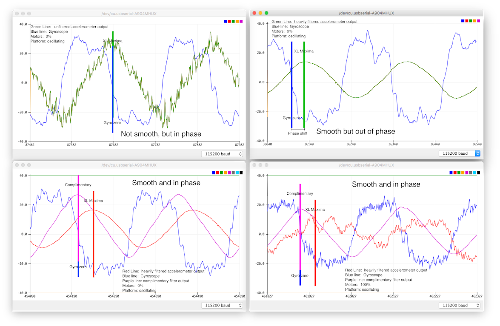
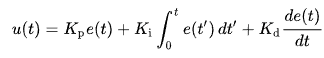

# Sensing and Control

To be completed in your groups.

Check the course schedule for due date(s).

## Skills to Learn

1.  Read data from the IMU.
2.  Using the Arduino plotting tool.
3.  Configure the builtin filters.
4.  Implement a complimentary filter in software.
5.  Tune the filters to provide good readings of FCB orientation.
6.  Implement a PID control loop in Arduino.
7.  Tune a PID control loop

## Equipment, Supplies, and Software You Will Need

1. Test stand
2. Remote control

## Tips

- This is a big lab, don't delay in starting.
- Your algorithms will have some parameters to tune. The remote's knob and buttons are meant to help tune them. You can use the knobs on your remote control to changes these dynamically, it will make tuning much faster than having to recompile.
- You can use the buttons too. For example, you could use the buttons to switch between parameters and adjust them with the knob.
- Some enterprising groups have also use the gimbals to set parameters too.
- You can send information over the serial port to your laptop to provide feedback to the user.
- If you stall the motors (i.e., hold them still with the throttle on), it may cause either your IMU reset, which will make it stop reporting any data.
- If your FCB resets when you turn on the motors, it's likely your battery is dying.
- Your IMU stops returning sensible numbers, it's likely your battery is dying.

## Part I: Sensing and Filtering

You cannot control what you cannot measure.

In this lab, you will use the IMU and some software to accurately measure the orientation of the quadcopter. In the next lab, you'll use this measurement as the input to a control algorithm that will keep the quadcopter stable.

### Reading Data from the IMU

Verify that your FCB is working properly and that you can program it and that you can read from the IMU by re-running your code from the previous lab.

The IMU provides a 3-axis accelerometer and a 3-axis gyroscope. You won't use the accelerometer data directly. Instead, your code will use them to compute the pitch and roll angles. You installed the library for this in the previous lab (https://github.com/NVSL/QuadClass_AHRS).

The key function in this library is: `Adafruit_Simple_AHRS::getQuadOrientation()` that fills in a new struct: `quad_data_t` with all the information you'll need: pitch and roll angles and the three axes of the gyro. There is also an example: `File->Examples->QuadClass AHRS->ahrs_quad_lsm6ds0.ino` that will print out these values.

I believe that you should not need to modify any of these libraries. If you find that you do, go ahead, but please let me know (or submit a pull request!).

### Plotting Data

Arduino has a nice data plotting facility built in. You print out numbers on a line, separated by spaces, it will plot each column of numbers in a different color in real time. Just select `Tools->Serial Plotter`. Any non-numeric data is ignored.

For best results, set your serial port bit rate to 115200. This the argument to `Serial.begin()` in your `setup()` function.

I have been having some trouble getting the serial port to work at 115200. For unclear reasons sometimes it will only work up to 19200. 9600 always works, but it's slow, so the graph is not very responsive.

Integrate the code from the example into your code for remote controlled motors from the last lab and have it plot the pitch euler angle (`.pitch` in the `quad_data_t` struct) and the pitch rate (`.pitch_rate`) from your IMU.

### Dealing with Noise

If you turn on the motors, you'll notice the output of the IMU gets noisy due to vibrations from the motorts. If you can't accurately sense the orientation of your quadcopter, you can't hope to control it.

To see the problem, use the sketch you just created. As you move the pivot platform with your fingers, you should see the curve swing back and forth pretty smoothly. Now try increasing the throttle to the motors using the remote control. You'll notice that curve becomes very jagged -- not smooth at all.

This is a big problems because it means that 1) the instantaneous measurements of your orientation are not accurate and 2) the derivative of your orientation is wildly unstable (since it bounces between positive and negative values). We need both the orientation and its derivative to be well-behave in order to stabilize the quadcopter (you'll see why in the next lab).

We will address this problem in two ways:

1. Applying filtering in software using a complementary filter.
2. Using the IMU's built in filters by configuring registers.

### Filtering in Software (Complementary filter)

You can filter out some of the noise in software by combining the readings from the accelerometer and the gyroscope. The AHRS library gives you Euler angles (i.e., degrees) for your quadcopter's orientation. These do not drift over time, but they are quite noisy when your motors are running.

The gyroscope gives you angular acceleration (i.e., the derivative of the Euler angles). The gyroscopes are less noisy than than the accelerometers. You could recover the Euler angles by integrating the gyroscope outputs, but the resulting measurement will drift over time due to accumulated error.

Our goal is to combine these two to use the accelerometer to avoid drift while using the gyroscope to avoid noise. The easiest way to do this is with a [complementary filter](http://www.pieter-jan.com/node/11). The math is simple and it's pretty intuitive.

The filter is weighted average of two terms:

1. The previously measured Euler angle + the integral of the gyroscope measurement since that measurement.
2. The current Euler angles measured from the IMU.

The filter's single parameter (called the _complementary gain_) ranges from 0 to 1 and controls how each of these terms contributes to the output. The higher the gain, the more influence the gyroscope has over the output.

Complementary filter (cf) equation:

```
cf_ange = (gain) * (cf_angle + (gyro_raw * RAD_TO_DEG * dt)) + (1-gain) * (acc_angle)
```

Where:

- `cf_angle` = Complementary filter angle
- `acc_angle` = Euler angles from `Adafruit_Simple_AHRS::getQuad()`
- `gyro_raw` = Gyroscope measurement from `Adafruit_Simple_AHRS::getQuad()`
- `gain` = Complementary gain
- `dt` = delta time

Notes:

- The `gyro_raw` value is in radians and needs to be converted to degrees.

```
#define RAD_TO_DEG 57.295779513082320876798154814105
```

- For dt (time), use the arduino funcion `millis()`. You want the time between loops, not the time now.

- Is advised to compare `acc_angle` to `gyro_angle` to check if both output a reasonable angle when tilting the FCB. The `gyro_angle` formula is the following:

```
gyro_angle = gyro_angle + gyro_raw * RAD_TO_DEG * dt
```

- When adjusting the gain from 0 to 1 you should see the complementary filter moving either to `acc_angle` or `gyro_angle`, depending on the gain value.
- You need to implement the complementary filter for both `pitch` and `roll`, we won't implement `yaw`.

I recommend watching this video to learn more about complementary filters: https://www.youtube.com/watch?v=6AoJ8wr8G6A

### Filtering using the IMU registers

The IMU has a bunch of settings that control how it collects and reports data. It also has some built in filters that can remove noise from its output. This is great, because it doesn't place any load on the microcontroller. Unfortunately, the documentation is kinda terrible.

Here's some basic terminology:

1. A low-pass filter allows the low-frequency component of a signal to pass through.
2. A high-pass filter allows the high-frequency component of a signal to pass through.

Generally, we would like the low-frequency information from the accelerometers and some part of the higher-frequency information from the gyroscopes.

#### Read Key Sections of the IMU Datasheet

- 6.4
- 9.12
- 9.13
- 9.17
- 9.18
- 9.19

#### Configure the Gyroscope and Accelerometer to Prevent Clipping (Sensitivity)

"Clipping" occurs when a measured value exceeds the range the IMU can handle. For the gyroscope, this means it rotates too quickly.
Clipping will show up as a flat plateau where a maximum should be on a graph of the gyro output. This is bad, because we will be relying on the integral of the gyro data to approximate Euler angles.

Use `lsm.setGyroRange()` to adjust range of values the gyros measure to eliminate the clipping. Use `lsm.setAccelRange()` to adjust the range of values for the accelerometer.

#### Adjust the Output Data Rate (ODR)

Adjust the output data rate (ODR) so it's higher than the rate at which you are sampling the data from the IMU. If the ODR is lower than your sampling rate, you'll read the same value repeatedly.

The AHRS example prints the latency for each trip through the loop at the beginning of each line (usually ~4ms). Your sampling rate is 1/latency (e.g., 250Hz). You can set the ODR for both the gyro and the accelerometer using `lsm.setAccelDataRate()` and `lsm.setAccelDataRate()`. See Table 44 and Table 48 for selecting the ODR.

#### Setup the Low-Pass Filter on the Accelerometer

The accelerometer can be configured as a low-pass filter or high-pass filter, this filter is called composite filter and can be setup using `lsm.setAccelCompositeFilter()`. The composite filter is shown in Figure 16 and 17, and the configuration register in Table 65.

We want the accelerometer to be configured as a low-pass filter to reduce noise, check how do this configuration using the function parameters.

You also need to set the cutoff for the low-pass filter of the composite filter, also referred as `LPF2`, by setting an ORD Ratio. The cutoff is set by dividing the ODR by the ODR ratio. For an ODR of 208 Hz and ODR/4, the low-pass cutoff is 52Hz.

#### Setup Filters On the Gyroscope

You want to let as much of the high-frequency signal from the gyroscope through as possible. Use `lsm.setGyroHPF()` to configure the Gyro HPF, use Table 62 for guidance.

#### Adjust for Offsets

When your FCB is still and level, it will probably not return zero pitch and zero pitch rate. When your FCB starts up (or maybe when you arm it) it should check the values coming from the IMU to see what offsets you are measuring. You should correct for these offsets so that the measured values are correct by subtracting the value measured at calibration, e.g. (`calibrated_angle = acc_angle - offset`). Do this for `acc_angle` and `gyro_raw`. Make the offsets variables global so that you can access them in all functions.

#### Coding Conventions

You can do all this tuning in a function similar to `setupSensor()` from the IMU example program. The example configures the IMU for all the values described above. Make sure you understand how it is working before you proceed.

In your code, you _must_ use the macros and constants defined in [QuadClass_LSM6DSOX.h](https://github.com/NVSL/QuadClass-LSM6DSOX/blob/main/QuadClass_LSM6DSOX.h) and [Adafruit_LSM6DS.h](https://github.com/adafruit/Adafruit_LSM6DS/blob/master/Adafruit_LSM6DS.h). If you show me code with magical hexadecimal values in it, I will tell you to go make your code readable first by using the macros and constants.

#### Target Values

You should configure the IMU's filters as follows:

1. You need to set the both gyroscope's and accelerometer's range to avoid clipping.
2. The ODR for both gyroscope and the accelerometer should be 208Hz.
3. You should configure the accelerometer's LPF2's cut off frequency to be 10.4Hz.

### What Your Output Should Look Like

For the completion of this lab, your demo will be you wiggling the airframe on your test stand with your motors going full blast and the plotting curves moving responsively but smoothly in response.

The output of your complimentary filter will be an estimate of your current pitch angle. When you have your IMU filters set properly and your complimentary filter set correctly, you should observe the following:

1. No clipping.
2. With the motors off and the platform still, your estimated pitch angle should not change, even over long periods.
3. With the motors off and the platform moving, the maxima and minima for the pitch angle should align with the zeros of the raw gyro measurement. The pitch angle should change smoothly.
4. With the motors on and the platform still, it should not significantly different than with the motors off.
5. With the motors on and the platform moving, it should not significantly different than with the motors off. The zeros of the raw gyro measurement should align with the maxima and minima of the pitch angle.

The figure below illustrates the layers of filtering at their effect:

1. Top-left: The unfiltered accelerometer and gyro data (motors off). It is noisy, but note that the maxima of the accelerometer curve coincides with the zero of the gyro. This means the two signals are phase-aligned, since the gryo is the derivative of the accelerometer reading.
2. Top-right: The accelerometer data after the IMU's low-pass filter. The noise is gone, but it is out of phase and the amplitude is reduced.
3. Bottom-left: Combining the accelerometer data with the gryo data with the complementary filter preserves the smoothness and corrects the phase alignment.
4. Bottom-right: Turning on the motors doesn't affect the output of the complimentary filter.



### Tuning Tips

Neither the complimentary filter nor the IMU's filters are sufficient on their own to get what we need: A smooth, non-drifting pitch angle in the presence of motor noise. It will take some trial and error to get the right output. Here are some tips:

1. Our gyroscopes are quite accurate, so integrating doesn't cause very much drift. They are also somewhat immune to vibrational noise. This argues for a high complementary gain.
2. The accelerometer has no drift, but is extremely susceptible to vibrations. This argues for a low cut off frequency for the accelerometer. This is ok especially because the gyroscope will provide good high-frequency data.
3. If your complimentary gain is too high, your measurements will drift. The drift can be very, very slow, but so take time to make sure it's not there.

You'll need to experiment quite a bit to get good measurement. The more tuning you can do without recompiling, the better, so spend some time refining your remote control code so you can tune things with the knob.

## Part II: Implementing PID

You will write the software to stablilize the FCB's yaw and pitch axes.  You should be able to control the following:

1. The spin rate of the FCB hanging from monofilament.
2. The pitch angle of the FCB on your test stand.
3. The overall thrust of the motors (using the throttle gimbal of your remote).

Using the yaw stick you should be able to easily control the rate of rotation of the quadcopter.  It should start and stop spinning quickly.

So you should be able to move your pitch gimbal and see the test platform quickly and stably move in response. 

For both pitch and yaw, you should should also be able to turn the throttle up and down without observing much change in the pitch angle or spin rate.


### What Should be Simple and What Should be Complex

Your implementation of PID should not be complicated.  The PID algorithm is not complex, and simple, straightforward translation of the math into C code works just fine.  The same goes for the complimentary filter.

My reference implementation of one PID controller is 5 lines and 252 characters.  There are no tricks in the code.  It is a direct transcription of the PID equation into C.  You just need to implement the math carefully and correctly.  My implementation of the complimentary filter is equally simple.  Simplicity here is a real virtue.  

This is not to say that the lab is easy.  It is not.  Debugging simple code can be quite hard -- all the more when the bugs will manifest themselves as a crashing quadcopter.  Tuning the PID loop is tricky, time consuming, and frustrating.  This source of difficulty is reflected in the reference design:  While my PID implementation is short and sweet, the code that allows me to quickly and easily tune my filters and PID coefficients from my remote is several hundred lines of code, contains some pretty tricky parts, and represents many more hours of my life.

In most (and possibly all cases), the solution is not in more complexity in your control code.  It is in more careful debugging, simplification, and careful, methodical testing.  That, and making sure that your battery is adequately charged.

### The Control Loop

You will implement two controllers in the lab:  one for yaw and one for pitch.  Your quadcopter will eventually have a third controller for roll.

The PID controlled is a closed loop controller. Here's the flow chart for a generic closed loop controller.


The "System" is your quadcopter. The "controller" is your PID code. The "input" is the target "angle of attack" or "rate of spin" for your quadcopter (0 means flat and not spinning).  This is also called the "set point" because it is what you want to set system to do (e.g., setting a thermostat).  The "output" is estimate of the quadcopter's pitch produced by your complementary filter and the yaw provided directly from the gyroscope.

The controller takes the difference between the desired state of system (input) with the current state of the system (output) as the "error."  Based on this error (and it's behavior over time), it computes a set of control setting (i.e., power levels for the motors) that will, hopefully, reduce the error.

You'll need to calculate the setpoint based on the position of your yaw and pitch gimbals.  For yaw, +/-180 degrees/sec is a good starting range.  For pitch, +/-10 degrees from horizontal is a reasonable range.  That is enough to make your quadcopter move forward or backward at a reasonable speed.

### The Mixer

The mixer (which would be inside the "system" box in the diagram above) is responsible for combining the current throttle setting with the outputs from the controller to set power levels for the motors.

A key consideration in the mixer is that the total angular speed of the propellers needs to remain constant.  That means that if you increase the speed of one counter-clockwise propeller you must decrease the speed of another one by the same amount.  This explain why propellers that are diagonally opposite one another rotate in the same direction.

The simplest way to implement the mixer is something like this: `power = throttle + PID_output` for the front motors and `power = throttle - PID_output` for the back motors.  A potential problem is that the PID adjustment might be larger than the current throttle value or the throttle value maybe very close to the max motor power. In both of these cases, the quadcopter will not be able to completely implement the output of the PID control. 

Initially, you can ignore this problem: Test with your throttle in the middle or so.  You may need to compensate for this problem later, or you may not.

For your real quadcopter, your mixer will need to account for inputs from all three PID controllers (Pitch, Roll, and Yaw).

### The PID Controller

The basic form of the PID controller is this (thanks Wikipedia):



Where:

* Kp, Ki, and Kd are the P, I, and D coefficients.
* e(t) is the error at time t.
* u(t) is the "control variable" (I.e., the adjustment you will apply to the motors)

Implementing the PID controller requires you computing the integral and derivative of e(t), and there are pitfalls in both of them.

#### The Derivative of Error

The easiest way to compute the derivative is by dividing the change in error by the change in time. Just remember:

* Measure time in seconds.
* Be sure you have the sign right on e(t) and de/dt. If you get it backwards nothing will work.
* Use the actual elapse time since your last measurement.

#### The Integral of Error

This one is a little trickier. The obvious answer is to just sum the error term forever. The problem here is that if you happen to hold your test platform steady with your hand, the integral will grow rapidly. 

For instance, if you hold it in a position where the error term is positive for 10 seconds, the integral term will come to a large positive value. When you release the platform, the platform will move sharply to a position with negative error (because it has been trying for 10 seconds to reduce the positive error). It will then take a while (maybe another 10 seconds) to “unwind” the integral by adding in the negative error.

Another common problem:  If your Ki = 0, and the integral of error becomes large (which is just what you would expect to happen when Ki = 0), and then you increasing Ki, your quadcopter will massively overadjust. 

There are couple of solution to this:

* You can have the integral decay over time.  For instance, instead computing `sum = sum + e` each iteration, you could do `sum = 3.0*sum/4.0 + e`.  The downside of this is that it will make your kI term's behavior more complex.  Complexity is your enemy.
* You can also just bound the integral at some value. Some trial and error may be required to find a reasonable bound.  Same problem as above -- this introduces a discontinuity is the algorithm's behavior.
* You can reset the integral when throttle is 0 or when `Ki` is zero.

You might also want to implement a "deadband" on throttle, so that if the throttle is below some small value, it reads as 0.  If your throttle is at 1, your motors probably won't turn on, but it would keep your error integral from reseting if you implement the last item above.


### Implementating PID

The PID algorithm is pretty simple and no complex tricks are required to get it to work.  That does not mean it's easy, though.  The big challenge is that it involves several interacting pieces: 

#### The IMU and your Filters

The PID controller does not control actually try to control the orientation of your quadcopter.  Rather, it tries to control the output of your complimentary filter.  If the filter's output does not accurately reflect the orientation of the quadcopter, all is lost.

You need to pay close attention to the output of your IMU and the complimentary filter.  For instance:

1.  Is the measurement accurate?
2.  Does track reality quickly and accurately? (your quad copter must react at sub-second time scales, if it takes 5 seconds for your pitch angle estimate to converge, the quadcopter cannot react faster than that.)
3.  Is there any clipping?
4.  Is there a lot of noise?

One particularly useful tip:  Don't worry about stability at low throttles settings.  I get horrible harmonic noise in my accelerometer at moderate throttle settings.  It's impossible to filter out, but the throttle is too low to take off at that level, so it's unimportant.

#### Your PID Implementation

The implementation can (and should) be pretty simple.  Trying to tweak the algorithm by having it behave differently in different situation, etc., is a recipe for poor performance.  Even without special cases, there are many simple errors to avoid.  Keep you code simple, clean, and well-organized.  If you code is a mess, and you have a sign wrong somewhere, you'll never find it.

If you get strange behavior, make your implementation simpler rather than more complex.

Pay attention to your PID update rate.  100Hz (10ms/iteration) is good.  The call to lsm.getQuad() takes about 1.8ms.  You will eventually have 3 PID loops. So that means you have about (10-1.8)/3.0 = 2.7ms per PID channel.  If you implementation is simple, this should not be a problem.

#### Your Mixer

The output of your PID controller is number that specifies how adjust the relative power of the front and back motors.  If that variation can't happen (because your motor outputs are saturated), PID cannot possibly work.  Implementing the PID's will is actually more important that implementing the pilot's requested throttle level (although you should strive for both).

#### Debugging and Tuning

* Use the knobs and buttons on your remote to tune parameters.  It’s much faster than recompiling.  Spending time on the code to support this will pay you back many times over.
* Use Arduino’s serial plotter to debug. You can put all sorts of stuff on there: Coefficients, the values of individual terms, etc.
* Start by just implementing an P controller (no I or D).  This should get you an oscillating test stand (for pitch) and spinning (for yaw).
* Save your PID parameters in the EEPROM.

When you encounter a problem in this lab, it really pays off to be methodical about how you track down the underlying cause.  Here is what I recommend as a check list:

0.  How's your battery?  If it's low, you'll have trouble.
1.  Are you controlling the right motors?  If the 2x3 SPI programming header is "front" of the FCB, the pins are: front-left: pin 4; front-right: pin 3; back-left: pin 5; back-right: pin 6.
2.  Do you have the right props on?  Make sure they are all blowing air down and that thy are turning the correct direction.
3.  Are you motors installed properly?  Diagonally opposite motors should have the same wire colors (i.e., red/blue motors should be on opposite corners).
5.  Check your raw IMU measurements -- are they reasonable?
6.  Is the sign of your pitch and roll rates correct (i.e., when the pitch rate is positive, is pitch increasing)?
7.  Check your filtered IMU measurements -- are they not-so-noisy when the motors are on?
8.  Is your IMU calibrated correctly?  When it's sitting on a flat surface or "docked" on the test stand, does it show 0-degrees pitch and roll and 0 yaw rate?
9.  Check your error calculation -- Does it change correctly when you tilt the FCB?  Does it change correctly when you move the pitch stick?
10.  Do the motor outputs change as you expect as you move the platform (i.e., do the motors on the lower side get stronger)?  Do they get stronger more aggressively when you turn up kP?
11.  Does it behave sensibly with just P?  Can you feel it trying to correct in the right direction?
12.  Check your derivative calculation -- Does it match up with your error calculation?  Is `dT` in the right units (i.e., compute using the right time scale)?  Does `dErr` have the correct sign (i.e., when error is positive and decreasing is `dErr/dT` negative?  When error is negative and increasing, is `dErr/dT` positive?)
13.  Does it behave sensibly with P and D?  Are your kD and KP reasonable values?
14.  Check your integral calculation -- Do you handle wind up correctly?  Is `dT` in the right units?
15.  Does it behave sensibly with PID? Is `kI` a reasonable value?

Almost always, overall PID problems are caused by something pretty early in this list.  It would be not be a bad idea to provide the means to run these tests quickly using the remote.  Then, if you have an error, you can quickly check whether all the underlying parts are working properly.

Be assured that the first time you ask me or the TA for help, we will go through this list (or something like it) with you.  You can save us both time by checking these items yourself first.

Here are some implementation notes suggested by the above:

1.  It'd be useful to have a mode where you can easily turn on one motor at time.
2.  It's useful to have a "manual" mode where your pitch stick directly controls the differential in power between the front and back props.  Might as well add left and right (for roll) and clockwise/counter-clockwise (for yaw).
3.  It's useful if the logic to disable the motors when the quad is disarmed does so at the last possible stage.  Then you can watch what sense/filter/PID/mix datapath is doing while the quad is disarmed.  It's very hard to concentrate on debugging when your quadcopter is flopping around.

#### Interpreting Your PID Parameters

As you tune and debug, you should think about what the value of each of your PID coefficients means.  This will help you tell if the values you are using make sense, and that will give you insight into whether your code is correct.

To make your PID coefficients easier to interpret, it is critical that you be calculating the derivitive and integral terms properly.  In particular, you need to calculate the derivitive by dividing the change in error by the change in time _in seconds_.  Likewise, you need compute the integral by summing the error times the change in time _in seconds_.  Remember, `millis()` gives you milliseconds, not seconds.

The P term controls how your quadcopter responds to error (measured in degrees).  Practically, this means that if P = 1 and error = 1 degree, than you are going to be changing your motor output by about 0.39%  = 1 * 1/255.  You can use this observation in several ways: 

1.  Check whether your motor outputs actually change by that amount when the error = 1 degree (or some other known quantity).
2.  You can experiment to see how big a change in motor output is required to change the orientation of the quadcopter on the test stand.
3.  If you need very large P values (e.g., P = 100) to get significant movement, something is wrong.  That means that a 1 degree change in orientation would result in 1*100/255 a 50% change in motor output.  

You can apply similar to reasoning to the D term.  The error derivitive is measured in degrees/second, and if you aren't moving your gimbals, it's just a measure of how quickly your quadcopter is rotating.  If error is change by 45 degrees/second and D = 1, then it will cause a 45/255=17% change in your motor output.  Experiment with your test stand to see how fast or slow 45 degrees per second is.  Does a 17% change in thrust seems like a reasonable response to rotating at that rate?

### Utilize the Bottom-Entry Programming Header

The programming header on the FCB can accept the programming cable from the top
or the bottom (fancy, no?  Well, maybe not. It can be a little flaky.).  Attaching the underside can be helpful to get the
programming cable out of the way.

### Trim

The calibration of your IMU is never perfect, and you will probably find that your quadcopter tends to drift/flop to one side.  Adding a trimming mechanism can help with this.  "Trimming" means adding a small, fixed offset to the controls (or the sensor readings) that can be adjusted in real time from the remote.  The D-pad of buttons is great for this.  It needs to be very easy to use -- it's not unusual to adjust trim while the quadcopter is airborne.  You probably only need to trim pitch and roll, and the D-pad is very intuitive for them.  If you want to be able to trim yaw as well, use the knob.

### The Yaw Axis

The yaw axis is the easiest of the three, so you should start there.  It's easy
becuase it doesn't move very fast and changes in the yaw angle don't cause the
quadcopter to move like pitch and roll do.

The first challenge is how to let the quad spin freely.  I've found the best
way to do this is to use monofilament to hang the quadcopter from the four
dowels we povided.  The real trick, though is to hang it upside down:


If you mount it right side up, it'll try to take off and start flopping around.
Flying it upside down means the harder you drive the motors, the more stable it
gets in the pitch/roll directions.  Just keep in mind that it'll look like it's
spinning backwards relative to what you do with the yaw stick.

To let the quadcopter spin freely, we have "spinners".  If you put it between your quadcopter and
whatever it's hanging from, it'll let the quad spin freely without twisting the
monofilament.

I recommend the Kreh Loop (https://www.netknots.com/fishing_knots/non-slip-loop-knot) to tie your monofilament to the wooden dowels.  It will create a small loop that will not close when you remove the monofilament from the dowel, so you can slip it back on again later.  The improved clinch knot (https://www.netknots.com/fishing_knots/improved-clinch-knot) will work also.  It is a good choice for tying monofilament to the 'eye' of the spinner.

The PID loop is different for yaw than it is for roll and pitch: Rather than
controlling the yaw angle, you are controlling the yaw rate.  This means can
just use the gyroscope output directly.  Neutral on the yaw stick should
correspond to a yaw rate of zero.

The behavior you are looking for is crisp start and stop of the rotation when
you move the stick and return it to neutral.  You should also be able to feel
it fight you if you try to rotate it by hand.

You want the lowest PID coefficients that give good results.  If they are too
high, I find the quadcopter will overreactive to small yaw distrurbances while
flying.

A few things to watch out for:

1.  You may notice some wobbling on the pitch and roll axes.  This is fine and seems to be a product of it being constrained and upside down.
2.  Make sure your gimbals are calibrated so that the neutral position on the yaw stick corresponds to a yaw rate of zero.
3.  Make sure your IMU is calibrated correctly.  It's easy to accidently calibrate the IMU while the quad is spinning slowly in the air.  This will make it impossible for you to achieve zero yaw and a neutral yaw stick position.
4.  The trim mechanism is useful for testing.  It will let you set the yaw rate so you can vary the throttle while maintaining a constant yaw rate, which is a good way to verify that your PID works across throttle values.

### The Pitch Axis

Tackle the pitch axis next with the quadcopter on the test stand.  This is
where you will probably spend most of your time.

The behavior your are looking for is stable, level "flight" when the pitch
stick is at neutral.  Ideally, you'll you see crisp responsive movement as you
move the pitch stick.  It should also me symmetric -- moving the stick forward
should have the opposite effect as moving it backwards.

Again, you can use the trimming mechanism to demonstrate stable operation across throttle values.

### Tuning Resources

Much has been written about how to tune PID controllers. I have used these two techniques with success:

* A simple manual tuning algorithm: https://en.wikipedia.org/wiki/PID_controller#Manual_tuning
* A more disciplined heuristic algorithm: https://en.wikipedia.org/wiki/PID_controller#Ziegler%E2%80%93Nichols_method

### Resources and Examples

#### Resources:

1. https://en.wikipedia.org/wiki/PID_controller
2. Interactive demo: https://sites.google.com/site/fpgaandco/pid
3. Cool example: https://www.youtube.com/watch?v=j4OmVLc_oDw

### Turn in Your Work

Commit your results:

1. Commit an updated version of `quad_firmware.ino` and `remote_firmware.ino`.

Once you've committed everything, create a tag called "sensing-and-filtering" Be sure to make it an "annotated" tag and push it to your repo (https://git-scm.com/book/en/v2/Git-Basics-Tagging). Verify that it is visible on github.

#### Demo your work:

1. Demo your clean orientation measurements for the TA.
2. Complete the reflection for this lab: https://docs.google.com/forms/d/e/1FAIpQLSfB8XsDV8FtTZYO1mv3FZrd9mUs1hDlFvQxnfAK0K2zptTjxQ/viewform

### Rubric

For the demo be ready with the serial plotter showing the output of your complimentary filter and the raw gyroscope output. Those are the only signals we need to say to grade the lab.

Possible points: 10

Check list

1.  Motors off, Quadcopter horizontal, your filter outputs should be zeros (1 point)
2.  Moving the motors manually should show smooth output of the filter (1 point)
3.  Quick movement of the FCB should show quick response from filter output (1 point)
4.  Phase alignment should be good (gyro zero matches angle maxima/minima) (2 points)
5.  All of the above must hold at with motors at 75% throttle (5 points)

You will lose one point for each day late your solution is.


Possible points: 13

Check list (for each axis):

Yaw:

1. Non-spin with yaw neutral.
3. No visible oscillation
4. Trim functional.
5. Crisp, sharp start and stop.
6. Constant yaw rate with increasing throttle.

Pitch:

1. Level "flight" with pitch at neutral.
2. Only moderate oscillation at neutral.
3. Almost no oscillation at neutral.
4. Trim functional.
5. Symmetric movement pitching forward and back (pitch stick at 10degree position gives 10 degree tilt)
6. Same amount of oscilation when pitched as when level.
7. Moderate overshoot
8. Almost on overshoot.

You will lose one point for each day late your solution is. 

